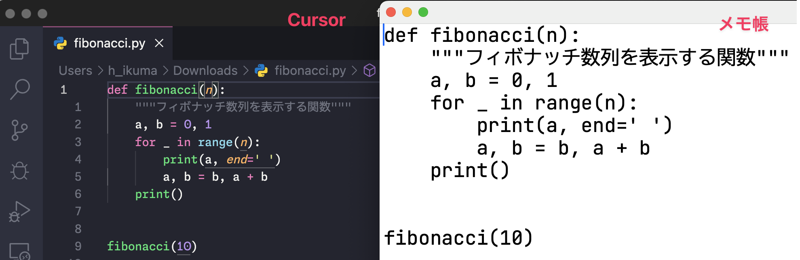

## Cursor とはなにか

Cursor とはプログラミングするためのアプリケーション = 統合開発環境 (IDE = Integrated Development Environment) です。コーディング、文章作成、プログラム実行、バージョン管理をこの中で行えます。

AI の利用を前提に作られており、上記のような作業ががめちゃくちゃ捗ります。ブラウザで実行する ChatGPT のような Web アプリケーションの場合、ブラウザとエディタの間を何度もコピペして、といった作業が必要だったり、添付できるファイル数に上限があったりします。しかし Cursor であれば AI が直接ファイルを編集してくれたり、多くのファイルをまとめて扱えます。

ちなみに Cursor 以外のよく使われる IDE には以下のようなものがあります。

| 名前       | 特徴                              | 開発元       | 価格             |
| -------- | ------------------------------- | --------- | -------------- |
| VS Code   | 拡張機能で環境を構築していく                  | Microsoft | 無料             |
| PyCharm  | Python に特化 (Windsurf 拡張機能あり) | JetBrains | 無料/有料 (高機能版)   |
| Windsurf | Cursor の競合                      | Codeium   | 無料/最新 AI 利用は有料 |

## なぜ Cursor なのか

このように Cursor 以外にも AI が統合された IDE や拡張機能は他にも色々とあります。しかし、この分野の先駆けは Cursor であり、利用者数や情報量の多さから、初心者には特におすすめです。

私自身は Cursor 以外にも GitHub Copilot という AI サービスに課金したり、JetBrains 系 IDE である PyCharm の有償版を使っていたり、Windsurf にも課金したり、Claude code の $100 プランに課金したり、複数の環境を使い分けたり比べたりして開発しています。その中でも Cursor は利用者が多いためおすすめです。

本音を言えば AI 統合機能以外の PyCharm の機能と使い心地にとても満足しておりこれをメインにしたいのですが、AI 統合機能では Cursor、AI の性能では Claude code に軍配が上がります。そのため開発効率を重視して現在は Cursor と Claude code を中心に据えています。

## 元になっている VS Code について

Cursor は Microsoft 社が開発した Visual Studio Code を元に作られています。VS Code はオープンソース (ソースコードが公開されている) です。そのため AI に特化するよう改造して Cursor を作ることができました。

骨格部分はほとんど同じなので、Cursor でできることの多くは VS Code でできます。反対に VS Code でできることの多くは Cursor でもできます。しかし、詳しくは省略しますが AI の使い勝手にはわりと違いがあります。

そして VS Code は基本的にはソースコードを編集するためのソフトウェアで、特定のプログラミング言語に特化しているわけではなく、拡張機能をインストールして自らの環境に合わせて整えていきます。

Python だけでなく JavaScript や HTML、変わり種としては Excel VBA の開発も行えます。テキストエディタであるためソフトウェア開発だけでなく文章作成・小説執筆に利用する方もいます。

## そもそもなぜ IDE が必要なのか？

そもそもなぜ IDE が必要なのかというと、その方がプログラミングしやすいためです。プログラムが書かれたファイル自体はただのテキストファイルであり、メモ帳などを使っても開発できます。しかし、IDE にはメモ帳にはない機能がてんこ盛りです。

下の画像は同じテキストファイルを Cursor で見たとき (左) とメモ帳で見たとき (右) を比較した画像です。左の方が見やすいと思いませんか？より具体的には、機能ごとに文字を色分けしたり、タイポ (キーの打ち間違い) や文法上の誤りがあったときに警告が表示されたり、変数や関数の文字を途中まで入力すると単語の続きを提案してくれたりします。

AI の活動結果が見やすく今後の学習もはかどります。というわけで Cursor をインストールしましょう。

ここからしばらくは、バイブコーディングのための環境構築が続くため、少し退屈に感じるかもしれません。しかし、ここを乗り越えれば初心者にとって最大の難関である環境設定を突破できますので、一緒に頑張りましょう。
