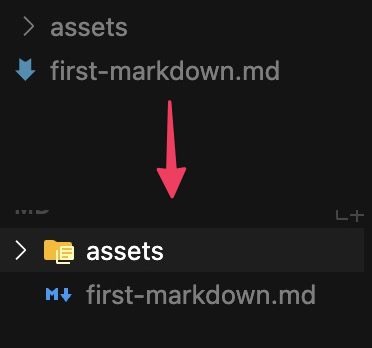

## Cursor のインストール

Cursor のインストール方法は以下の通りです。画像は Windows のものですが、macOS でもほぼ同じようにインストールできます。また、画像は執筆時点のものです。変化の早い業界なので、多少違うかもしれませんが、ご容赦願います。

まずは [https://www.cursor.com/ja](https://www.cursor.com/ja) にアクセスしてダウンロードボタンをクリックし、インストーラーをダウンロードします。


ダウンロードしたら、インストーラーを実行します。実行すると次のような画面になります。「同意する」を選択して「次へ」


インストール先は初期値のまま次へ


スタートメニューフォルダの設定も初期値のまま次へ


追加タスクの選択も初期状態のまま次へ


インストールボタンをクリックします。


インストールが始まります。インストールが終わると以下の画面になるので、Cursor を実行するにチェックを入れて完了ボタンをクリックします。


### Cursor のアカウント登録と初期設定

起動するとアカウントサインイン画面が表示されます。アカウントがないと Cursor を使用できないため、これからアカウントを作りましょう。まずは「Sign Up」をクリックします。


ブラウザが開いて、メールアドレス、もしくは、Google アカウントなどを選択する画面になります。場合によってはサインアップではなく「Sign in」と表示されるかもしれません。その場合は「Sign up」のリンクをクリック、登録を進めてください。


アカウントの登録が終わると、デスクトップで開いている Cursor にログインするか？のボタンが表示されますので、「Yes, Login」ボタンをクリックしてください。


デスクトップで開いている Cursor では次のような表示になります。もし Visual Studio Code がインストールされている場合は、Import from VS Code をクリックすると、VS Code の設定をそっくり引き継げます。クリックしておきましょう。そうでない場合は、「Skip and continue」をクリックします。


次に表示されるのは、Cursor のテーマ (外観) を選択する画面です。好きなものを選んで「Continue」ボタンを押してください。


次に表示される「Quick Start」画面は、Cursor の機能にアクセスするためのショートカットキーの設定です。これは初期値のままで構いませんので、VS Code が選択されていることを確認して、Continue ボタンをクリックします。


次に表示される画面は、Cursor とデータを共有するかの設定です。


以下のように書いてあります。

> デフォルトでは、Cursor はコードから学習し、可能な限り最高のエクスペリエンスを得られるようにします。
>
> 1. あなたがコントロールしてください：設定 → プライバシーでいつでもオフにできます！Cursor を使い始めた最初の日は、データ共有もオフになります。
> 2. デフォルトの動作：1 日使用すると、Cursor はあなたのプロンプト、コードベース、編集履歴、およびその他の使用データを保存して学習し、製品を改善します。
>
> 詳細はプライバシーポリシーとセキュリティページをご覧ください。
> Cursor が私のコードから学習するのは構わない（あるいは、設定→プライバシーでオフにする）。

データを共有するかどうかは、任意です。どちらかを選択して、Continue をクリックして次に進みます。

次に表示される「Review Settings」では AI とチャットするときの応答を日本語にするかの設定と、ターミナルで Cursor コマンドを実行したときに Cursor を開くか、というものです。※ ターミナルとは、PC を操作するためにコマンドを入力するものです。詳しくは後述します。

「Language for Al」は「Japanese」を選択しておきましょう。「Open from Terminal」はインストールしなくても大丈夫です。Continue を押して次に進みます。


### Cursor の日本語化

ここまででようやく Cursor のインストールと初期設定が終わりました。最初に表示されるのは以下のような画面です。英語表記なのでまずは日本語表記にしましょう。


アプリ上部にある View というタブの中の Extensions をクリックします。


検索ウィンドウに「Japanese」と入力し、一番上に表示される拡張機能のインストールボタンをクリックします。Microsoft が作成した拡張機能なので安心してインストールできます。


インストールが完了すると画面左下に再起動を促すボタンが表示されますので、クリックし再起動してください。


再起動すると、メニューなどが日本語表示されます。あとは必要に応じて拡張機能をインストールして自分に必要な環境を整えていきます。

### プライバシーモードの確認

インストール時にデータ共有の可否を設定しましたが、反映されているか確認します。共有したくない場合は以下のようにプライバシーモードを設定してください。右上にある歯車アイコンを押し設定画面を開いたら General のなかにあるプライバシーモードを有効にします。


### ルールの追加

もう一つ行っておきたいのはルール設定です。ルールを設定しないと余計なファイル・余計な修正を行いがちです。そのせいで今まで動いていたものが突然動かなくなってしまうことがあります。そのため、以下のようなルール設定をお勧めします。

```
- 指示された箇所以外のコードは絶対に触らないでください。
- 既存のコードのロジックを勝手に変更しないでください。
- 新しいライブラリや依存関係を勝手に追加しないでください。
- フォーマットの変更や、コメントの不要な削除・追加は行わないでください。
```

画面右上の歯車アイコンをクリックし設定画面の Rules & Memories の中にある User Rules の右側にある Add Rule ボタンを押しルールを追加したら Save ボタンで保存してください。


### Markdown 拡張機能のインストール

次は Markdown(マークダウン) 拡張機能をインストールします。マークダウンはこれまで、ほとんどソフトウェアエンジニアにしか使われていませんでしたが、AI にも人間にも扱いやすい記法として注目を集めています。

これから AI や Cursor を使うのであればマークダウン記法も身につけてください。具体的な記法については後ほど解説するとして、ここでは拡張機能のインストール方法を解説します。

正直なところ、マークダウンを扱うのであれば、Curosr よりも Obsidian というマークダウンに特化したアプリケーションの方が断然、使いやすいのですがあまり色々インストールするのもあれなので、なるべく Cursor だけで完結するようにしました。

以下の拡張機能をインストールしてください。

- Markdown Preview Enhanced
- Markdown Paste
- Markdown All in One


サードパーティー(第三者) が開発した拡張機能を初めてインストールするときは、警告が出るとおもいますが、許可してインストールしてください。

具体的な使い方は後ほど解説します。

### 外観の調整

#### フォントサイズを調整する

必要に応じてエディタ (コードを編集する画面) やターミナル (コマンドを入力する画面) で表示される文字 (フォント) 大きさを調整しておきましょう。

画面右上のパネルの切り替えもしくは


`Ctrl+J` (Windows) / `Cmd+J` (macOS) を押してターミナルを表示して文字の大きさを確認してください。文字の大きさを変えたい場合は `Ctrl+,` (Windows) / `Cmd+,` (macOS) で設定画面を表示します。

検索欄に `font size terminal` と入力して、任意のサイズにします。


次はエディタの調整です。検索欄から `terminal` を消して `Editor: Font Size` を調整します。


#### アイコンを見やすくする

Cursor 標準設定で表示されるファイル・フォルダのアイコンはあまり見やすいものではありません。とくにフォルダがわかりにくいです。そこで「Material Icon Theme」でわかりやすく表示します。


インストールするとアイコンテーマを選択するダイアログが出てきますので「Material Icon Theme」を選択してください。


下図のように見やすくなります。



#### お気に入りのテーマで気分を上げて開発しよう

Cursor では最初に選択できるテーマ以外にも有志によるテーマが数多く利用できます。お気に入りのテーマが見つかれば気分よく開発できるようになります。

拡張機能検索ウィンドウに「theme」と入力するといろいろなものが表示されます。気になるものをインストールしてみてください。


インストールしたテーマを適用するには「コマンドパレット」を表示して


①「theme」と入力し、「配色テーマ」を選択し、


候補の中から好きなものを選びます。なお、コマンドパレットは、F1 キーでも開けます。


#### アクティビティバーの表示

次は外観を VS Code に寄せていく設定です。これは完全に好みの問題ですが初心者のうちは設定しておいた方が迷いが少なくなってよいと思います。

Cursor の標準設定ではプロジェクトが開かれていたり、拡張機能の一覧が表示されていると下図の矢印の辺り「アクティビティバー」が表示されます。


VS Code の初期値ではアクティビティバーは下図のように左側に並んでいます。これを再現します。


アクティビティバーを常に左側に表示させるのには、2 つの理由があります。1 つは、誤ってショートカットキー（`Ctrl+B` や `Cmd+B`）を押して非表示にしてしまった際に、元に戻す方法が分からず混乱するのを防ぐためです。もう 1 つは、各機能へ迅速にアクセスできるようになるためです。

アクティビティバーを再表示させるには下図①を押すか、ショートカットキーで表示させればいいのですが、それを知らないと混乱してしまいます。ですから、左側に常にアクティビティバーが表示されておいた方が迷いが少ないというわけです。

ちなみに AI とのチャット画面を不意に非表示にしてしまった場合は②をクリックすればもう一度表示されます。もしくは `Ctrl+I` や `Cmd+I` でも 表示できます。


話を戻します。アクティビティバーを左側に縦表示するには「ファイル」「ユーザー設定」「設定」をクリックするか、ショートカットキーを押して設定画面を開きます。

Windows であれば、`Ctrl+,`、macOS であれば、`Cmd+,` を押します。


設定の検索ウィンドウに「activity」と入力し、「Workbench › Activity Bar: Orientation」で「vertical」を選択します。再起動が促されるので再起動してください。


再起動するとアクティビティバーが VS Code のように左に並ぶようになります。

余談ですが、ショートカットキーを覚えるためのコツをお伝えします。クリックしたいアイコンの上にマウスカーソルを持っていってください。大体の場合、下図のようにショートカットキーも同時に表示されますので、1 つずつ覚えていきましょう。ショートカットキー身につけると開発と学習が捗ります。


## AI の作業完了時に鳴らすようにする

AI の作業が完了した時に音を鳴らす設定にしておきます。AI に任せている間に他のことをやっていても気がつきやすくなり、時間を有効活用できます。

設定画面の Scroll to New Messages にチェックを入れてくだい。


## Cursor を構成する 6 つのパーツ

ここからの解説で共通認識を持つために画面の見方を簡単に解説しておきます。Cursor の画面は大きく分けると 1~6 のパーツで構成されています。それぞれ以下のような名前がついています。

1. Activity Bar
2. Primary Side Bar
3. Editor Groups
4. Panel
5. Stabus Bar
6. Secondary Side Bar

どのように使うかは順を追って解説します。本書を読み終える頃にはそれぞれの使い方を体で覚えているでしょう。


