次は PC に Python をインストールしましょう。Python は AI との親和性が高く近年特に注目を集めています。また様々な巨大 IT 企業でも使われており、やりたいことはだいたいそつなくこなせます。

## Windows でのインストール

### 公式サイトからインストール

Windows にはここで解説する方法以外にも Microsoft Store から Python をインストールする方法がありますが、**問題が起きやすいので公式サイトからのインストールがオススメです**。

[公式サイト](https://www.python.org/downloads/) のダウンロードページの黄色いボタンは最新バージョンのダウンロードボタンです。

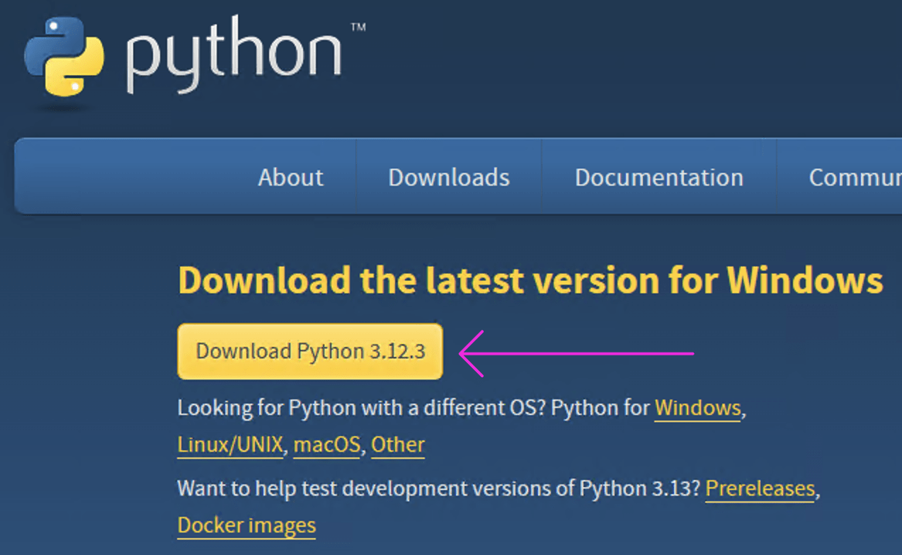

通常はここから最新版をダウンロードすればいいのですが、本書では動作確認済の `3.12.10` のインストールを推奨します。(最新バージョンではライブラリの開発が追いついていないことがあり、うまく動かない場合があるためです)

以下の URL からインストールしてください。

https://www.python.org/downloads/release/python-31210/

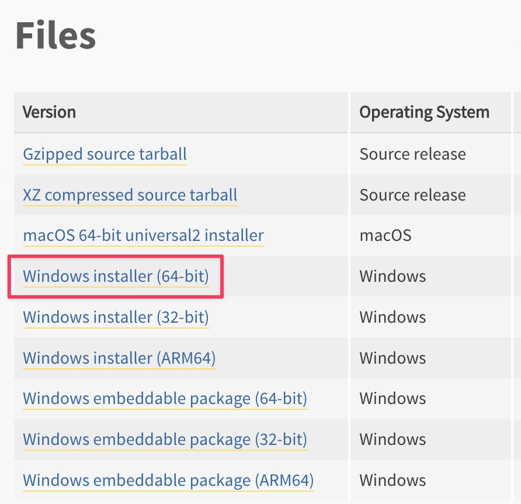

ダウンロードしたらインストーラーをダブルクリックして画面の指示に従って作業を進めます。

下図の枠囲みに注目してください。「**Add python.exe to PATH**」に必ずチェックを入れてください。**チェックを入れたら Install Now をクリックしてインストールを開始します。** (※ 下図は 3.12.3 ですが気にせず 3.12.10 をインストールしてください)

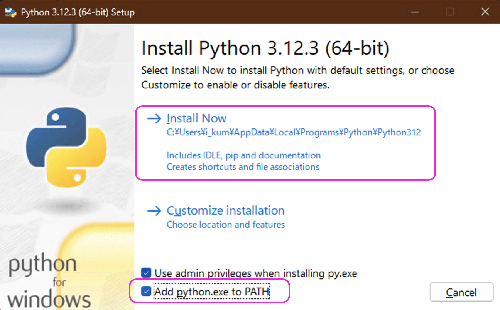

インストールが終わると次のような表示になりますので「Close」をクリックしてください。

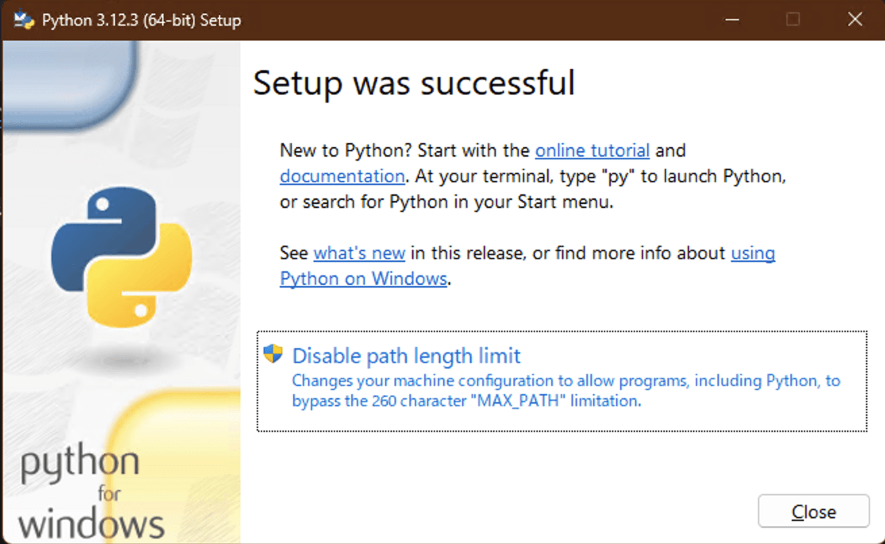

#### インストールが成功したかテスト

Python インストール作業が終わったら成功したかテストします。

そのために PowerShell (パワーシェル) を起動します。PowerShell とは Windows に対してマウスやアイコンからではなく文字列で指令を出すためのツールです。プログラミングにおいては頻繁に使います。

PowerShell を起動するにはタスクバーの Windows アイコンをクリックし、検索窓に「PowerShell」と入力してください。このとき (x86) ではない方で「管理者として実行する」を選択してください。

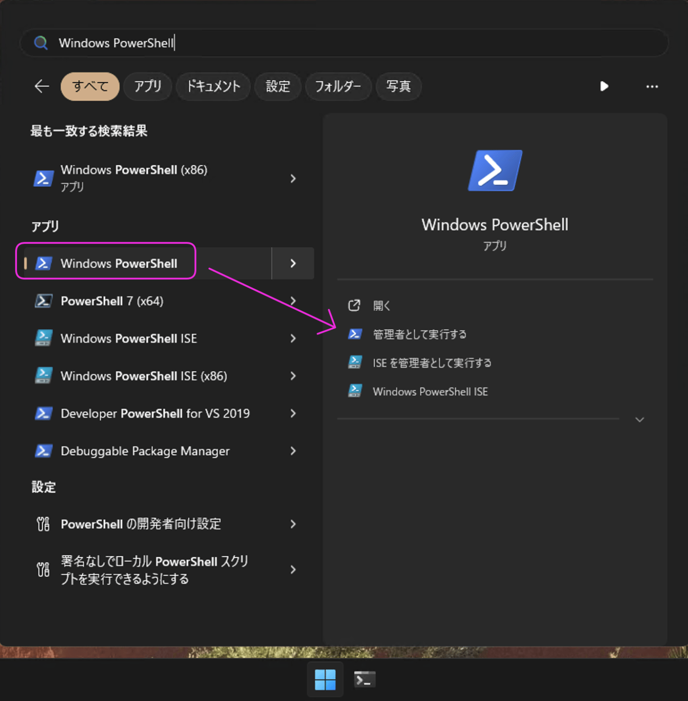

PowerShell を起動したら以下のコマンドを入力します。※ `-V` は大文字の V です。

コマンドとはコンピュータに指令を与えるための文字列のことです。

```
python -V
```

以下のようにバージョンが表示されれば成功です。

```
python -V
Python 3.12.3
```

#### Windows で Python ファイルを実行できるように設定しておく

Windows はセキュリティ確保のためすんなり Python ファイルを実行できない設定になっています。今後のバイブコーディングを円滑にするために設定変更しておきます。

PowerShell を管理者権限で開き以下のコマンドを入力し Enter キーで実行してください。

```
Set-ExecutionPolicy RemoteSigned
```

実行すると以下のように「実行ポリシーの変更」の問い合わせがあります。「y」と入力し Enter キーを押してください。

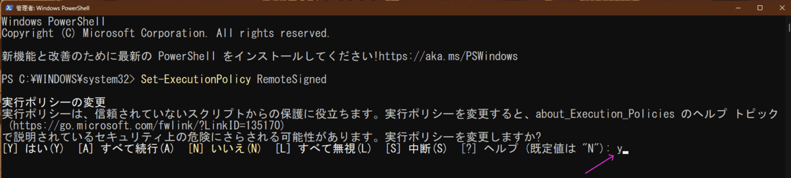

ちゃんと設定できたか確認しておきます。PowerShell をいったん閉じて「開く」から起動してください。続いて以下のコマンドを実行してください。

```
Get-ExecutionPolicy
```

以下のように「RemoteSigned」になっていれば成功です。

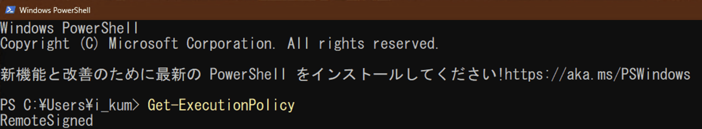

これで初期設定は完了です。

なお、このようなコマンドを入力する画面のことをターミナルと呼びます。本書では、何回も登場する言葉なので覚えておいてください。

## macOS でのインストール

macOS に Python をインストールする方法はいくつかありますが、特におすすめなのは以下の 2 つです。

1. 公式サイトからインストール
2. Homebrew でインストール

「公式サイトからインストール」がもっとも簡単ですが、今後バイブコーディングを継続して楽しみたいのであれば「Homebrew」を使う方法もオススメです。以下の解説をざっと眺めてみてできそうな方法でインストールしてください。

### 公式サイトからインストール

[公式サイト](https://www.python.org/downloads/) からインストーラーをダウンロードします。ダウンロードページの黄色いボタンは最新バージョンのダウンロードボタンです。ここからダウンロードしてください。


ダウンロードしたらインストーラーをダブルクリックして画面の指示に従って作業を完了させましょう。**特に設定する項目はありません**ので全て「続ける」か「同意する」を選択し最後に「インストール」して作業は終了です。


#### インストールが成功したかテスト

Python インストール作業が終わったら成功したかテストします。

そのために「ターミナル」を起動します。「ターミナル」とは macOS に文字列で指令を出すためのツールです。プログラミングにおいては呼吸するくらいよく使います。ターミナルを起動するには Spotlight 検索に「ターミナル」と入力するか Launchpad から見つけます。


ターミナルを起動したら以下のコマンドを入力します。※ `-V` は大文字の V です。

コマンドとはコンピュータ与える指令のことです。

```
python3 -V
```

以下のようにバージョンが表示されれば成功です。

```
python3 -V
Python 3.12.3
```


### Homebrew でインストール

ネット上のコンテンツでは「Homebrew + Pyenv」の組み合わせを使って環境構築する手順を紹介するものが多いですが Homebrew だけでも問題ありません。いろいろなものをインストールすると問題に遭遇する可能性が上がるため初心者のうちはシンプルを心がけます。

#### Homebrew とはになか

Homebrew は macOS のアプリケーションを簡単にインストールしたりアップデートしたり削除したりするためのツールです。macOS にアプリをインストールするには App Store を使うのが一般的ですがプログラミングにおいては Homebrew を使うほうが一般的です。

なぜならエンジニアはなんでもキーボードだけで操作したがる人種だからです。いろいろな画面を開いてマウスをポチポチ押しながらインストールするなどという面倒なことを嫌うのです。Homebrew を使うとコマンドでサクサクインストールできるので好まれます。

#### CommandLineTools(CLT) がインストールされているか確認/インストール

Homebrew をインストールするには、macOS に CommandLineTools(CLT) がインストールされている必要があります。インストールされているか以下のコマンドで確認します。

```shell
xcode-select -p
```

以下のように、インストール先のパスが表示されていれば、CommandLineTools(CLT) がインストールされています。Homebrew のインストールに進んでください。

```shell
/Library/Developer/CommandLineTools
```

この表示されない場合は、以下のコマンドで CommandLineTools(CLT) をインストールしてください。

```shell
xcode-select --install
```

インストールしたら**ターミナルを再起動して**下のコマンドを入力し、インストール先が表示されれば成功です。Homebrew をインストールできます。

```shell
xcode-select --install
```

#### Homebrew のインストール

Homebrew をインストールするには [公式サイト](https://brew.sh/ja/) からコマンドをコピーしてください。

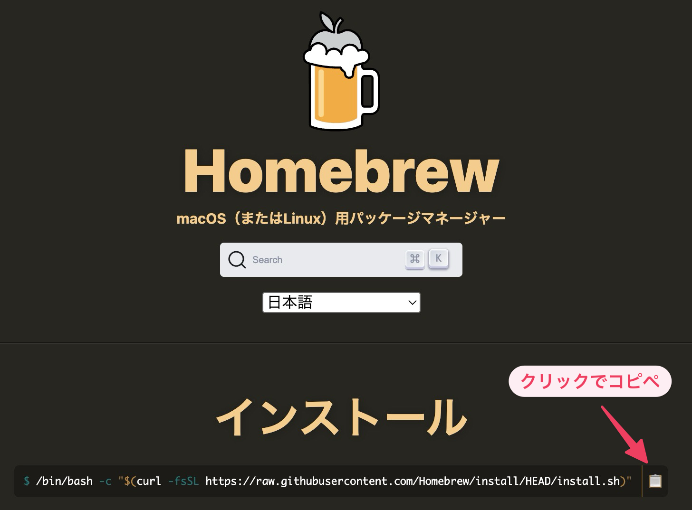

実行するとパスワード入力を求められます。macOS のログインパスワードを入力して Enter キーを押してください。

ターミナルに `Installation successful!` などと表示されたらインストールは完了です。その下の**Next steps:** に以下のように表示されます。枠囲みをコピーしてターミナルにペーストして実行してください。

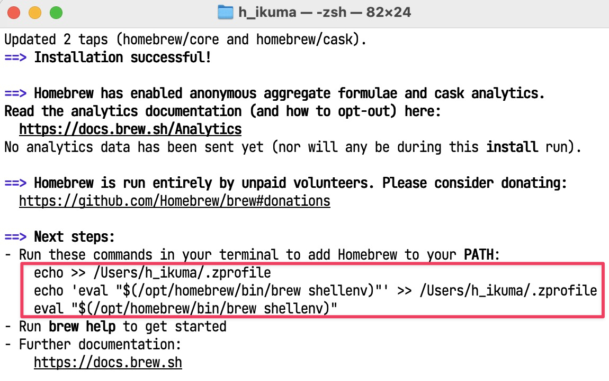

これは PATH(パス) を通すためのコマンドです。「PATH を通す」とは brew というプログラム名だけで実行できるようにする方法です。PATH が通っていない場合、プログラムをターミナルで実行するにはインストールされている場所 = フルパスを入力する必要があります。しかし面倒なので macOS にプログラム名とフルパスの組み合わせを教えてやります。これが PATH を通す作業です。

作業が完了したら上手く行っているか確認しましょう。`brew -v` を実行したときにバージョンが表示されれば成功です。表示されない場合はターミナルを再起動して再度コマンドを実行してください。

```
brew -v
Homebrew 4.3.1
```

#### 最新バージョンの Python をインストールする方法

続いて Homebrew を使って Python をインストールします。以下のコマンドを実行すると Python の最新バージョンがインストールされます。

```
brew install python3
```

Python を Homebrew でインストールした場合は本書で扱う Tkinter という GUI ライブラリが含まれておらず以下のコマンドで別途インストールする必要があります。

```
brew install python-tk
```

Python インストールが成功したかテストします。ターミナルを再起動して実行してください。※ V は大文字です。

```
python3 -V
Python 3.12.3
```

上記のようにバージョンが表示されれば成功です。

次は Tkinter のテストです。ターミナルで以下のコマンドを実行したときに下図のダイアログが表示されれば成功です。

```
python3 -m tkinter
```

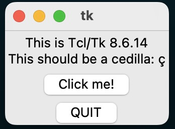

## Python 拡張機能のインストール

Python を PC にインストールしたら、Cursor に Python 拡張機能をインストールします。まずは「表示」「拡張機能」をクリックし

検索ウィンドウに「python」と入力します。拡張機能名の下に「ms-python」と書いてあるものをインストールします。これは拡張機能の作成者を表しています。ms は Microsoft の略です。

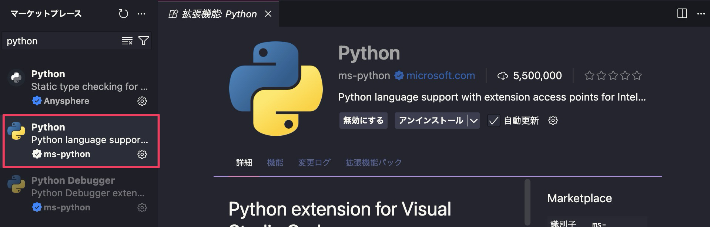

なお、拡張機能をインストールするときは、ごく稀に悪意のある拡張機能がマーケットプレイスに存在するので注意してください。どこを見ればよいかというと、上の図の 5,500,000 と書いてあるところです。

インストール数の多寡が悪意の有無に直接関わるわけではありませんが、悪意があればがすぐに広まる世の中ですから、インストール数が多いほど安心と考えて良いと思います。
