ここからは、マークダウン記法を解説します。先述したように AI の発達とともに近年マークダウンが注目を集めるようになりました。

- シンプルなルールで見出しや太字などの装飾を適用できる
- ChatGPT などの AI の回答をコピーするボタンはマークダウンでコピーされる
- AI に読み込ませるデータとして人にも AI にも扱いやすい

という理由からです。マークダウン記法の習得は波及効果が高く、ルールもシンプルなためサクッと覚えてしまいましょう。

## そもそもマークダウンとは何か

マークダウンは文書を書くための記述言語です。普通のテキストファイルに簡単な記号を追加するだけで、見出しや太字、リンクなどの装飾ができます。紙に下線や○印を付けるように、シンプルな記号で文書を見やすくする仕組みです。

マークダウンで書いた文書は、最終的にウェブページ（HTML）や PDF に変換できます。

また、マークダウンの閲覧や編集には、Microsoft Word のような専用アプリは必要ありません。メモ帳のようなシンプルなテキストエディタでも可能です。様々なアプリケーションで開くことができ、非常に軽量であるため、手軽に利用できます。

先述した理由の背景にはこうした理由があります。

### マークダウンの利用例

複数の AI チャットサービスを利用したり、AI とのチャットが増えたりすると、その管理に手間を感じる方も少なくないでしょう。サービスによってはスレッドのピン留め機能やプロジェクトごとの整理機能がありますが、複数のサービスを横断して一元的に管理するには不向きです。

そこで AI の回答をコピーして自身の管理下に置いて一元管理する方法があります。こんなとき ChatGPT のコピーボタンを押してコピーされるのはマークダウン記法です。Google Gemini でも Anthropic の Claude でも同様です。

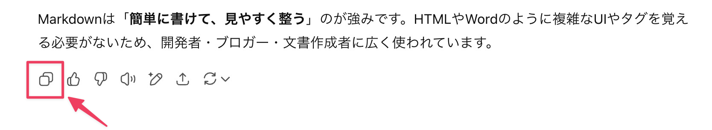

コピーしたテキストを元に自分でマークダウンファイルを作って一元管理するときに、マークダウン記法の知識が役に立ちます。

また、開発したプログラムの説明書 (README.md) もマークダウンで書く (AI に書かせる) のが一般的です。

具体的にはマークダウンでは文字を太字にしたり、見出しにしたり、ハイパーリンクを埋め込んだり、などの装飾を施せます。

同じような装飾の例に、私たちが普段目にする Web ページがあります。そこでは下図のような装飾が施されていますよね。これは HTML (Hyper Text Markup Language) という記法で書かれています。

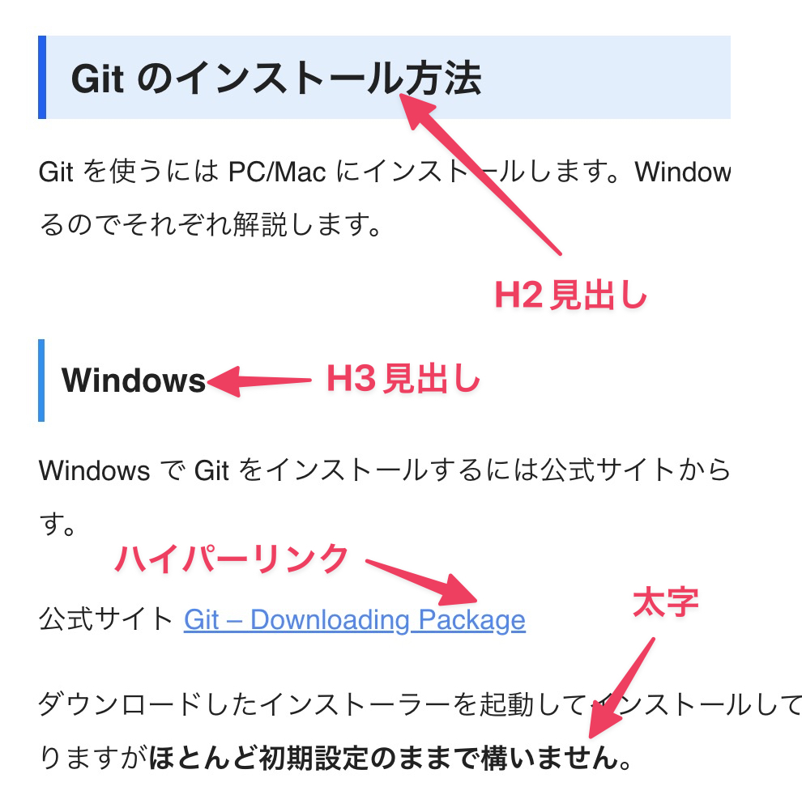

HTML は下のような記法ですが煩雑で見るのも嫌になりますね。

```html
<h2 class="wp-block-heading" id="i-1">Git のインストール方法</h2>

<p>Gitを使うにはPC/Mac にインストールします。Windows と Mac でインストール方法が異なるのでそれぞれ解説します。</p>

<h3 class="wp-block-heading" id="i-2">Windows</h3>

<p>WindowsでGitをインストールするには公式サイトからインストールするのが最も手軽です。</p＞

<p>公式サイト<a href="https://git-scm.com/downloads/win">Git - Downloading Package</a></p>

<p>ダウンロードしたインストーラーを起動してインストールしていきます。設定項目が多数ありますが<strong>ほとんど初期設定のままで構いません</strong>。</p>
```

これをもっと簡単にしたのがマークダウン記法です。HTML のハイパーテキスト**マークアップ**ランゲージという名前に対し、**マークダウン**という名前なのでシャレが効いていますね。同じ装飾をするのに以下のようにします。HTML に比べると簡単そうだと思いませんか？

```
## Git のインストール方法

Git を使うには PC/Mac にインストールします。Windows と Mac でインストール方法が異なるのでそれぞれ解説します。

### Windows

Windows で Git をインストールするには公式サイトからインストールするのが最も手軽です。

公式サイト [Git - Downloading Package](https://git-scm.com/downloads/win)

ダウンロードしたインストーラーを起動してインストールしていきます。設定項目が多数ありますが**ほとんど初期設定のままで構いません**。
```

## マークダウン拡張機能の初期設定

マークダウンをより書きやすくするために拡張機能のインストールと初期設定をしておきます。練習のため以下の説明と同じように操作してください。

### マークダウンファイルと格納先フォルダの作成

Cursor をインストールした直後はどのフォルダも開いていない状態です。Cursor のエクスプローラーアイコンをクリックすると以下のように表示されますので、マークダウンファイルと格納先のフォルダを作成します。エクスプローラーの「フォルダを開くボタン」をクリックします。

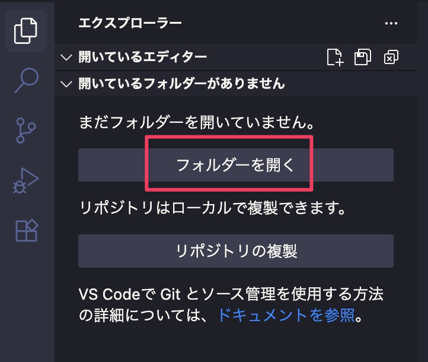

すでに保存したいフォルダが決まっている場合は、そのフォルダを選択して開くボタンをクリック。新たに作りたい場合は、新規フォルダを作成し、それを選択して開くをクリックしてください。保存先はどこでも構いません。ここではデスクトップに「first-md」という名前のフォルダを新たに作ります。

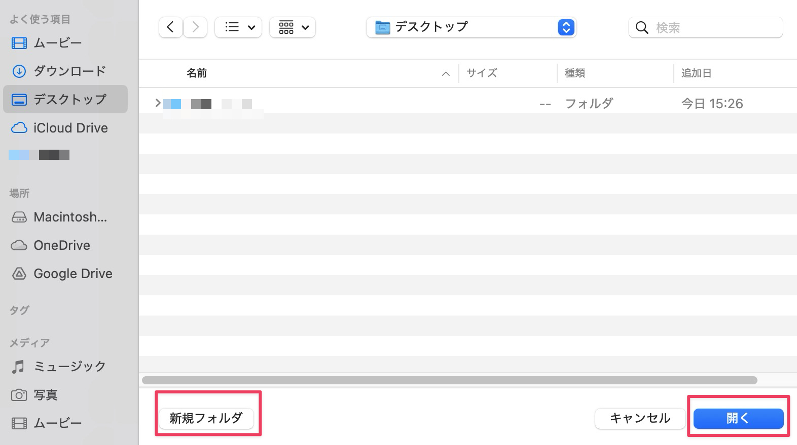

もし Cursor を起動したときに前回開いていたフォルダが開かれた場合はファイルメニューから新しいウィンドウを開いてください。

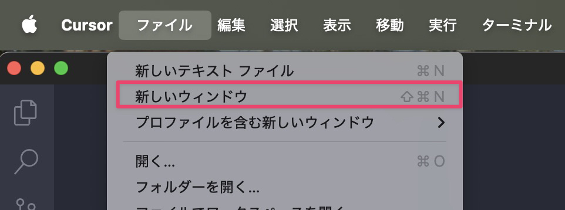

次に新しいファイルを作るアイコンをクリックし ファイル名を「first-md.md」とします。これで、マークダウンファイルができました。このファイルに演習用の文字を書いていきます。

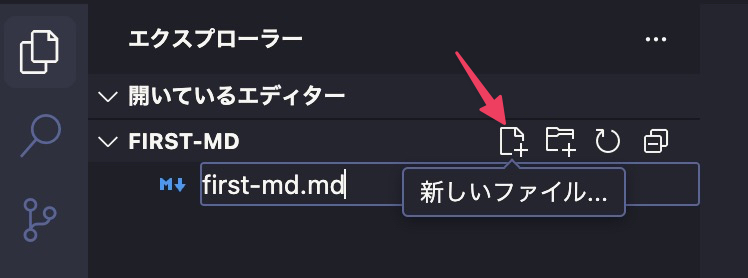

### Cursor Tab の設定

Cursor には「Cursor Tab」という機能があります。これは、ユーザーが次に行うであろう操作を AI が予測し、自動的にコードやテキストを補完してくれる機能です。

初期状態ではマークダウンファイルに対しては無効になっていますので、有効にします。画面右下にある Cursor Tab にマウスカーソルを持っていくと、下の図のような表示になりますので、チェックを外してください。取り消し線が消えれば有効になっています。

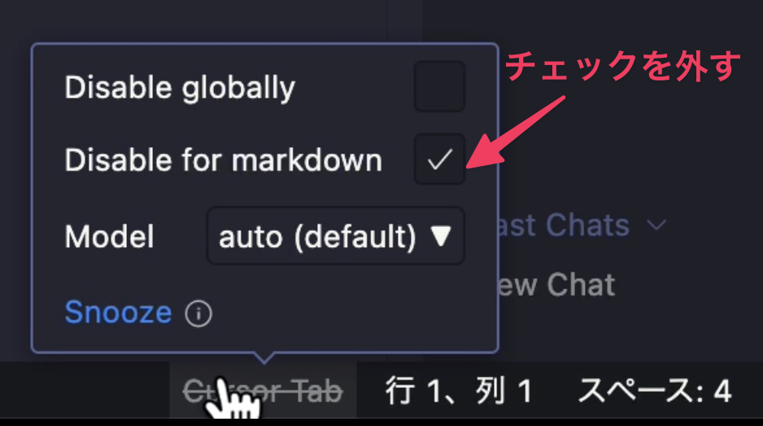

### 拡張機能の初期設定

次に画像をペーストした時にいい感じにマークダウン用に整形してくれる拡張機能の設定をします。拡張機能の中にある「Markdown Past」をクリックし歯車マークを押して設定画面を開きます。

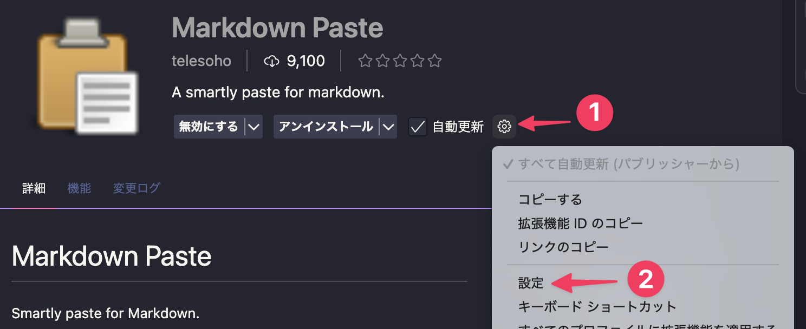

設定画面下部にある「Markdown Paste: Path」で「assets」と入力し設定タブを閉じます。これは画像の保存先の設定です。何も設定しないと現在開いているフォルダ (プロジェクト) の直下に保存されます。散らかってしまうので毎回指定のフォルダ (ここでは assets) に保存することで整頓した状態に保てます。

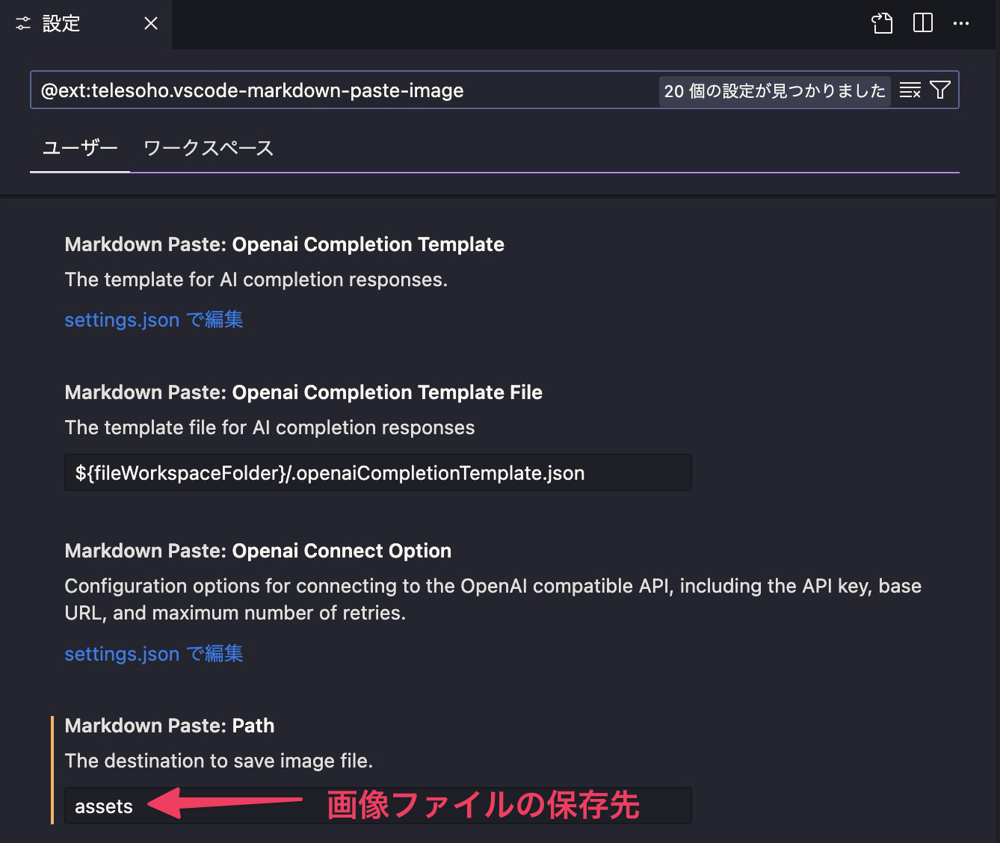

挙動を確認してみましょう。

まず適当な画像ファイルをコピーするかスクリーンショットを撮ります。スクリーンショットをとるには以下のショートカットキーを使います。

- Windows: `Windows+Shift+S`
- macOS: `Shift+Cmd+4`

コピーするかスクリーンショットを撮ったらエディターを右クリックして「Markdown Paste」をクリックします。右端に表示されているショートカットキーでも OK です。

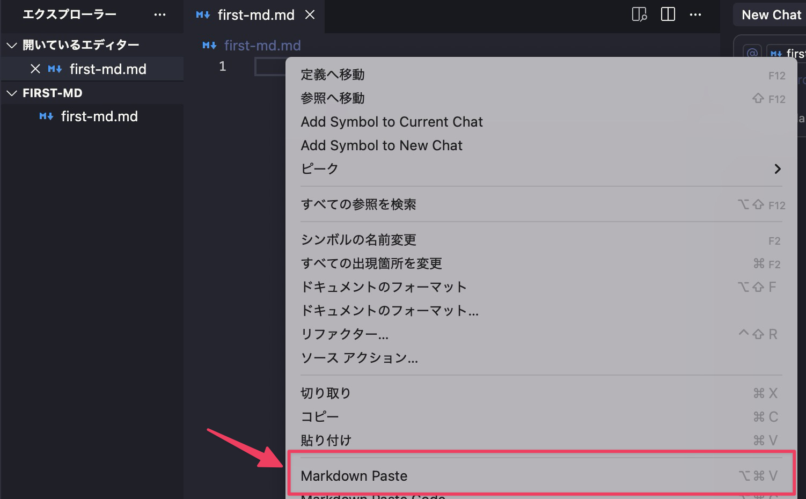

以下のように表示されます。Enter キーを押すと保存されます。ファイル名を変更することも可能です。

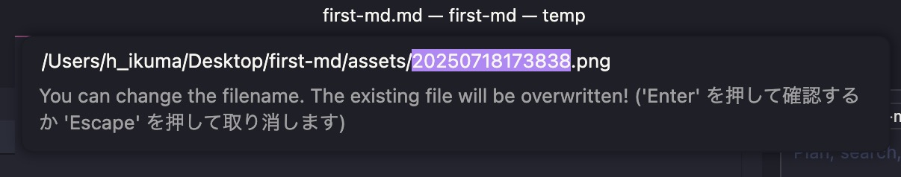

すると下の図のようになります。

① 自動的に画像が表示される記法になります。

② 設定したフォルダが自動的に作られ保存されます。`V` をクリックすると、フォルダを展開できます。

③ ●はまだ保存されていないことを表しています。`Ctrl+S` (Win) および `Cmd+S` (macOS) を押すか上部メニューバーにあるファイルの中にある「保存」をクリックします。

④ マークダウンのプレビューを表示するアイコンです。装飾された結果が表示されます。

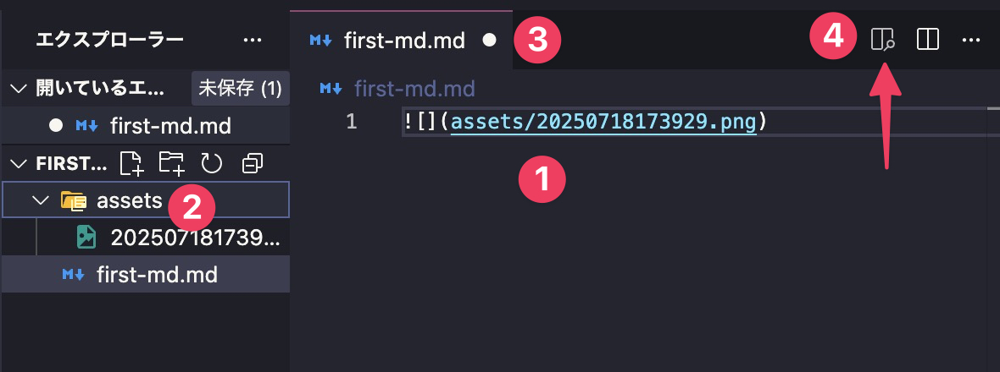

④をクリックするとプレビュー用のタブが開き装飾結果が表示されます。

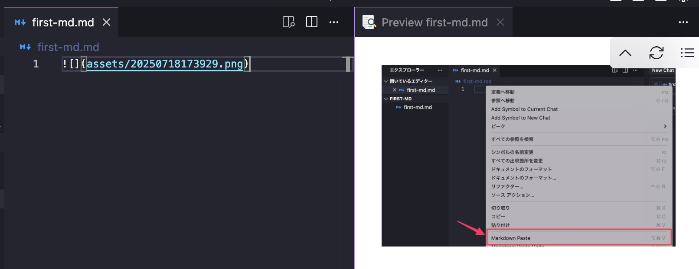

なお、画像表示をしたくない場合は該当の行を消します。ファイルは残ったままなのでファイルも削除したい場合はプライマリーサイドバー で対象のファイルを選択して右クリックから削除します。

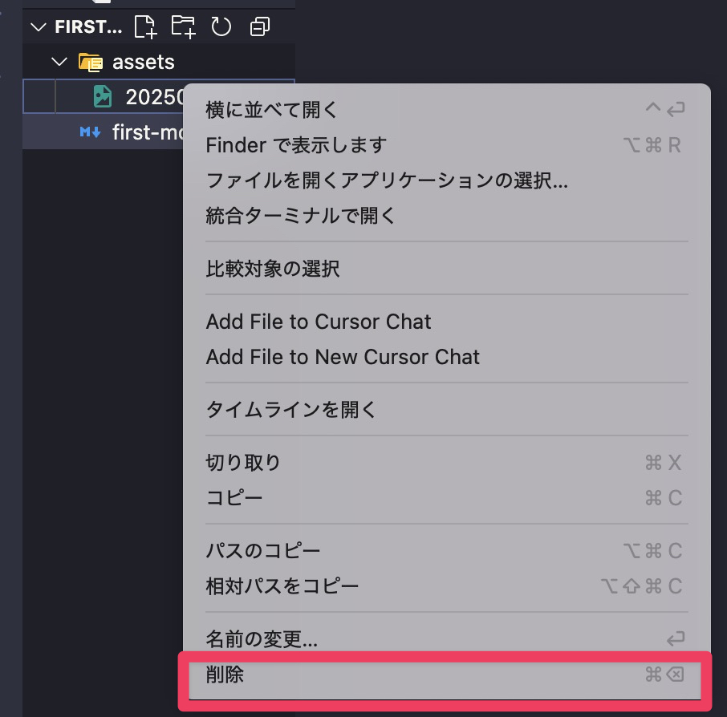

これで拡張機能の初期設定は終わりです。

### マークダウンの見出しを表示

先述したように Cursor で開いているマークダウンファイルは画面右上にあるアイコンをクリックすると装飾が施された後の文章をプレビュー表示できます。プレビュー表示の右上にあるアイコンをクリックすると、見出しを表示することもできます。


## 初心者のためのマークダウン記法ガイド

チートシートを以下にまとめました。マークダウンで何ができるかざっと目を通してください。

### マークダウン記法チートシート

マークダウンの主な記号には以下の表のものがあります。個人的には以下を覚えれば十分だと思っています。

1. `#` (見出し)
2. `*` (強調)
3. `-` (リスト)
4. `1. ` (番号付きリスト) 記号
5. `[]()`(リンク記号)
6. `` (画像表示)
7. \` インラインコード
8. \`\`\` コードブロック

| 記号         | 説明       | 表示例                               |
| ---------- | -------- | --------------------------------- |
| #          | 見出し      | # 見出し 1                           |
| **         | 太字       | **太字になります**                       |
| *          | 斜体       | _斜体になります_                         |
| ***        | 太字かつ斜体   | ***太字かつ斜体***                      |
| >          | 引用       | > 引用文です。|
| 1.         | 番号付きリスト  | 1. りんご                            |
| -          | リスト      | • りんご                             |
| \`         | インラインコード | `console.log("Hello");`           |
| \`\`\`<br> | コードブロック  | (テーブル内で表現できないため割愛)                |
| ---        | 水平線      | 水平線が引かれます                         |
| \[]()      | リンク      | [Google](https://www.google.com/) |
|!\[]()     | 画像       | 画像が表示されます                         |
| \          | エスケープ文字  | (\* や \\ 自体を表示するために用いる)           |
| (割愛)       | テーブル     | テーブル形式で表示                         |
| ~~         | 打ち消し線    | ~~打ち消し線~~                         |
| - []      | タスクリスト   | ☐ 未完了タスク                          |
| - [x]      | 完了タスク    | ☑ 完了タスク                           |
| ==         | ハイライト    | ==ハイライト==                         |
| ~          | 下付き文字    | H₂O                               |
| ^          | 上付き文字    | E = mc²                           |

これからそれぞれの記法について解説しますが気になるものをエディタに入力してください。だんだん身についていきますよ。

### 互換性について

マークダウンビューアやエディタには多くのアプリが存在しますが、すべての装飾がすべてのアプリでサポートされているわけではありません。

「基本構文」は、ほぼすべてのマークダウンアプリでサポートされていますが、「拡張構文」はアプリによってはサポートされていない場合があります。

なお、本書では拡張機能「Markdown Preview Enhanced」インストールでいるので、すべての構文が機能するはずです。

## 基本構文

### 見出しの作成

見出しは H2 の配下に H3 が、H3 の配下に H4 が、というような階層構造を表す要素です。マークダウンでは、行の先頭に `#` 記号を付けることで見出しになります。`#` の数が多いほど、小さな見出しになります。

```markdown
# これは最大の見出し（レベル1）
## これは2番目の見出し（レベル2）
### これは3番目の見出し（レベル3）
#### これは4番目の見出し（レベル4）
##### これは5番目の見出し（レベル5）
###### これは最小の見出し（レベル6）
```

**注意点**：`#` と見出しテキストの間には必ずスペースを入れます。

実際の見え方は標準設定では以下のようになります。(本書では扱いませんが CSS を使うと装飾をさらに細かく設定できます)

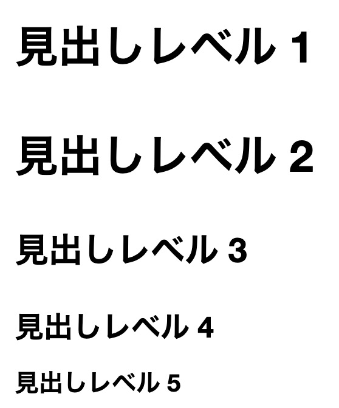

### 段落

段落は文書の基本単位です。マークダウンでは、空行で段落を区切ります。

```markdown
これは最初の段落です。
この行も同じ段落に含まれます。

これは新しい段落です。
空行によって段落が分かれています。
```

### 文字の強調

文書で重要な部分を目立たせる方法を覚えましょう。

#### 太字

**太字**にしたい場合は、文字を 2 つのアスタリスク `**` で囲みます。

この文章には**重要な部分**があります。

```markdown
この文章には**重要な部分**があります。
```

アスタリスクで囲う際は、強調したい文字を選択して、そのままアスタリスクを打って構いません。

OS 標準のメモ帳などでは選択中の文字がアフタリスクで上書きされてしまいますが、Cursor の場合は自動的に囲ってくれます。この「選択した文字を記号で囲う」という動作は後で登場する「斜体」「コード」等でも同様に機能します。

その他ショートカットキーも使えます。Windows では `Ctrl+B`、macOS では、`Cmd+B` 囲えます。`B` は**Bold** (太字) の `B` です。

#### 斜体

*斜体* にしたい場合は、文字を 1 つのアスタリスク `*` で囲みます。

この文章には*強調したい部分*があります。

```markdown
この文章には*強調したい部分*があります。
```

ショートカットキーを使う場合、Windows であれば `Ctrl+I`、macOS の場合は、`Cmd+I` 使います。`I` は `Italic` の `I` です。

#### 太字かつ斜体

***太字かつ斜体*** にしたい場合は、文字を 3 つのアスタリスク `***` で囲みます。

この文章には***非常に重要な部分***があります。

```markdown
この文章には***非常に重要な部分***があります。
```

#### 注意点

日本語でマークダウン扱うときは一つ注意点があります。記号の前後に全角文字があるとうまく機能しないことがある、という問題です。

例えば次のように「)」と「し」の間に `**` があると意図した結果になりません。

**強調 (きょうちょう)**します

```markdown
**強調 (きょうちょう)**します
```

このような場合は、次のように「し」の前に半角スペースを入れるなどして調整します。

**強調 (きょうちょう)** します

```markdown
**強調 (きょうちょう)** します
```

### 引用文

他の人の言葉や重要な文章を引用する際は、引用記号を使います。行の先頭に `>` を付けます。

> これは引用文です。
> 他の人の言葉や重要な文章を
> このように表示できます。

```markdown
> これは引用文です。
> 他の人の言葉や重要な文章を
> このように表示できます。
```

引用文は入れ子にすることも可能です。これは、メールの返信で「>」が重なっていくのと同様のイメージです。

> 元の引用文です。
>
>> これは引用文の中の引用文です。

```markdown
> 元の引用文です。
>
>> これは引用文の中の引用文です。
```

引用文の中では、見出しや太字などの他のマークダウン記法も使用できます。

> ## 引用文内の見出し
>
> これは**太字**の文章です。
>
> *斜体*も使えます。

```markdown
> ## 引用文内の見出し
>
> これは**太字**の文章です。
>
> *斜体*も使えます。
```

### リストの作成

情報を整理して表示するために、リストを使用します。

**番号付きリスト**は、各項目の前に数字とドットを付け、ドットの後に半角スペースを入れるとリストになります。

1. 最初の項目
2. 2 番目の項目
3. 3 番目の項目

```markdown
1. 最初の項目
2. 2番目の項目
3. 3番目の項目
```

実際の数字の順番は関係ありません。以下のようにすべて「1.」で始めた場合、Cursor のプレビューでは自動的に連番が表示されます。Obsidian では入力したように表示されます。

1. 最初の項目
1. 2 番目の項目
1. 3 番目の項目

```markdown
1. 最初の項目
1. 2番目の項目
1. 3番目の項目
```

**順序なしリスト**は、項目の前に `-`、`*`、`+` のいずれかを付けます。どれか 1 つに統一しておきましょう。

- 項目 A
- 項目 B
- 項目 C

```markdown
- 項目A
- 項目B
- 項目C
```

リストは入れ子にすることが可能です。子項目は、4 つの半角スペースまたは 1 つのタブでインデントします。

1. 主要項目 1
	- 副項目 1-1
	- 副項目 1-2
2. 主要項目 2
	- 副項目 2-1
		- さらに細かい項目

```markdown
1. 主要項目1
    - 副項目1-1
    - 副項目1-2
2. 主要項目2
    - 副項目2-1
        - さらに細かい項目
```

リスト内に段落や他の要素を含める場合は、4 つの半角スペースでインデントします。

1. 最初の項目
	これは最初の項目に関連する段落です。
2. 2 番目の項目

	> これは 2 番目の項目に関連する引用文です。

```markdown
1. 最初の項目
    これは最初の項目に関連する段落です。
2. 2番目の項目
    > これは2番目の項目に関連する引用文です。
```

### コードの表示

プログラムのコードや、コンピューターへのコマンドを表示する際に使用します。

#### インラインコード

**インラインコード**は、バッククォート 1 つ (\`) で囲みます。バッククォートは `Shift+@` キーで入力します。

コマンドプロンプトで `vim` と入力してください。

```markdown
コマンドプロンプトで `vim` と入力してください。
```

#### コードブロック

**コードブロック**は、バッククォート 3 つ (\`\`\`) で囲います。

~~~
```

```
~~~

最初のバッククォート (チルダ) の後に言語名を記述できます。言語名を記述すると、その言語に応じて色分けしてくれるので見やすくなります。

~~~
```python
def greetings():
    print("Hello, World!")
```
~~~

```python
def greetings():
    print("Hello, World!")
```

バッククォートとチルダの使い分けですが、コードブロックの中にバッククォートが登場し、干渉してしまう場合はチルダを使用してください (あるいはその逆)。

### 水平線

文書の区切りや章の終わりを示すために水平線を使用します。3 つ以上の `*`、`-`、`_` を連続して配置します。

---

```markdown
---

***

___
```

水平線の前後には、空行を入れることをお勧めします。

### リンクの作成

他のウェブサイトやページへのリンクを作成できます。

#### 基本的なリンク

基本的なリンクは、リンクテキストを `[]` で囲み、URL を `()` で囲みます。Windows の場合は `Ctrl+K`、macOS の場合は `Cmd+K` で、リンク書式できます。

私のお気に入りの検索エンジンは [Duck Duck Go](https://duckduckgo.com) です。

```markdown
私のお気に入りの検索エンジンは[Duck Duck Go](https://duckduckgo.com)です。
```

#### タイトル付きリンク

タイトル付きリンクは、URL の後にタイトルを追加できます。**マウスカーソルをリンクに重ねると表示されます**。

私のお気に入りの検索エンジンは [Duck Duck Go](https://duckduckgo.com "プライバシーを重視する検索エンジン") です。

```markdown
私のお気に入りの検索エンジンは[Duck Duck Go](https://duckduckgo.com "プライバシーを重視する検索エンジン")です。
```

#### 自動リンク

自動リンクは、URL やメールアドレスを `<>` で囲むと自動的にリンクになります。しかし多くのマークダウンエディタ、ビューアでは、囲っていなくても自動的にリンク形式に変換されますのであえて書かなくても大丈夫です。

<https://python-engineer.co.jp/>

<example@email.com>

```markdown
<https://python-engineer.co.jp/>

<example@email.com>
```

自動リンクを無効にし、クリックしてもリンクを開かないようにしたい場合は、URL をバッククォートで囲んでコードとして表示します。

`https://python-engineer.co.jp/`

```markdown
`https://python-engineer.co.jp/`
```

#### リンクの装飾

リンクの装飾：リンクテキストを太字や斜体にできます。日本語でマークダウンを使うときは、先述したように「`)`」や「`[`」と前後の全角文字の間に半角スペースを入れないと、意図したようになりませんので注意してください。

これは **[パイソンエンジニア部](https://python-engineer.co.jp/)** です。

これは *[パイソンエンジニア部](https://python-engineer.co.jp/)* です。

```markdown
これは **[パイソンエンジニア部](https://python-engineer.co.jp/)** です。
これは *[パイソンエンジニア部](https://python-engineer.co.jp/)* です。
```

### 画像の挿入

画像を文書に挿入するには、リンクの前に `!` を付けます。画像の URL は、Web 上の URL でも、コンピュータ内のファイルパスでも、どちらでも構いません。


```markdown

```

「代替テキスト」は、画像が表示されない場合に代わりに表示される文字です。タイトルは、画像にマウスカーソルを重ねると表示されます。「リンクの作成」の項目で説明したパターンと同様ですが、先頭に「!」が付いているかどうかで、画像として表示されるか、リンクとして表示されるかが変わります。

かなりややこしいのですが、**画像にリンクを付ける**場合は、画像のマークダウンを `[]` で囲み、その後にリンクを付けます。

```markdown
[](リンク先のURL)
```

```markdown
[](https://python-engineer.co.jp/)
```

[](https://python-engineer.co.jp/)

### エスケープ文字

マークダウンで「特別な意味を持つ文字」を「普通の文字」として表示したい場合は、以下のようにバックスラッシュ（`\`）を前に付けます。バックスラッシュは Windows では `¥` キーで入力します。macOS の場合は `Opt+¥` キーで入力します。

エスケープ文字を使うと以下のようになります。

* この行頭のアスタリスクはリストにならずに表示されます。

```markdown
* この行頭のアスタリスクはリストにならずに表示されます。
```

エスケープが必要な主な文字には以下のものがあります。

```
\ ` * _ { } [ ] ( ) # + - . !
```

### HTML の使用

マークダウンでは、HTML タグを直接使用できます。特別な装飾や、マークダウンで表現できない要素に使用します。

この<strong>単語</strong>は太字で、この<em>単語</em>は斜体です。

```markdown
この<strong>単語</strong>は太字で、この<em>単語</em>は斜体です。
```

ただし、ブロックレベルの HTML 要素（`<div>`、`<table>` など）の内部ではマークダウン記法は使用できません。

## 拡張構文

### テーブル（表）の作成

#### 標準的な表

データを整理して表示するためにテーブルを使用します。パイプ（`|`）で列を区切り、ハイフン（`-`）でヘッダー行を作成します。

| 名前  | 年齢  | 職業    |
| --- | --- | ----- |
| 田中  | 30  | エンジニア |
| 佐藤  | 25  | デザイナー |

```markdown
| 名前 | 年齢 | 職業 |
|------|------|------|
| 田中 | 30 | エンジニア |
| 佐藤 | 25 | デザイナー |
```

ご覧の通り、表を手入力するのは現実的ではありません。AI に作成を依頼しましょう。下の図のように表を挿入したい場所で `Ctrl+K`、もしくは `Cmd+K` を押してどのような表を作りたいか指示します。

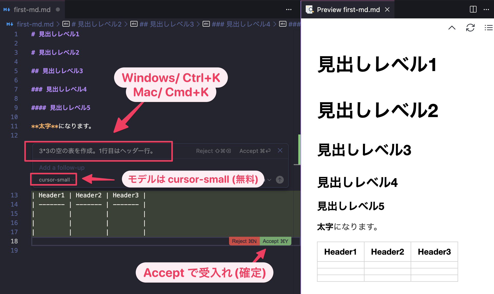

例えばプロンプトは以下のようにします。

```
3*3の空の表を作成。1行目はヘッダー行。
```

ここで使う AI モデルは単純な表であれば、無料の cursor-small で十分です。表が挿入されると赤いボタン (Reject = 拒否) と緑色のボタン (Accept = 受け入れ) が表示されます。期待した表ができれば、緑色のボタンを押して受け入れます。期待した結果でない場合は、赤いボタンを押して再度作成させます。

※ 本書執筆時点では緑色のボタンは「Accept」ですが、最新では「Keep」になっています。

#### 左寄せ、中央寄せ、右寄せ

**列の配置**を指定できます。

| 左寄せ | 中央寄せ | 右寄せ |
|:-- |:--: | --: |
| 左   |  中央  |   右 |
| データ | データ  | データ |

```markdown
| 左寄せ | 中央寄せ | 右寄せ |
|:-------|:--------:|-------:|
| 左 | 中央 | 右 |
| データ | データ | データ |
```

- `:---` 左寄せ
- `:---:` 中央寄せ
- `---:` 右寄せ

これも AI に作ってもらいましょう。ただし使うモデルは cursor-small 以外を選択する必要があるかもしれません。cursor-small あまり賢くないので期待した結果にならないことが多いです。

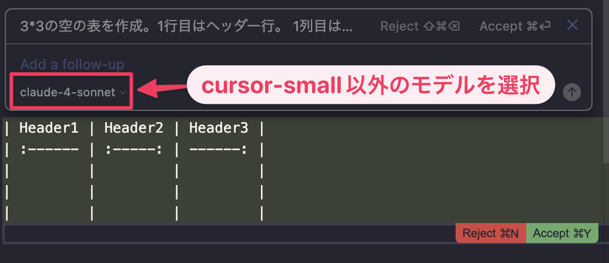

#### 表中のマークダウン記法について

テーブル内では、リンクや強調などのマークダウン記法も使用できます。ただし、見出しやリスト、画像は使用できません。

### 取り消し線

間違いや削除された内容を示すために使用します。2 つのチルダ（`~~`）で文字を囲みます。

~~この情報は古くなりました。~~ 最新の情報はこちらです。

```markdown
~~この情報は古くなりました。~~ 最新の情報はこちらです。
```

### タスクリスト

やることリストやチェックリストを作成できます。

- [x] 完了したタスク
- [ ] 未完了のタスク
- [ ] 別の未完了タスク

```markdown
- [x] 完了したタスク
- [ ] 未完了のタスク
- [ ] 別の未完了タスク
```

`[x]` がチェック済み、`[]` が未チェックを表します。

### ハイライト

重要な文字を蛍光ペンでマークしたように表示します。2 つの等号（`==`）で囲みます。

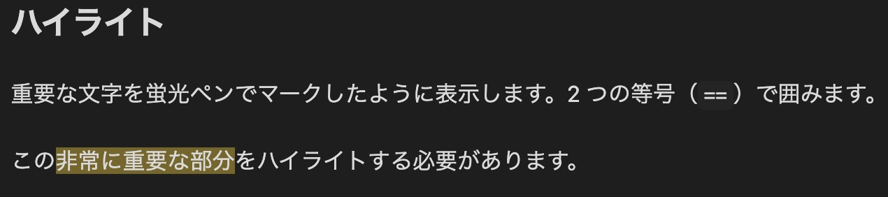

この==非常に重要な部分==をハイライトする必要があります。

```markdown
この==非常に重要な部分==をハイライトする必要があります。
```

すべてのハイライトはマークダウンアプリがサポートしているわけではありません。代替案として、HTML の `<mark>` タグも使用できます。

```markdown
この<mark>非常に重要な部分</mark>をハイライトします。
```

### 下付き文字

化学式や数学の表記で使用します。1 つのチルダ（`~`）で囲みます。

水の化学式は H~2~O です。

```markdown
水の化学式はH~2~Oです。
```

HTML を使用する場合：

```markdown
水の化学式はH<sub>2</sub>Oです。
```

### 上付き文字

数学の指数や注釈番号で使用します。1 つのキャレット（`^`）で囲みます。

E = mc^2^

```markdown
E = mc^2^
```

HTML を使用する場合：

```markdown
E = mc<sup>2</sup>
```
