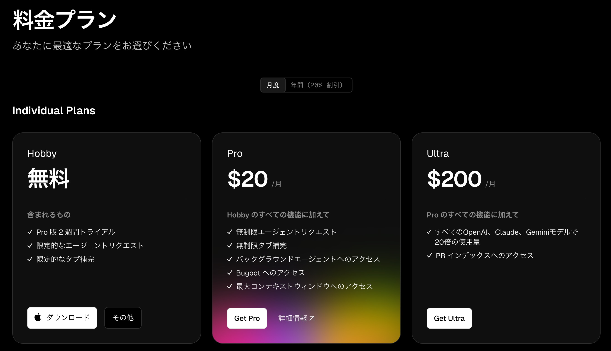
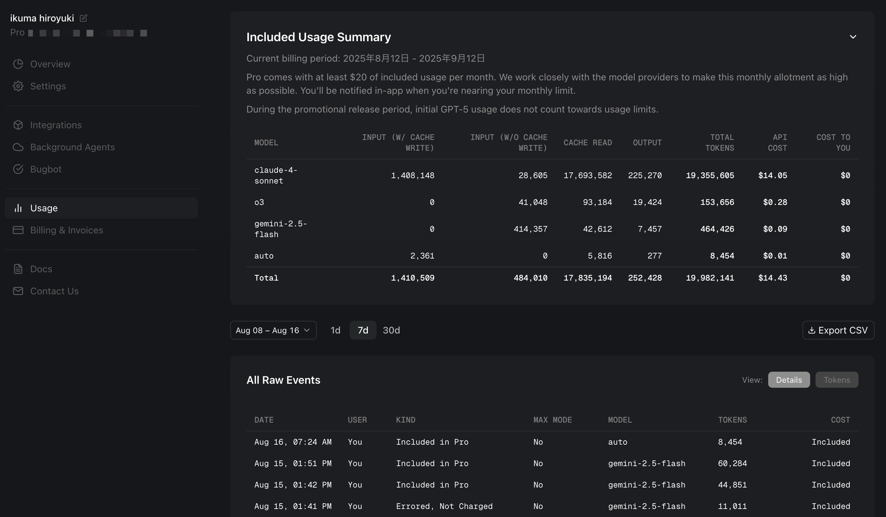
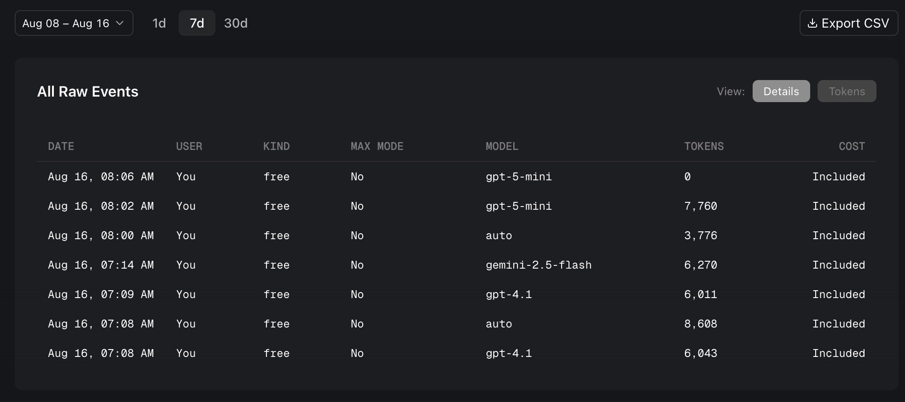
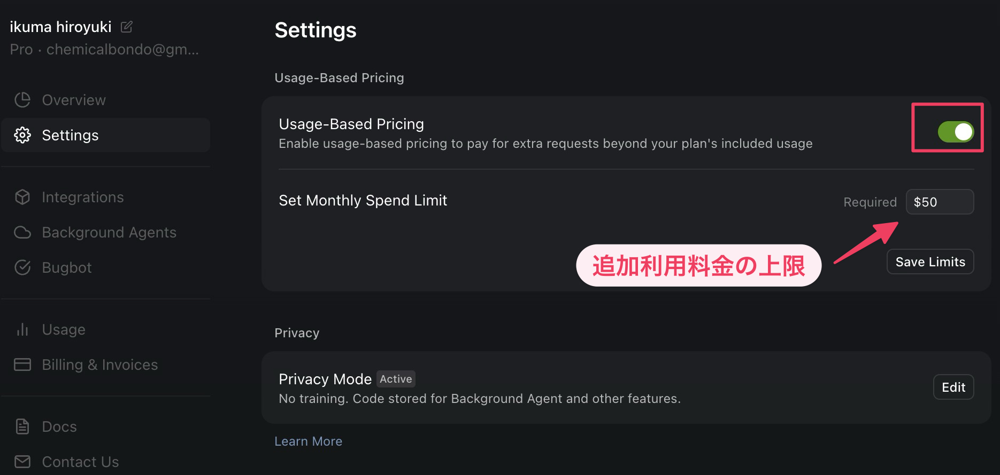

Cursor には大きく分けると無料プランと有料プランがあります。本書に掲載しているサンプルコードは有料プランで使える AI モデルを使って作られたものですが、無料プランでもそこそこ使えます。

まずは無料プランで AI に生成させたコードがうまく動かないという時により高度なモデルを利用するためプロプランに切り替えるという方針で良いかと思います。

[https://cursor.com/ja/pricing](https://cursor.com/ja/pricing)

それでは、料金プランと利用状況の確認画面について、もう少し具体的に見ていきましょう。

## 料金プラン

### Hobby プラン（無料）

Hobby プランは、無料プランです。Cursor の基本的な AI 機能を試せます。無料で使える AI モデルでもけっこう使えます。

**こんな方におすすめ**

- Cursor を試してみたい方
- 週末プログラマー
- 学生や個人の小規模プロジェクト
- 学業の課題に取り組む学生
- 個人的な趣味のプロジェクトを開発
- 有料プランへの移行を検討する前に、Cursor の基本機能を試したい

公式によると主な機能は以下のようになってますが、公式ドキュメントが充実しておらず詳しいことは読み取れません。

- Pro 版 2 週間トライアル
- 限定的なエージェントリクエスト
- 限定的なタブ補完

「限定的なエージェントリクエスト」は使えるモデルが限られている、という意味でしょう。執筆時点では gpt-5-mini や gemini-2.5-flash は使えますが claude-4-sonnet は使えません。

「限定的なタブ補完」はおそらく利用回数のことだと思われます。以前は 500 回/月だったと思いますが、具体的に何回かは不明です。

### Pro プラン（月額 $20）

Pro プランは月額 20 ドルからで、AI 利用時に発生する API 利用料金として月額 20 ドル分が利用可能です。

[https://docs.cursor.com/en/account/pricing](https://docs.cursor.com/en/account/pricing)

**こんな方におすすめ**

- フリーランスエンジニア
- スタートアップの開発者
- 日常的に AI アシスタンスを活用したい個人開発者
- 日々の業務で生産性向上を目指すプロのソフトウェアエンジニア
- クライアントワークで効率を重視するフリーランサー
- 高度な AI 支援機能を活用して開発を加速させたい小規模チーム

**主な機能**

- **月額 $20 相当の API 使用量**が含まれる
- **タブ補完**：無制限
- **AI リクエスト**：API 使用量の範囲内で利用可能

**実際の利用目安**

- **Claude 4 Sonnet **：約 225 リクエスト/月
- **Gemini**：約 550 リクエスト/月
- **GPT-5**：約 500 リクエスト/月

## Auto モードと Max モード

無料プラン・有料プランという軸とは別に Cursor には料金に関わる Auto モードと Max モードという軸があります。

### Auto モード

Auto モードは、Cursor がデフォルトで推奨する動作モードです。有効にすると、Cursor は現在のタスクに最も適したプレミアムモデルを自動的に選択します。というのが公式のアナウンスですが、あまり恩恵を感じたことはありません。Pro プランにおいては特別に安くなるわけでもなく、自分でモデルを選んだ方が結果的に上手く行きます。

無料プランでどのモデルが使えるかよく分からないときに Auto モードを使うのはありだと思います。ちなみに、本書執筆時点では以下のモデルを利用できました (全てを試したわけではありません)。

- gpt-5-mini
- gpt-4.1
- gemini-2.5-flash

### Max モード：大規模コードベースを扱うための究極兵器

Max モードは高度なタスクのために用意された、いわば「究極兵器」だそうです。無料プランでは使えません。

このモードを有効にすると、Cursor が AI に渡すコンテキスト（コードの文脈）の量が、標準の 20 万トークン（20,000~40,000 行のコードに相当）から、選択されたモデルが対応する最大値まで拡張されます。

要するにコードベースをより深く理解して活動してくれる、ということでしょう。

が、めちゃくちゃ高額です。あっという間に資金が溶けます。ここぞというとき以外使いたくありません。

## コスト管理画面

### 利用状況

利用状況は [https://cursor.com/ja/dashboard?tab=usage](https://cursor.com/ja/dashboard?tab=usage) で確認できます。いつ、どのモデルでどのくらい利用したか、利用料はいくらかが分かります。下図は Pro プランの画面です。

無料プランだと下図のように表示されます。

### 設定

必ず確認しておきたいのが [https://cursor.com/ja/dashboard?tab=settings](https://cursor.com/ja/dashboard?tab=settings) の Usage-Based Pricing です。

下図枠囲みにチェックが入っているとプラン内の API 利用料金を超えたときに設定した利用料上限まで AI のリクエストできる、という設定です。下図は例えば Pro プランであれば $20 を超えたときに追加で $50 まで使える、という設定です。

基本的にこのチェックはオフにしておけばよいと思います。
