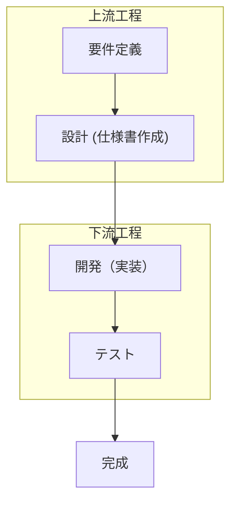
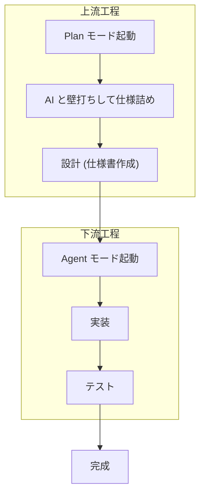

いよいよ Cursor での開発工程に入りますが、最初は「Plan モード」の作成から行います。これは、アプリケーションの設計書・仕様書を AI に作成させるための設定です。

プログラム開発では仕様書を元に開発しますが、バイブコーディングでもこれがあった方が精度の高い実装が期待できます。まずは一般的なプログラム開発の流れを確認します。

## プログラム開発の流れ

プログラム開発の流れはおおよそ以下のような流れです。

1. 要件定義: 何をしたいのか、何をすればゴールなのか
2. 設計: 要件を実現するためにどのような構造にするのか
3. 開発 (実装): 設計に基づいて実装する
4. テスト: 要件通り機能するかテスト

一般的に要件定義や設計を上流工程、開発やテストを下流工程と呼びます。この開発の流れにおいて、上流工程がしっかりしているほど、下流工程も堅牢になります。

近年の AI プログラミングツールには、AI と対話しながら仕様書を作成できるものがあります。Amazon が提供する Kiro という IDE が代表例です。しかし、本書執筆時点では Cursor には、**ユーザーが直接編集できる形**での Plan モードがありません。そこで、この Plan モードを自作してみましょう。作成手順は難しくありません。

### なぜ Plan モードがあるのか

そもそも、なぜ Plan モードが近年の AI プログラミングツールに組み込まれているのでしょうか？それは、要件や設計が曖昧な場合、AI が意図を誤って解釈し、期待通りのプログラムが生成されずに手戻りが発生する可能性があるためです。

## Plan モードを指導した開発の流れ

Plan モードを使用すると以下のような流れになります。システムを外注するときは人間のシステム屋さんと打ち合わせして仕様書を作成もらいます。Plan モードはそれを AI が行ってくれます。それだけではなく下流工程も含めてすべて AI が担います。まさに AI との協働時代の到来です。

※ Agent モードとは AI があなたの代わりにコンピューターを操作したりファイルを編集したりするモードです。

参考: [My current AI coding workflow. How I use custom Cursor modes to… | by Carl Rannaberg | Jun, 2025 | Medium](https://carlrannaberg.medium.com/my-current-ai-coding-workflow-f6bdc449df7f)
