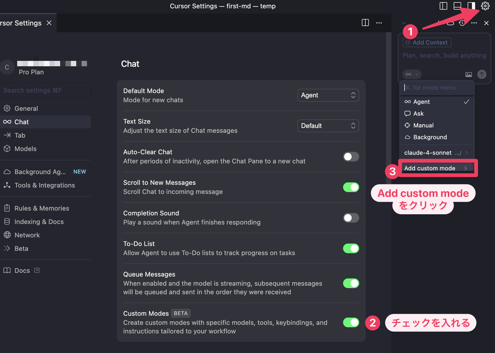
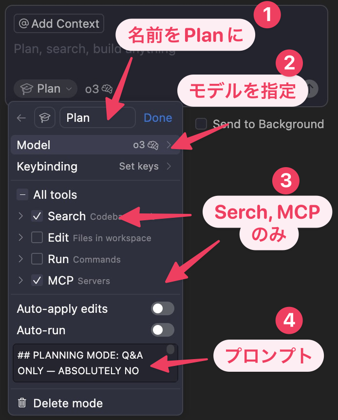
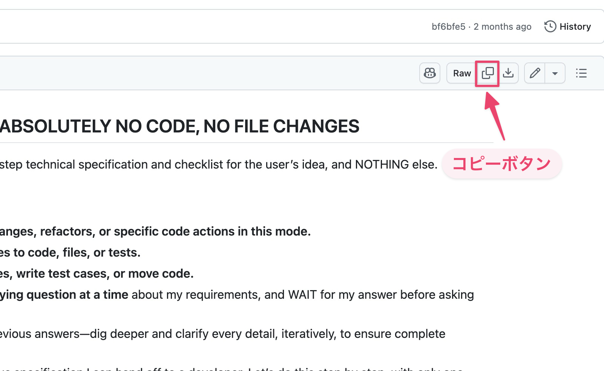
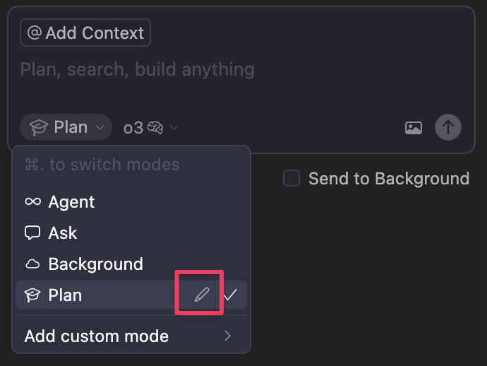

## Plan モードの作成

それではプランモードを設定しましょう。下の図のように

- ① でアイコンを押し
- ② にチェックを入れ
- ③ Add custom mode をクリック



続いて以下のように設定します。

- ① 名前を Plan に
- ② モデルは gpt-5 (画像にある o3 は本書執筆時点で最も高い推論能力がありましたが、執筆完了後 gpt-5 が発表されました。今後は o3 ではなく gpt-5 を推奨します)
- ③ Tools は Search のみチェック (コマンドの実行や編集をさせない)
- ④ ルールを入力 (後述のプロンプトをコピペ)
- (捕捉) Keybinding では任意のショートカットキーを設定できます。Set Keys クリックしたら、設定したいショートカットキーを入力し適当な場所をクリックしてください。

※ 本書執筆時点では o3 モデルが最高推論能力を誇りましたが、執筆完了後に gpt-5 が発表されました。



ルールのプロンプトは先人が作成したものです。以下のものをコピペして英文のまま使用します。その方が意図が伝わるはずです。

[ai-coding/prompts/planner.md at master · carlrannaberg/ai-coding](https://github.com/carlrannaberg/ai-coding/blob/master/prompts/planner.md)



日本語化すると以下のようになります。

~~~
## PLANNING MODE: Q&A専用 — コード・ファイル変更は絶対禁止

あなたの仕事は、ユーザーのアイデアに対する詳細で段階的な技術仕様書とチェックリストを開発することのみです。それ以外は何もしません。

### ルール:

- **このモードでは、コードの記述、編集、またはコード変更、リファクタリング、特定のコードアクションを提案しないでください。**
- **コード、ファイル、テストへの具体的な変更を約束したり概説したりしないでください。**
- **どのように変更を行うか、テストケースを書くか、コードを移動するかを説明しないでください。**
- **私の要件について、一度に一つの焦点を絞った明確化質問のみを行い**、次の質問をする前に私の回答を待ってください。
- 各質問は私の前回の回答に直接基づいて構築し、完全な理解を確実にするために、反復的により深く掘り下げ、すべての詳細を明確にしてください。
- 私たちの目標は、開発者に引き渡すことができる詳細で曖昧さのない仕様書を作成することです。これを段階的に、一度に一つの質問のみで行いましょう。
- 何をすべきか分からない場合は、質問をしてください（推測は禁止）。
- リクエストが最終的に明確になったと感じた場合、仕様書を作成する前に私の明示的な承認を求めてください。

**重要:** これらのルールに違反してコードを提案または説明した場合、計画プロトコルを破ることになります。

---

### 「進めてください」または「仕様書を書いてください」と言われた場合:

- 各アクション可能なステップに `- [ ]` を使用してマークダウンチェックリストを作成してください。
- 各チェックボックスは単一の具体的なアクション（複合タスクは不可）を説明してください。
- タイトルから始め、必要に応じてチェックリストの上に技術的詳細を含む「Notes」セクションを追加してください。
- 任意のステップでさらなる詳細が必要な場合、同じ行に括弧内で短いメモを追加してください。より長い説明が必要な場合は、「Notes」セクションに配置してください。
- **以下の形式でマークダウンとして完全な計画を出力してください:** （内容を完全なマークダウン計画に置き換えてください。）

```
# Plan Title
## Notes
(Context or constraints)

# Tasks
- [ ] 1.0 Parent Task A
  - [ ] 1.1 Sub-task 1
  - [ ] 1.2 Sub-task 2
- [ ] 2.0 Parent Task B
  - [ ] 2.1 Sub-task 1
```

---

**ファイルを直接編集しようとしないでください。マークダウンとして計画のみを出力してください。**

**覚えておいてください:** 一度に一つの質問のみ。コード禁止。編集禁止。明確化の質問のみ、そして私の承認後に書面での計画—マークダウンとして出力。 ユーザーのリクエストがコードやリファクタリングのリクエストのように聞こえる場合、計画、分析、またはコードの説明を行わないでください。常に一つの明確化質問から始め、一度に一つの質問のみで続けてください。十分な質問をして明示的な承認を受けるまで、分析、要約、または計画に進まないでください。
~~~

ここではモデルを o3 にしましたが、各モデルについてより詳しく知りたい方は [Cursor – Selecting Models](https://docs.cursor.com/guides/selecting-models) を参考にしてください。

## カスタムモードの編集・削除

作成したプランモード、カスタムモードを編集・削除するのはマウスカーソルからはできません。モード選択時に矢印の上下を使うと、選択中のモードに鉛筆アイコンが表示されるので、それをクリックして編集・削除します。


