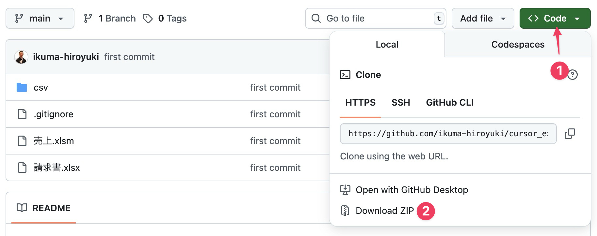
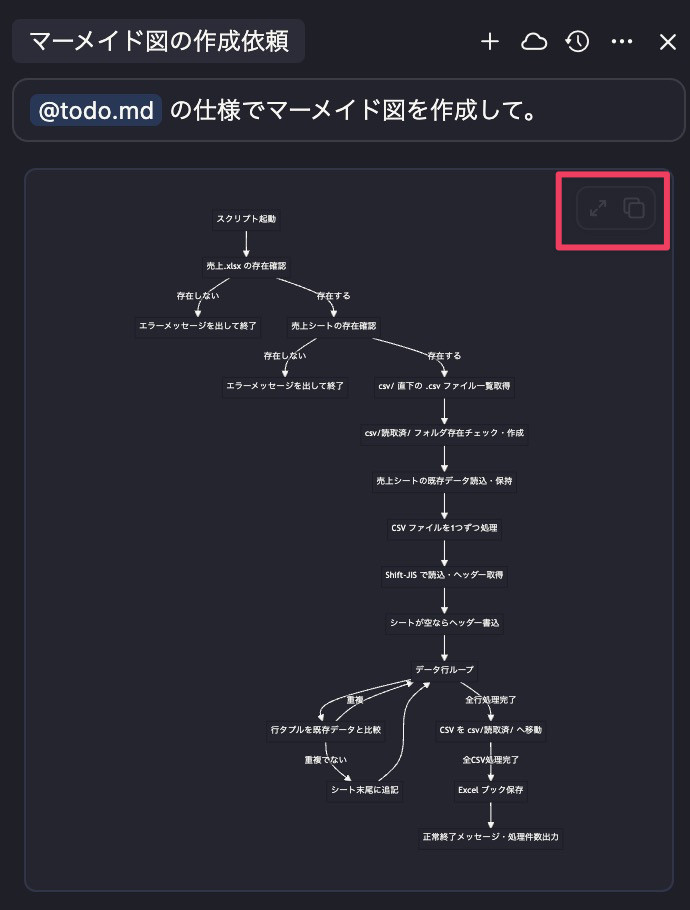

## 売上データを取り込むシナリオ

作成した Plan モードで仕様書を作成する前に作成するプログラムのシナリオについて説明します。今回は多くの方が日々触る Excel 作業を自動化する Python プログラムを開発します。**基幹システムから出力した売上データ CSV ファイルを Excel に取り込み、複数ある取引先ごとに任意の月の請求書 (PDF) を一括作成する**、というシナリオです。

当初は Windows でも macOS でも動作する Excel VBA という Excel に組み込めるプログラムを AI に作らせようとしたのですが macOS 用のプログラムがどうしてもうまくいきませんでした。おそらく macOS VBA の AI 学習データが少ないためだと思われます。

どこがまずいのか私には分かりますが、本書はプログラミング未経験の方を対象にしたバイブコーディングですからそれでは意味がありません。そのためどちらの OS でも使える Python で解説することにしました。

ここまで読み進めてあなたであればお分かりだと思いますが、Python の実行環境を揃えるだけでも大変ですよね。でも、最終的にはアイコンをダブルクリックするだけでプログラムを実行でき、Python がインストールされていない他の方に配布して使えるようにします。楽しみにしていてください。

まずは必要なファイルをダウンロードしてください。[ikuma-hiroyuki/cursor\_excel\_py](https://github.com/ikuma-hiroyuki/cursor_excel_py) にアクセスし、Code をクリック、Download ZIP をクリックし、ダウンロード、解凍してください。



解答したフォルダをカーソルドラッグ&ドロップしてください。下図の枠囲み「Open project」から指定することもできます。


中身は以下のような感じになっています。


 CSV というフォルダと請求書.xlsx、売上.xlsx があります。CSV フォルダーの中には各店舗の売上データが入っており、全てのファイルに同じ構造でタイトル行があります。

 ここで CSV ファイルについて簡単に説明しておきます。

### CSV ファイルについての捕捉

おそらく多くの方のパソコンで CSV ファイルをダブルクリックすると、Excel が開かれ、中身が表示されると思います。しかし CSV ファイルは Excel ファイルとは違います。上の図のようにデータをカンマ区切りで表現したのが CSV ファイルです。CSV は **C**omma **S**eparated **V**alues の略で中身はただのテキストファイルです。Cursor などのエディターで開くとそれがよくわかりますね。

ここで注目していただきたいのは下図右下の枠囲み、Shift_JIS と書かれた部分です。これは文字コードというもので、コンピューターで文字を表す時の規格です。色々な種類がありますが、現代は UTF-8 という規格が一般的に使われます。最初に CSV ファイルを開くと下図のように表示されていると思います。


これは shift-jis という規格でファイルが作られているのに、UTF-8 の規格で CSV ファイルを表示しているため、文字化けしてしまっています。shift-jis は UTF-8 が主流になる以前の日本語環境でよく使われていた規格ですが、日本語環境では未だによく登場します。

文字化けを直すために shift-jis で再度開き直しましょう。文字コードを変更するには、上の図の枠囲み部分をクリックし「エンコード付きで再度開く」選択


候補の中から shift-jis を選択してください。


### 売上.xlsm について

データは売上.xlsx に取り込みます。売上シートと取引先シートがありますが、今回は売上シートのみ使います。CSV ファイルの中身をすべて売上シートに転記します。取引先シートは後で請求書を作る時に使います。


## Cursor で Excel ファイルを直接閲覧できる拡張機能

Cursor には Excel ファイルの中身を直接閲覧できる拡張機能があります。ここでは Office Viewer を紹介します。インストールして Cursor で Excel ファイルをクリックすると下図右側のように中身を確認できます。


## 売上データの取込仕様書作成

では仕様書を作成しましょう。

ここでのポイントは転記〜請求書作成までを**一気に実装しようとしない**ことです。一気に実装しようとすると精度が下がります。そのためここでは「**売上データ CSV を Excel に取り込む**」部分と「**請求書を作成する**」部分の 2 つに分けます。どのような単位で分割すればよいか？は経験と勘が頼りですが、新人君に仕事を割り振る時をイメージしてみてください。

新しいチャットを始めて以下のように設定します。まず、Plan モードを選択し (①)、以下のようなプロンプトを入力したら、上向き矢印ボタンを押すか、`Enter` キーを押して AI との壁打ちを開始します (②)。

```
@csv/ のCSVファイルを読み取って 売上.xlsxの売上シートに出力したい。読取り済のCSVファイルはCSVフォルダの中に「読取済」フォルダを作って移動。Pythonで作成する。
```


なお、プロンプトを入力するときに改行したい場合は `Enter` キーだとプロンプト送信になってしまうため `Shift+Enter` を押してください。

### @ シンボルについての捕捉

ここで初めて登場した `@` について触れておきます。いわゆるメンションというやつで、対象のファイルやフォルダを指定するときに使う記号です。`@` に続いて csv と入力し、Enter キーを押すと少し色が変わります。キーボードから入力する方法の他に、マウスでファイルやフォルダをドラッグしても OK です。


なお、`@` を使うときに前後に全角文字があるとうまく機能しませんので注意してください。

`@` については以下の公式ドキュメントも参考にしてください。

[Cursor – @ symbols](https://docs.cursor.com/context/@-symbols/overview)

### 仕様の確定

AI と壁打ちを繰り返すと最終的に仕様書の作成を促されます。例えば下の図のように「ok」と入力してエンターを押すと仕様書はコピーできるテキストになりますので、これでマークダウンファイルを作ります。


コピーボタンは下図チャット末尾の枠囲みのアイコンです。


コピーしたら「todo.md」ファイルを作りペーストします。これは AI に読ませるためのドキュメントです。何が書いてあるか理解しなくて構いません。バイブコーディングですから。


仕様書の中身は以下のようになりました。下記 URL からコピーできます。本書を進める上で環境を合わせるためできればコピーしてお使いください。

https://gist.github.com/ikuma-hiroyuki/acf54c9a1bab9b6129e3f7b5629ca0b8

```markdown
# CSV 売上取込スクリプト仕様

## Notes
- ワークスペース直下に `売上.xlsx` が存在し、かつ同ブックに `売上` シートが存在することを前提とする。存在しない場合は処理を中止し、エラーを返す
- 取込対象 CSV は `csv/` 直下にある拡張子 `.csv` のファイルすべて（サブフォルダは対象外）
- CSV は Shift-JIS エンコーディング
- CSV の 1 行目はヘッダー（全ファイル同一構成）
- 取込先シートが空の場合、先頭にヘッダー行を書き込む
- 取込時はシート末尾に追記する
- 取込前にシート全体を読込み、各行を「全列値の完全一致」で比較し、重複行をスキップする
- 取込後、処理済み CSV は `csv/読取済/` に移動（フォルダが無ければ作成）し、同名ファイルがあれば上書き
- 処理中に発生した例外・I/O エラーは呼び出し元へ送出するか、明示的にログ出力して終了する

# Tasks
- [ ] 1.0 スクリプト起動時にワークスペース直下の `売上.xlsx` の存在を確認
  - [ ] 1.1 同ブック内に `売上` シートが存在するか確認
- [ ] 2.0 エラー条件検査
  - [ ] 2.1 ファイルまたはシートが無ければエラーメッセージを出して終了
- [ ] 3.0 `csv/` 直下の `.csv` ファイル一覧を取得
- [ ] 4.0 `csv/読取済/` フォルダの存在をチェックし、無ければ作成
- [ ] 5.0 取込先シートの既存データをすべて読み込み、行をタプル等で保持
- [ ] 6.0 CSV ファイルを 1 つずつ処理
  - [ ] 6.1 Shift-JIS で読込み、ヘッダー行を取得
  - [ ] 6.2 シートが空であればヘッダーを先頭行に書込む（列順そのまま）
  - [ ] 6.3 データ行をループ
    - [ ] 6.3.1 行タプルを既存データと比較し、重複ならスキップ
    - [ ] 6.3.2 重複でなければシート末尾に追記
  - [ ] 6.4 CSV ファイルを `csv/読取済/` へ移動（同名があれば上書き）
- [ ] 7.0 すべての CSV が完了したら Excel ブックを保存
- [ ] 8.0 正常終了メッセージまたは処理件数などを出力
```

ちなみに o3 モデルとのやりとりは以下のような感じです。

```markdown
# CSVファイルをExcelに出力する方法

**User**

@csv/ のCSVファイルを読み取って 売上.xlsxの売上シートに出力したい。読取り済のCSVファイルはCSVフォルダの中に「読取済」フォルダを作って移動。pythonで作成する。

---

**Cursor**

「売上.xlsx」の『売上』シートには、どのような列（順序・見出し名）が存在し、今回取り込む CSV のデータをどの列に対応させたいですか？
また、既に同シートにデータがある場合は追記（末尾に追加）か上書きか、どちらをご希望でしょうか？

---

**User**

csvと同じ並びにする。データは追記する。

---

**Cursor**

「売上」シートには既に CSV と同じ見出し行（ヘッダー行）が入っていますか？
入っていない場合、今回の処理で最初にヘッダー行を追加する必要がありますか？

---


**User**

入っていない。最初に追加する必要がある。がcsvファイルのヘッダー行は全て同じ構成になっている前提。

---

**Cursor**

CSV ファイルはどの文字コード（例: UTF-8, Shift_JIS など）で保存されていますか？

---

**User**

すべてshift-jis

---

**Cursor**

取込済みの行が「売上」シートにすでに存在する場合（たとえば同じ CSV を誤って二度読み込んだ場合）でも、そのまま追記して重複行が出来ても構わないでしょうか？ それとも、重複を検知してスキップするロジックが必要ですか？

---

**User**

全ての列が同じ場合は重複とし、スキップしたい

---

**Cursor**

処理対象の CSV は
「csv フォルダ直下に存在する *.csv すべて」でよろしいでしょうか？
その場合、読取後に移動する「読取済」フォルダも csv フォルダの直下に作成する、という理解で合っていますか？

---

**User**

csv フォルダ直下に存在する .csv すべてでよい。「読取済」フォルダも csv フォルダの直下に作成する理解でよい。

---

**Cursor**

もしワークスペースに「売上.xlsx」ファイル自体が存在しない、または存在しても『売上』というシートがまだ無い場合には、スクリプト側で自動的に
1) 新しいブックを作成する
2) 既存ブックに『売上』シートを新規追加する

のどちらも許可してよろしいでしょうか？ それとも、そのような場合はエラーとして終了させるべきでしょうか？

---

**User**

売上.xlsxと売上シートがない場合はエラーとして終了させる。

---

**Cursor**

読み込み完了後に CSV を csv/読取済 へ移動する際、すでに同名ファイルが存在した場合は
1) 上書きして構わない
2) 別名（タイムスタンプなどを付与）で保存
3) エラーにして処理を止める

のいずれをご希望ですか？

---

**User**

上書きする

---

**Cursor**

「売上.xlsx」はワークスペース（このスクリプトを置く場所）直下に存在する想定でよろしいでしょうか？

---

**User**

よい

---

**Cursor**

要件を整理すると以下のようになります。ご確認ください。

1. 対象 CSV
• パス: `csv/` 直下にある拡張子 `.csv` のファイルすべて
• 文字コード: Shift-JIS
• 先頭行はすべて同一構成のヘッダー行

2. 取込先 Excel
• ファイル: ワークスペース直下の `売上.xlsx`
• シート: `売上`
• ファイルまたはシートが存在しない場合はエラー終了

3. 取込ロジック
• シートが空の場合、最初に CSV のヘッダー行をそのまま書き込む
• 行追加はすべて末尾に追記
• 重複判定: 「シート内に同一内容の行が 1 行でも存在する場合、その CSV 行はスキップ」
(比較対象列はヘッダーに含まれる全列)

4. 処理後の CSV
• `csv/読取済/` フォルダを（存在しなければ作成して）移動
• 同名があっても上書き保存

5. エラー条件
• Excel ファイルまたはシートが無い
• その他 I/O エラー等が起きた場合は適宜例外を投げる

この内容で仕様書（チェックリスト）を作成してよろしいでしょうか？

---

**User**

ok
```

## 使用したトークンの確認

チャット末尾を見ると n% という表記があります。これは各 AI に設定されているトークンに対して今のスレッドがどの程度使用しているか、というものです。

トークンがいっぱいになると AI の頭が悪くなっていきます。以前行ったやりとりを忘れて同じ事を何度もループする、といったことが起きます。スレッドで使用中のトークンを横目で見ながら進めてください。


トークンがいっぱいになったら新しいチャットを始めるようにしてください。新しいチャットでは、@を使って Past Chats の中から以前のチャットを選ぶと良いです。そのチャットを要約して AI、それを元に回答してくれます。


### マーメイド図で視覚化

今回のような定型的で簡易なプログラムの仕様書としてはこれで十分だと思いますが、今後のために Mermaid (マーメイド) 図で視覚化する方法も学んでおきましょう。

マーメイド図とは文字列でフローチャートやガントチャートどを作成できる記法で、拡張機能「Markdown Preview Enhanced」をインストールしていればマークダウンファイルに組み込んで表示できます。

マーメイド図を作成するためには新しいチャットを開始し、Ask モードに切り替えて次のように AI に指示します。(Ask モードは AI に質問したり相談したりするモードです)

```
@todo.md の仕様でマーメイド図を作成して。
```

※「新しいチャットを開く」動作はけっこう重要です。チャット履歴が長くなると AI が指示を忘れたり AI 自身が行った処理を忘れてしまい精度が落ちます。新しい依頼する時や精度が落ちてきたなと感じたら「新しいチャット」を開いてください。

AI にとってマーメイド図の作成はそれほど負荷が高くないでしょうからコストを抑えるためにモデルを gpt-4.1(もしくは gpt-5-mini) にします。


すると以下のようにマーメイド図が作成されます。下の図の枠囲み部分の左のアイコンは図を拡大表示するボタン、右側はマーメイド図のテキストをコピーするボタンです。



右側のテキストコピーボタンをクリックし、エディタに以下のように入力し

~~~
```mermaid

```
~~~

入力したら \`\`\` の中にペーストし、プレビュー表示してください。断然見やすくなったのではないでしょうか？


なお、今回作成されたマーメイド図の文字列は以下のものでした。AI の出力なのであなたの環境とは違うものができている可能性がありますが。

~~~
```mermaid
flowchart TD
    A["スクリプト起動"] --> B["売上.xlsx の存在確認"]
    B -->|"存在しない"| X1["エラーメッセージを出して終了"]
    B -->|"存在する"| C["売上シートの存在確認"]
    C -->|"存在しない"| X2["エラーメッセージを出して終了"]
    C -->|"存在する"| D["csv/ 直下の .csv ファイル一覧取得"]
    D --> E["csv/読取済/ フォルダ存在チェック・作成"]
    E --> F["売上シートの既存データ読込・保持"]
    F --> G["CSV ファイルを1つずつ処理"]
    G --> H["Shift-JIS で読込・ヘッダー取得"]
    H --> I["シートが空ならヘッダー書込"]
    I --> J["データ行ループ"]
    J --> K["行タプルを既存データと比較"]
    K -->|"重複"| J
    K -->|"重複でない"| L["シート末尾に追記"]
    L --> J
    J -->|"全行処理完了"| M["CSV を csv/読取済/ へ移動"]
    M -->|"全CSV処理完了"| N["Excel ブック保存"]
    N --> O["正常終了メッセージ・処理件数出力"]
```
~~~

マーメイド図にもいろいろな種類がありますが、今回は特に種類の指定はしませんでした。興味があればどのような種類があるかご自身で調べて指示してみてください。いかの記事もとても参考になると思います。

[Markdown × AI で図解を効率化！コピペで使えるMermaidプロンプト集](https://zenn.dev/aun_phonogram/articles/aba7a591fa10de)
