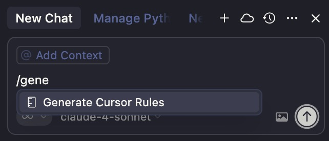
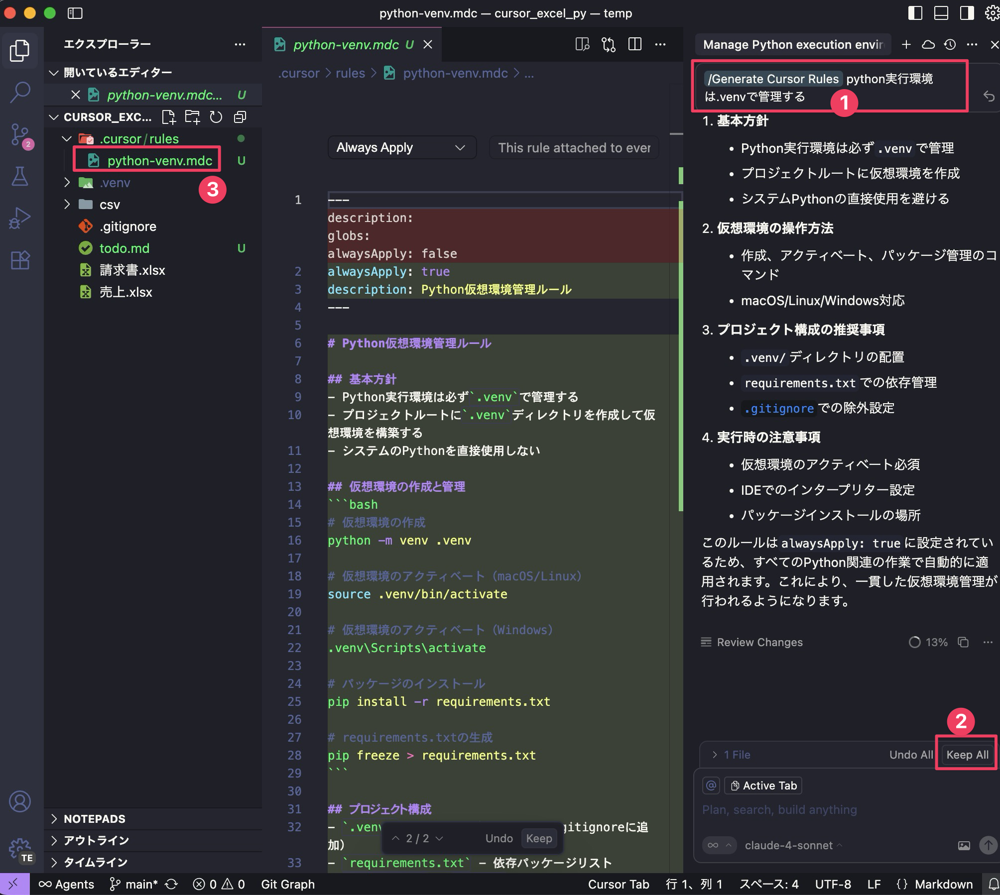
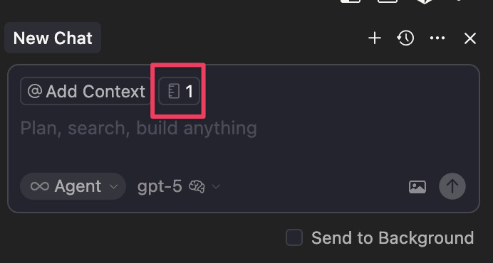

ここまでの工程で仕様書ができました。次は Agent モードで実装させるのですが、その前に Cursor に守らせるプロジェクトルールを作っておきましょう。Agent モードで自動運転させる時により安全に実行させるためのルール作りです。このルールはプロジェクト (エクスプローラーで表示されているフォルダ) ごとに適用されます。

ルールは Cursor が理解できる形式で書く必要がありますが、AI に作成させます。

新しいチャットを開いて `/gene` あたりまで入力すると `Generate Cursor Rules` と表示されるので、Enter キーを押します。



続けて以下のように入力し、AI に指示を出します (下図 ①)。使用するモデルは、gpt-5-mini や claude-4-sonnet あたりが良いでしょう。

```
Python実行環境は.venvで管理する
```

このプロンプトの意味は後ほど解説します。

AI がルールファイルを作り終えたらチャット画面下部に、「Undo All」「Keep All」というボタンが表示されます (②)。これは、AI が生成したコードをすべて受け入れない、あるいはすべて受け入れるというボタンです。Keep All で全て受け入れます。③ でルールを記述したファイルが作られたことがわかります。



これは AI エージェントが活動するときに読み込まれるファイルで、このように指示しておかないと仮想環境 (後述) の存在を忘れたりいろいろ面倒な事が起こりがちです。プロジェクトごとに忘れず作成しておきましょう。

ここで設定したルールは適用されていれば下図のようにチャット欄に表示されます。


