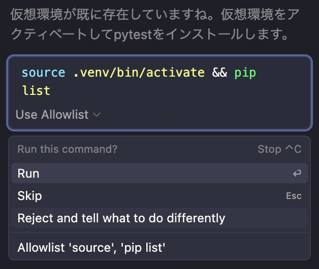
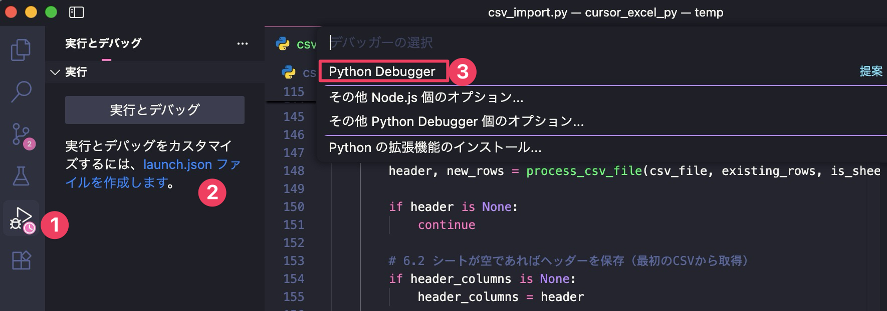
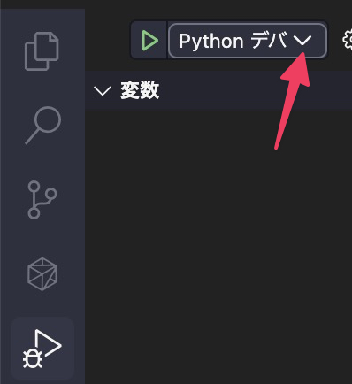

## Agent モードで実装

### 実装の指示

ここまでの工程で仕様書とプロジェクト固有のルールファイルができました。次は Agent モードで実装させます。新しいチャットを開いて、以下のようにプロンプトを入力します。モデルは、claud-4-sonnet を使います。

```
@todo.md にしたがってpythonプログラムを作成して。
```


AI によるコード生成が開始されます。しばらく待つと実装が終了し、csv_import.py が作成されました。


コードを読み解ければ部分的に受け入れたり拒否したりできますが、バイブコーディングですので、ここでは Keep All をクリックします。

生成された Python プログラムは、以下のものです。AI が生成するコードは同じものが生成される保証はありません。生成させる手順をご自身で試した後、話を合わせるため以下に示したもの置き換えていただければと思います。(ご自身でコードが読み解ける場合、置き換える必要はありません)

[csv\_import.py](https://gist.github.com/ikuma-hiroyuki/4d83ede22f50c2c3deed8d21a23339a9)

```python
#!/usr/bin/env python3
# -*- coding: utf-8 -*-
"""
CSV 売上取込スクリプト

ワークスペース直下の売上.xlsxの売上シートに、csv/フォルダ内のCSVファイルを取り込むプログラム
重複行はスキップし、処理済みCSVはcsv/読取済/フォルダに移動する
"""

import os
import shutil
import pandas as pd
from pathlib import Path
import glob
import sys


def check_excel_file_and_sheet():
    """売上.xlsxファイルと売上シートの存在確認"""
    excel_path = "売上.xlsx"

    # 1.0 売上.xlsxの存在確認
    if not os.path.exists(excel_path):
        print(f"エラー: {excel_path} が見つかりません。")
        sys.exit(1)

    # 1.1 売上シートの存在確認
    try:
        excel_file = pd.ExcelFile(excel_path)
        if "売上" not in excel_file.sheet_names:
            print("エラー: 売上.xlsx に '売上' シートが存在しません。")
            sys.exit(1)
        excel_file.close()
    except Exception as e:
        print(f"エラー: 売上.xlsx の読み込みに失敗しました: {e}")
        sys.exit(1)

    return excel_path


def get_csv_files():
    """csv/直下の.csvファイル一覧を取得"""
    csv_folder = "csv"
    if not os.path.exists(csv_folder):
        print(f"エラー: {csv_folder} フォルダが存在しません。")
        sys.exit(1)

    # 3.0 csv/直下の.csvファイル一覧を取得（サブフォルダは対象外）
    csv_files = glob.glob(os.path.join(csv_folder, "*.csv"))
    return csv_files


def ensure_processed_folder():
    """csv/読取済/フォルダの存在チェックと作成"""
    # 4.0 csv/読取済/フォルダの存在をチェックし、無ければ作成
    processed_folder = os.path.join("csv", "読取済")
    if not os.path.exists(processed_folder):
        os.makedirs(processed_folder)
    return processed_folder


def load_existing_data(excel_path):
    """取込先シートの既存データを読み込み"""
    try:
        # 5.0 取込先シートの既存データをすべて読み込み、行をタプル等で保持
        df = pd.read_excel(excel_path, sheet_name="売上")
        # 各行をタプルとして保持（重複チェック用）
        existing_rows = set()
        for _, row in df.iterrows():
            row_tuple = tuple(row.values)
            existing_rows.add(row_tuple)
        return df, existing_rows
    except Exception as e:
        # シートが空の場合やデータがない場合
        return pd.DataFrame(), set()


def process_csv_file(csv_file_path, existing_rows, is_sheet_empty):
    """CSVファイルを処理して新規データを返す"""
    try:
        # 6.1 Shift-JISで読込み、ヘッダー行を取得
        df = pd.read_csv(csv_file_path, encoding='shift_jis')

        new_rows = []
        header = df.columns.tolist()

        # 6.3 データ行をループ
        for _, row in df.iterrows():
            # 6.3.1 行タプルを既存データと比較し、重複ならスキップ
            row_tuple = tuple(row.values)
            if row_tuple not in existing_rows:
                # 6.3.2 重複でなければ追記用リストに追加
                new_rows.append(row.values)
                existing_rows.add(row_tuple)  # 次回の重複チェック用に追加

        return header, new_rows

    except Exception as e:
        print(f"エラー: {csv_file_path} の読み込みに失敗しました: {e}")
        return None, None


def move_csv_to_processed(csv_file_path, processed_folder):
    """CSVファイルをcsv/読取済/フォルダに移動"""
    try:
        # 6.4 CSVファイルをcsv/読取済/へ移動（同名があれば上書き）
        filename = os.path.basename(csv_file_path)
        destination = os.path.join(processed_folder, filename)
        shutil.move(csv_file_path, destination)
        print(f"移動完了: {csv_file_path} -> {destination}")
    except Exception as e:
        print(f"エラー: {csv_file_path} の移動に失敗しました: {e}")


def main():
    """メイン処理"""
    print("CSV売上取込スクリプトを開始します...")

    # 1.0, 2.0 売上.xlsxとシートの存在確認
    excel_path = check_excel_file_and_sheet()

    # 3.0 csv/直下の.csvファイル一覧を取得
    csv_files = get_csv_files()

    if not csv_files:
        print("処理対象のCSVファイルが見つかりません。")
        return

    print(f"処理対象CSVファイル数: {len(csv_files)}")

    # 4.0 csv/読取済/フォルダの確認・作成
    processed_folder = ensure_processed_folder()

    # 5.0 既存データの読み込み
    existing_df, existing_rows = load_existing_data(excel_path)
    is_sheet_empty = existing_df.empty

    # 全ての新規データを蓄積するリスト
    all_new_data = []
    header_columns = None
    total_processed_rows = 0
    processed_files = 0

    # 6.0 CSVファイルを1つずつ処理
    for csv_file in csv_files:
        print(f"処理中: {csv_file}")

        header, new_rows = process_csv_file(csv_file, existing_rows, is_sheet_empty)

        if header is None:
            continue

        # 6.2 シートが空であればヘッダーを保存（最初のCSVから取得）
        if header_columns is None:
            header_columns = header

        if new_rows:
            all_new_data.extend(new_rows)
            total_processed_rows += len(new_rows)
            print(f"  新規データ行数: {len(new_rows)}")
        else:
            print(f"  新規データなし（すべて重複）")

        # 6.4 処理済みCSVを移動
        move_csv_to_processed(csv_file, processed_folder)
        processed_files += 1

    # Excelファイルの更新
    if all_new_data:
        try:
            # 新規データをDataFrameに変換
            new_df = pd.DataFrame(all_new_data, columns=header_columns)

            if is_sheet_empty:
                # シートが空の場合、新規データをそのまま書き込み
                final_df = new_df
            else:
                # 既存データと新規データを結合
                final_df = pd.concat([existing_df, new_df], ignore_index=True)

            # 7.0 Excelブックを保存
            with pd.ExcelWriter(excel_path, mode='a', if_sheet_exists='replace') as writer:
                final_df.to_excel(writer, sheet_name='売上', index=False)

            print(f"売上.xlsx に {total_processed_rows} 行のデータを追加しました。")

        except Exception as e:
            print(f"エラー: Excelファイルの保存に失敗しました: {e}")
            sys.exit(1)
    else:
        print("新規追加データがありませんでした。")

    # 8.0 正常終了メッセージまたは処理件数などを出力
    print("=" * 50)
    print("処理完了しました。")
    print(f"処理したCSVファイル数: {processed_files}")
    print(f"追加したデータ行数: {total_processed_rows}")
    print("=" * 50)


if __name__ == "__main__":
    main()
```

このやり取りに関わる AI からの出力は以下のようになりました。

~~~
# Pythonプログラムの作成依頼

_Exported on 2025/8/4 at 15:14:29 JST from Cursor (1.3.9)_

---

**User**

@todo.md にしたがってpythonプログラムを作成して。

---

**Cursor**

`todo.md`の仕様に従って、CSV売上取込スクリプトをPythonで作成します。まず、`todo.md`ファイルの内容を確認しましたので、仕様に基づいてプログラムを作成します。

仕様に従ってPythonスクリプト `csv_import.py` を作成しました。このスクリプトは以下の機能を実装しています：

## 実装された機能

### 1. ファイル・シート存在確認
- ワークスペース直下の `売上.xlsx` の存在確認
- 同ブック内の `売上` シートの存在確認
- 存在しない場合はエラーメッセージを出力して終了


### 2. エラーハンドリング
- ファイルまたはシートが見つからない場合の適切なエラー処理
- I/Oエラーの捕捉と明示的なエラーメッセージ出力

### 3. CSV処理
- `csv/` 直下の `.csv` ファイル一覧取得（サブフォルダは対象外）
- Shift-JISエンコーディングでの読み込み
- ヘッダー行の取得と処理

### 4. 重複チェック機能
- 既存シートデータの全行読み込み
- 各行をタプル化して完全一致での重複比較
- 重複行のスキップ処理


### 5. データ追記機能
- シートが空の場合のヘッダー行書き込み
- シート末尾への新規データ追記
- 既存データとの結合処理


### 6. ファイル管理
- `csv/読取済/` フォルダの自動作成
- 処理済みCSVファイルの移動（同名ファイルの上書き）


### 7. 処理結果の出力
- 処理したCSVファイル数の表示
- 追加したデータ行数の表示
- 正常終了メッセージの出力


## 使用方法

```bash
python csv_import.py
```


## 必要なライブラリ
このスクリプトは以下のライブラリを使用しています：

- `pandas`: Excel・CSV操作用
- `openpyxl`: Excel操作用（pandasの依存関係）

必要に応じて以下のコマンドでインストールしてください：

```bash
pip install pandas openpyxl
```

スクリプトは `todo.md` に記載された全ての仕様要件を満たしており、フローチャートに従った処理順序で実装されています。

```shellscript
python csv_import.py
```

```shellscript
pip install pandas openpyxl
```
~~~

以下の箇所は追加説明が必要だと思いますので解説します。


### プログラム実行方法の解説

AI が提示した使用方法には以下のコマンドを実行するように記述されています。

```bash
python csv_import.py
```

これはターミナルで実行するという意味ですが、最初の Python は「ターミナルで Python を実行」、次の csv_import.py は「Python で実行するのはこのファイル」という意味です。

ターミナルを表示するには、画面右上のパネルの「切り替えアイコン」をクリックします。表示されているショートカットキーでも開けますので、ショートカットキーで開く方法にもチャレンジしてみてください。


ターミナルを開くと下の図のように表示されます。これで先ほどのコマンドを入力し実行すると、この Python プログラムが動き始めますが、この前にもう 1 つやっておくことがあります。


先ほど AI の出力した必要なライブラリという項目には以下のように書いてありました。言葉の補足します。

```
## 必要なライブラリ
このスクリプトは以下のライブラリを使用しています：

- `pandas`: Excel・CSV 操作用
- `openpyxl`: Excel 操作用（pandas の依存関係）

必要に応じて以下のコマンドでインストールしてください：

pip install pandas openpyxl
```

### ライブラリとは

ライブラリとは、Web ブラウザの拡張機能のようなもので、Python の機能を強化するものです。ライブラリには大きく分けると「標準ライブラリ」と「サードパーティーライブラリ」があります。

標準ライブラリは Python に組み込まれているもの、サードパーティーライブラリは標準以外のライブラリです。サードパーティーライブラリを使うには別途インストールが必要で、そのコマンドが以下のものです。

```bash
pip install pandas openpyxl
```

これをターミナルに入力し実行するとインストールされますが、実はこのままインストールするのは推奨されません。それを理解するためには、「仮想環境」という機能の理解が必要です。

### 仮想環境とは

仮想環境をざっくり説明すると、Python を実行する PC の中に他とは切り離された仮想的な領域を作り、PC 内の他の環境に影響を与えないようにする機能です。

現実の例で喩えるとグローブボックスのようなものです。箱の中 (仮想環境) で行ったことを箱の外の環境 (PC 全体) に影響が及ばないようにします。


なぜこのような仮想環境が必要かというと、先ほどの `pip install` コマンドを使うと PC 全体にインストールされてしまうためです。

PC 全体にインストールされると、例えばプロジェクト A では Python 3.12 バージョン、ライブラリの Django は バージョン 4.2 を使いたい。プロジェクト B では、Python 3.5、Django 3.2 を使いたい、という時に困ったことになります。


PC 全体にインストールした場合、ライブラリのバージョンを個別に管理できません。そこで、プロジェクトごとにバージョン管理するのに、仮想環境を使います。色々なプロジェクトを管理しないよ、という場合でも仮想環境を使うのが Python プログラム開発の作法です。

ちなみに今回のように `pip` コマンドでサードパーティーライブラリインストールせず、Python のバージョンも気にしない場合は仮想環境を使わなくても OK です。

### 仮想環境の作成と有効化

仮想環境を作るには、下の図の画面右下の Python のバージョンが書いてあるところをクリックし (①)、「仮想環境の作成」をクリックします (②)。


次の画面で「Venv」をクリックします。(Venv は Virtual environment の略です。environment = environment。)


次に任意の Python のバージョンを選択しますが、ここでは PC にインストールされている最新バージョンである、グローバルと書いてある Python のバージョンを選択します。


すると、仮想環境の作成が開始され、作成が完了すると画面左下の図のように表示されます。


「エクスプローラー」でも.venv が作成されているのが確認できます。このフォルダが仮想環境の実体です。このフォルダの中に必要なあれこれがあれこれが入っていますが追求する必要はありません。ふ〜んそうなんだ、くらいの理解で大丈夫です。


次は、「ターミナルの強制終了ボタン」をクリックします。


するとターミナルパネルが閉じますので、もう一度画面右上のパネルを開くアイコンもしくはショートカットキーでターミナルを開いてください。すると仮想環境に入った状態 (機能している状態) でターミナルが起動します。

行の先頭に括弧、(.venv) と書いてありますね。これが仮想環境に入っていることを示すサインです。Cursor を再起動してもこうなっているはずです。仮想環境に入った状態であれば、心おきなく色々なライブラリをインストールできます。


バイブコーディングで AI がプログラムを作ってくれましたが、このような知識は必要です。将来自動運転が実用化されても、ドライバーは道路交通法を覚える必要があるでしょうが、それと同じようなものです。

なお、仮想環境を作る作業は基本的にプロジェクトごとに**最初の 1 回で十分です**。何らかの理由で仮想環境が壊れてエラーを吐くことがまれにありますが、その場合は.venv フォルダを削除し再度作成すれば OK です。

### ライブラリのインストール

前置きが長くなりましたが、仮想環境が作れましたので、ライブラリをインストールしましょう。ターミナルで以下のコマンドを入力し、Enter キーを押します。このコマンドは `pandas` と `openpyxl` を pip というツールでインストールしろ、というコマンド (命令) です。

```bash
pip install pandas openpyxl
```

以下のように、最後に `Successfully installed` と表示されていれば成功です。


また、以下のコマンドでもインストールされたライブラリの詳細を知ることができます。Python でプログラミングするときによく使いますので解説しておきます。

```
pip freeze
```

このコマンドを実行すると下図のようにライブラリ名とバージョン情報が表示されます。明示的にインストールした `pandas` と `openpyxl` 以外も混ざっています。これは `pandas`, `openpyxl` を使うのに必要な他のライブラリでいわゆる「依存関係」のあるライブラリで、自動的に同時にインストールされます。


さて、必要なライブラリをインストールできたので、次は、CSV インポートプログラムを実行してみましょう。

なお、今回はライブラリが自動的にインストールされませんでしたが、インストールされる場合もあります。

プロジェクトルールにて「実行環境は仮想環境で管理」するというルールを作ったので、AI の自動運転でもそのようになると思いますが、もし、このようなルールを設定していない場合は PC 全体にインストールされる可能性が高いです。これはあまり良くない状況なので、新しいプロジェクトを始めるときは毎回仮想境を使うようにルール作っておきましょう。

### requirements.txt の作成コマンドが示されたら

状況によっては、上記のように自分でライブラリをインストールするのではなく、AI がインストールしてもいいですか？と聞いてくることがあり、さらに、インストールしたライブラリを requirements.txt というファイルに出力するコマンドの確認もセットで求めてくることがあります。


requirements.txt とは環境にインストールされているライブラリをテキストファイル形式で記載したものです。このファイルがあると別の環境に開発した Python プログラムを移植するときに必要なライブラリのインストールを一発で行えるようになりとても便利なものです。

中身は以下のような感じでライブラリ名とバージョンが記載してあります。

```
appscript==1.3.0
et_xmlfile==2.0.0
iniconfig==2.1.0
lxml==6.0.0
numpy==2.3.2
openpyxl==3.1.5
packaging==25.0
pandas==2.3.1
pluggy==1.6.0
psutil==7.0.0
pytest==8.3.4
pytest-mock==3.14.0
python-dateutil==2.9.0.post0
pytz==2025.2
six==1.17.0
tzdata==2025.2
xlwings==0.33.15
```

requirements.txt の作成は Python でプログラムを開発する時の作法と言ってもよいでしょう。が、バイブコーディングにおいてはコマンドを無理に覚える必要はありません。覚えるに越したことはありませんが、AI に依頼すればこの程度のコマンドはサクッと実行してくれますから。

ちなみに、requirements.txt に記載されたライブラリを一気にインストールするには以下のコマンドで行います。

```
pip install -r requirements.txt
```

requirements.txt がプロジェクトに存在する場合、AI がこのコマンドの実行確認をすることがありますので、頭の片隅に入れておくと良いでしょう。

### AI からのコマンド実行確認

途中で以下のように何らかの確認を求められた場合、「Run」をクリックしないと先に進みません。これは Cursor がコマンドを実行しようとしたときに表示される確認ボタンです。



なるべくどのような意味のコマンドか確認してから実行てください。コマンドを使えばコンピューターの全データを削除するような極めて強力かつ危険な事ができますので、むやみに許可を与えてはいけません。

AI がこのような危険なコマンドを提案する可能性は高くないと思いますが、プロジェクト内の必要なファイルを勝手に削除するくらいの暴走はあり得ます。

コマンドの意味を確認するには、コピーして 新規 AI チャットタブで意味を聞いてみてください。AI とのチャットは複数タブ同時並行できます。

コマンドの解説は負荷が高くないので、応答の速い gemini-2.5flash を使います。


## CSV インポート Python プログラムを実行

Python プログラムの実装と必要な環境のインストール終わりましたので、プログラムを実行しましょう。

### 実行構成ファイルの作成

Python プログラムを実行するためにはいくつかのやり方がありますが、ここでは実行構成を作成する方法を解説します。実行構成とはプログラムをどのように実行するかを設定したファイルです。

これを作成するには、下の図の①、「launch.json ファイルを作成します」(②) の順番にクリックし、「Python Debugger」をクリックします。



次の画面で「Python File」を選びます。


以下のように launch.json という Python プログラム実行設定ファイルが作成されます。「pythonn Debugger」が選択されていると思いますのでこのまま保存してください。


プロジェクトフォルダの直下に「.vscode」というフォルダが作られ、その中に「launch.json」が作られます。launch.json については後ほど解説するとして、まずは作成されたプログラムを実行しましょう。


### プログラムの実行

では作成した実行構成ファイルを基に Python プログラムを実行します。実行するには、実行したいファイルをエディターで表示し、`F5` キーで実行します。実行時の注意点として、**処理対象の Excel ファイルが開いている場合は閉じて実行してください**。Windows の場合エラーになります。

プログラムが実行され、以下のようにターミナルに結果が表示されましたね。処理が完了し、csv ファイルすべて読み取り済みフォルダに移動していることがわかります。


Excel ファイルを開くと CSV 読み込みが成功していることが分かります。しかしよく見ると日付が文字列になっていて Excel での日付データであるシリアル値になっていません。仕様書作成時に明確に指示していなかったためですね。今気がつきました。これは後で修正します。

なお、罫線の設定が中途半端ですがここでは無視します。


### 実行構成ファイルの解説

実行構成ファイルである launch.json について解説します。.vscode というフォルダの中に作られましたが、Cursor は VS Code を元に作られているので、その設定がそのまま使われています。中身は以下のようになっています。

```json
{
    // IntelliSense を使用して利用可能な属性を学べます。
    // 既存の属性の説明をホバーして表示します。
    // 詳細情報は次を確認してください: https://go.microsoft.com/fwlink/?linkid=830387
    "version": "0.2.0",
    "configurations": [

        {
            "name": "Python Debugger: Current File",
            "type": "debugpy",
            "request": "launch",
            "program": "${file}",
            "console": "integratedTerminal"
        }
    ]
}
```

`{}` 中に 5 つの項目があります。

- **name**: "Python Debugger: Current File" - 設定の表示名
- **type**: "debugpy" - Python デバッガーを使用
- **request**: "launch" - 新しいプロセスを起動してデバッグ
- **program**: "${file}" - 現在開いているファイルを実行
- **console**: "integratedTerminal" - VS Code 内蔵のターミナルを使用

「name」は以下の場所に表示されます。


複数の実行構成がある場合 V を押すとドロップダウンリストに色々な候補が表示されますので、見分けるために使います。

「type」に記載されている debugpy はデバッガーの種類で、Python ではこれを使用します。デバッグとはプログラムを一時停止させて、実行中の変数値やプログラムの挙動を確認することです。ということで実際にプログラムを後で一時停止させてみましょう。

「program」には `"${file}"` と記載されていますが、これは「現在開いているファイル」を意味します。特定のファイルを設定することもできます。今までとは別のやり方でやってみましょう。下図のようにエディターを開いたら、`Ctrl+K` (Windows) もしくは `Cmd+K` (Mac) を押すと、プロンプト入力欄が現れます。

```
csV_import.pyの設定も追加
```

入力したら、Edit Selection をクリックし、その中の Edit Full File を選択し、Enter キーを押します。修正させたい箇所がピンポイントでわかっている場合は、Edit Section を使いますが、わからない場合は今回のようにファイル全体に対して変更依頼をかけます。


しばらく待つと、下図のように設定が追加されます。緑色の部分が新しく追加されるところ、赤いところは変更されるところです (今回の場合は空白行の削除)。Keep ボタンを押して変更を受け入れましょう。深くなっているところも Keep ボタンを押して変更を受け入れてください。


「実行とデバッグ」のドロップダウンリストを確認すると設定が追加されていますね。csv_import.py を選択して F5 キーを押すとエディタでどのファイルを開いていても毎回必ずこのファイルが実行されます。




試しに Current File を選択して F5 キーを押してみてください。下図のようなエラーになります。これは「現在開いているファイル」が Python ファイルではないため起きたエラーです。


プログラミングが上達して複数のファイルを扱うようになると複数の実行構成を作成して管理する意味が出てきますので、ここでは設定方法を頭の片隅に入れておいてください。

「request」と「console」はあまり気にしなくても良いと思いますので割愛します。

## 要件を満たしているかテスト

AI が要件をちゃんと満たして実装したか確認してましょう。下図のように新しいチャットで ASK モードにして AI に解説させます。下図はこの後さらに解説が続きますが、仕様を満たしていることが確認できる内容です。

あるいは以下のように、仕様を満たしているかチェックさせるのも良いでしょう。

```
@csv_import.py はプログラムは何をするもの？詳しく解説して。 @todo.md の仕様を満たしているか確認して。
```


自分でも確認しましょう。CSV ファイルを選択して右クリックしたら、Explorer (Windows) もしくは Finder (Mac) で表示します。


取り込み済みの中から適当なファイルを 1 つ取込済と同じ階層に移動させます。


京都 \_2025-07.csv の 1 行目の伝票番号 1001448 を削除してプログラムを再度実行します。


すると下図のように削除した 1 行のみが取り込まれ、すでに取込済のデータはスキップされたことが分かります。


データも末尾に追記されています。要件を満たしていますね。


## デバッグしてみる

AI によって書かれたプログラムを見なくてもよい、というのが本書のテーマですが、今後の発展ためにプログラムをデバッグする方法を解説しておきます。それなりに雑なプログラムになると全くコードを見ない、あるいはデバッグしなくてよい、というケースが少なくるためです。

そもそもデバッグとは Debug = バグを取り除く作業で、手法はいろいろありますが、ここではプログラム実行中に、一行ずつコードを実行・確認して、状態を追いながらバグを取り除くための方法を解説します。

そのために「ブレークポイント」というものを設置して、コードを一時停止させ、1 行ずつ実行・確認します。ブレークポイントを置きたいところで、`F9` キーを押して設置します。設置したブレークポイントを外すにはもう一度同じ行で `F9` キーを押します。

今回はコードの末尾 202 行目にブレークポイントを設置してみましょう。ちなみに `F9` キー以外にも行番号のすこし左をクリックして設置することもできます。


ブレイクポイントを設置したら、F5 キーでプログラムを実行します。すると下の図のように一時停止しているところで行の色が変わります (①)。ここから 1 行ずつ実行できます。

一行ずつ実行するためには、エディター上部に並んだアイコン (②) もしくはショートカットキーを実行します。


### よく使うキー

よく使うのは `F11`、`F5` `Shift+F5` キーです。まずはこの 3 つだけ覚えてください。

- `F11` は 1 行ずつ実行
- `F5` は後続の行全てを実行 (後続にもブレークポイントがあればそこで停止)
- `Shift+F5` はプログラム途中でも停止させる

実際に動作を確認してみてください。

### デバッグ中の変数確認

デバッグ中は変数の値を確認できます。変数の値を確認するには、エディターで変数の上にマウスカーソルを持っていく、もしくはプライマリーサイドバー で表示される「変数」、「ウォッチ式」に状態を追いたい変数を入力します。(Python の変数はデータを別名で呼ぶための機能です)


このようにコードを一時停止させ、そこから一行ずつ実行して状態を追い、何が原因でプログラムが意図したように動かないのか、探るのがデバッグです。デバッグ作業が終了したら設置したブレークポイントはすべて削除しておきます。下図枠囲み箇所をクリックすれば、一気にブレークポイントを削除できます。


 あるいは、ブレークポイントは設置したまま、ブレークポイントで一時停止しないで実行したいという場合は、`Ctrl+F5` キー実行できます。ちなみに `Ctrl+F5` キーの実行はデバッグが不要な分、実行速度がやや速くなります。

これらの操作はアプリ開発の習熟とともに、いずれこの機能を使うようになりますので、頭の片隅に使い方を入れておいてください。

## プログラムの修正依頼

### UTF-8 にも対応できるように修正

ここまで使ったサンプル CSV ファイルは全て Shift-JIS ですが、現代の主流である UTF-8 に対応できるように AI に修正させましょう。

まずは適当な CSV ファイルを「読取済」フォルダから 1 つ上の「CSV」フォルダに移動させます。起動させた CSV ファイルをエディターで開き、UTF-8 で保存しましょう。エディターで CSV ファイルを開くと、デフォルトでは UTF-8 で開くようになっているため、文字化けしている場合があります。そこで、「エンコード付きで再度開く」を Shift-JIS で開いた後、「エンコード付きで保存」を選択し、UTF-8（BOM なし）で保存します。

1. CSV ファイルを「読取済」から「CSV」フォルダに移動させる。
2. 移動させた CSV ファイル、Shit-JIS で再度開く。
3. UTF-8 で保存する。

このような作業を行ってから、AI に指示を与えます。新しいチャットを開いて修正依頼をしてもいいのですが、色々な機能を身につけていただきたいので実行構成ファイルの時に使った方法で再度やってみましょう。csv_import.py の該当箇所を選択し、`Ctrl+K` あるいは `Cmd+K` を押して

[csv\_import.py](https://gist.github.com/ikuma-hiroyuki/4d83ede22f50c2c3deed8d21a23339a9/9ecd024b05e6294af31c125b8209c125a78cf95c) の 82 行目です。

プロンプトは以下のようにします。

```
utf-8かshift-jisか判定して適切なエンコードで読み取るようにして
```


以下のようなコードが生成されました。同じにならなくても、実行して期待通りの動きになっていれば次に進みましょう。

```python
        # 6.1 エンコードを自動判定して読込み、ヘッダー行を取得
        encodings = ['utf-8', 'shift_jis', 'cp932']
        df = None
        for encoding in encodings:
            try:
                df = pd.read_csv(csv_file_path, encoding=encoding)
                break
            except UnicodeDecodeError:
                continue

        if df is None:
            raise Exception(f"サポートされているエンコード({', '.join(encodings)})で読み込めませんでした")
```

### 日付をシリアル値にする修正

既にお気づきの方もいらっしゃるかと思いますが、日付が単なる文字列として記録されています。Excel で日付を「シリアル値」という値を使って表現するのですが、今回作ったプログラムではそれを実装できていません。

読込対象の CSV ファイルの日付列が文字列であるため、それがそのまま出力されるプログラムになっています。これは最初の仕様を固める段階で、AI に指示していなかったためです。

というわけで、新規チャットで以下のように修正依頼します。Claude-4-sonnet を使いました。

```
@csv_import.py CSVファイルの売上日列(1列目)をシリアル値でExcelに出力したい。
```

以下の URL で「UTF-8 形式 CSV 読込に対応」「日付をシリアル値に変換」の修正を加えたコードを確認できます。

[csv\_import.py](https://gist.github.com/ikuma-hiroyuki/4d83ede22f50c2c3deed8d21a23339a9/4cade27c03ebc729e05571f82b50794a3f925dbf)

### シリアル値で再度取込み

シリアル値で CSV ファイルの値を出力できるようになりました。次の目標は請求書作成です。シリアル値を使用して請求書を作成しますので、売上シートにあるデータをすべて削除し、シリアル値で再取り込み・確認してください。

取り込んだら売上.xlsx を開き確認します。A 列が下図のようになっていればシリアル値です。ただしこのままだと人間には見づらいので、セルの書式設定で日付形式表示するようにしたいところです。

ところが Excel で以下のように手動で書式設定しても Python プログラムで再度 CSV 取り込みするとシリアル値のまま出力されてしまいます。


そのためプログラム的に書式設定させます。チャットのスレッドはそのままです。

```
シリアル値のまま出力すると見づらいため、出力後にセルの書式をyyyy/m/d形式にしてください。
```

yyyy は年を 4 桁表示、m は月を 1 桁表示、d は日を 1 桁表示する指定です。

コードは以下の URL でご確認ください。

[csv\_import.py](https://gist.github.com/ikuma-hiroyuki/4d83ede22f50c2c3deed8d21a23339a9/a8fff4a63025306a14f08f36db50a5c2a679543d)

変更箇所は以下のとおりです。


## ここまでのまとめ

一旦ここまでのプログラム開発の流れをおさらいしておきましょう。

1. Plan モードで要件定義・仕様書作成
2. Agent モードでプロジェクトルールを作成
3. Agent モードでプログラム実装
4. 仮想環境の作成 (最初の 1 回のみ) と仮想環境の有効化
5. Agent モードで実行構成ファイルの作成 (最初の 1 回のみでよい。必要に応じて構成を追加)
6. テスト (手動)
7. Agent モードでプログラム修正依頼
8. テスト (手動)
9. 完成

という流れです。工程が多く慣れないうちは難しく感じると思いますが、何度か繰り返すうちにだんだん感じを掴んで自転車を運転するように、あまり意識しなくてもプログラムを開発できるようになっていくと思います。


余談ですが今回はテストを手動で行っています。しかし実際のソフトウェア開発ではプログラム的に行う「自動テスト」でテストするケースがほとんどです。本書でも自動テストの手法を解説しようと思い試行錯誤しました。

しかしプログラミング未経験の方を対象にするには AI の出力も安定せずかなりそのための解説が煩雑になり自動テストだけで本一冊かけてしまう分量なので本書では割愛しました。

詳しく知りたい方は以下のリンクをご確認くださいませ。

- Amazon Kindle (Unlimited です) [Pythonユニットテスト入門](https://amzn.asia/d/bmsw13u)
 - Udemy [Python ユニットテスト入門](https://www.udemy.com/course/pyhon-unittest-basic/?referralCode=61025F5EFA9F036EEFE0)
