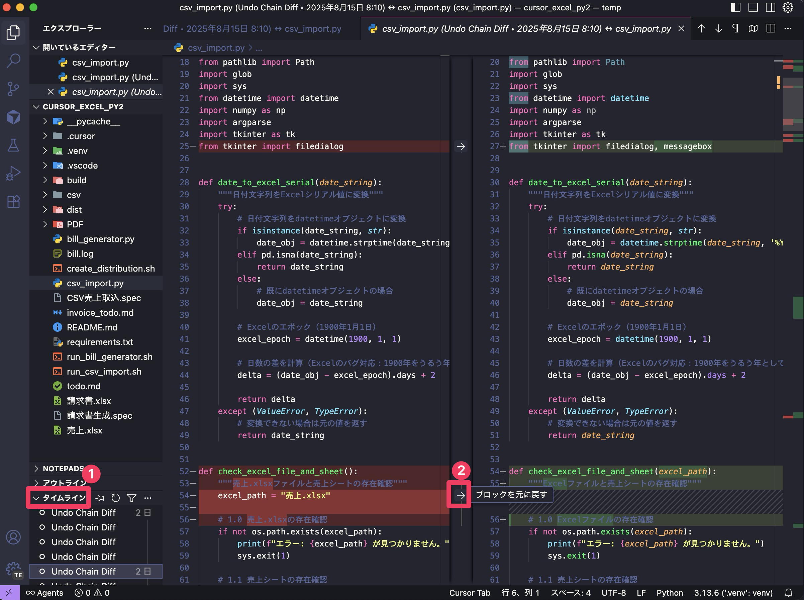
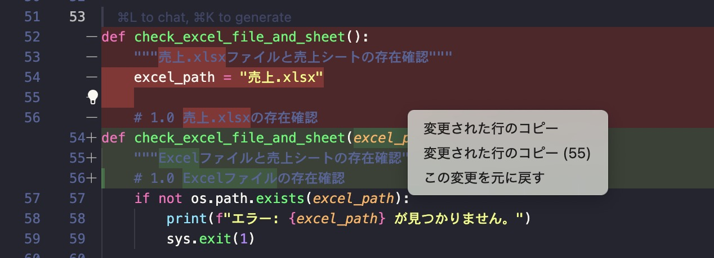
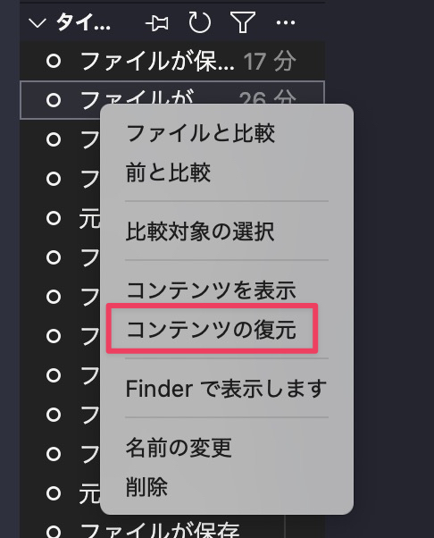

AI に色々実装させていると、さっきの方が良かったな、なんてことがあります。そういう時は元に戻したいファイルをエディタで開き、「タイムライン」をクリックし、遡りたい変更をクリックします。すると変更箇所エディタに表示されます。

エディタの左側が変更前 (赤)、右側が変更後 (緑) です。元に戻したいところ、マウスカーソルを持って行き「ブロックを元に戻す」をクリックすると戻せます。

エディターの表示領域が狭いと、上下で変更箇所を表示します。赤い箇所をクリックすると変更を元に戻すメニューが表示されるので、それを利用します。

どの行を戻したら挙動がどう変化するのかよく分からないということもあるでしょう。その場合はどの時点まで期待した動きになっていたか思い出し、変更箇所をすべてその時点まで戻します。

タイムラインのリストを右クリックして「コンテンツの復元」でまるごと元に戻せます。

ただ、このタイムラインのリストには「ファイルが保存されました」「元に戻す/やり直す」としか表示されないので探すのが大変です。右クリックメニューの中には名前の変更というのがあるので、重要な変更については見分けがつくよう名前を変更しておくと良いでしょう。

本来、このような変更履歴管理は、Git (ギット) という専用のバージョン管理システムを使うのですが、Git の説明を始めると長くなってしまうため、ここでは簡易な方法を紹介しました。

Git でバージョン管理する方法は別の機会に譲りたいと思います。
