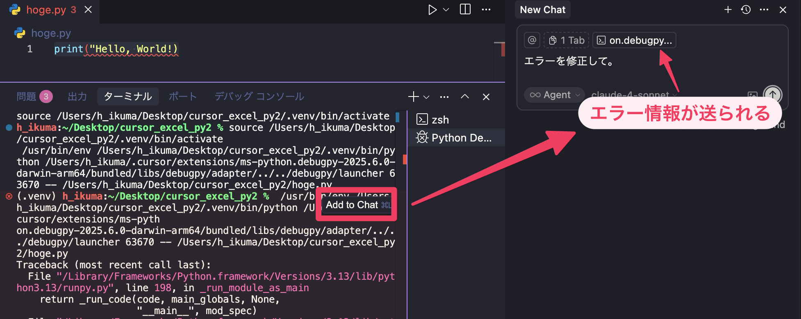
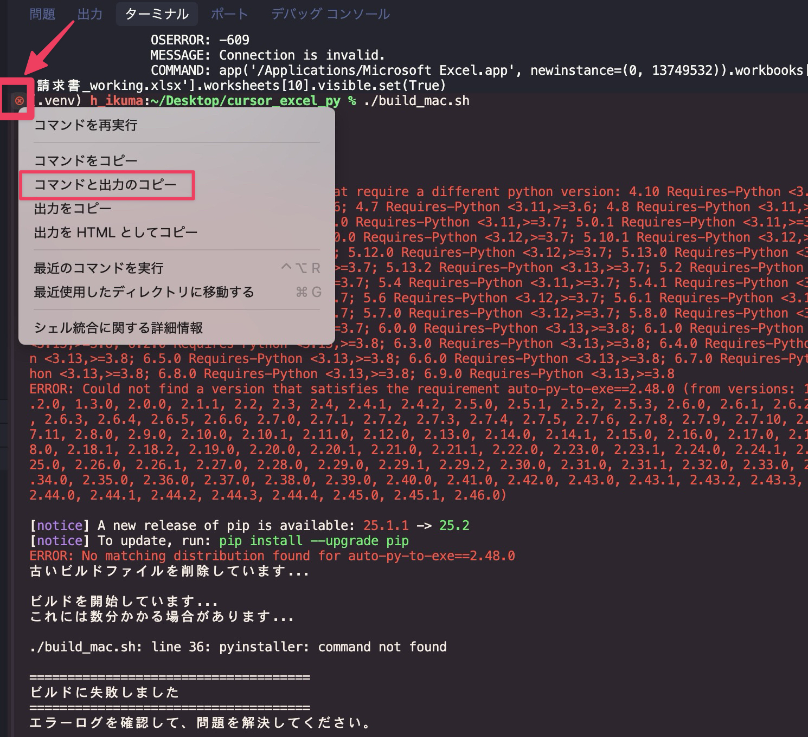

AI に実装させているとエラーを吐くプログラムを実装することがあります。プログラミングでは、一回もエラーに遭遇することなく、一筆書きでアプリを作れることはないのですが、AI でもそれがあてはまります。

## AI にエラーを修正させる

 エラーが発生するとターミナルにエラーの情報が表示されます。エラーになるとターミナルで赤っぽい色が表示されるので、そのあたりをクリックします。すると「Add to Chat」というボタンが表示されます。エラー情報をチャットに送るボタンです。エラーを修正させるプロンプトを入力しましょう。

どのような状況でどのようなエラーが発生したかという情報も付け加えると、より精度高くエラーを修正してくれます。

状況によっては、Add to Chat ボタンが表示されないことがあります。そのような時は下の図のように枠囲みのアイコンをクリックし、コマンドと出力のコピーを実行してチャット欄に貼り付けてエラーを修正させます。

## なかなかエラーが解決しない時は

複雑プログラムになると、同じ場所を何度もぐるぐりくり返してなかなかエラーが解決しないことがあります。そういう時は以下のようにするとうまくいくことがあります。

- プロンプトを細かく
- AI モデルを変える
- 実装されたプログラムを削除してイチから作り直さる
- 仕様書も削除してエラー内容を踏まえて再度仕様書作成
