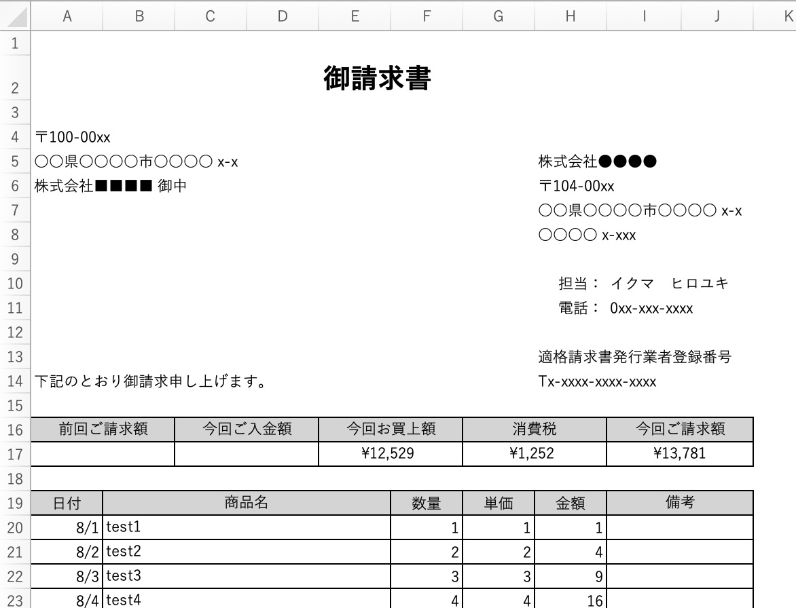
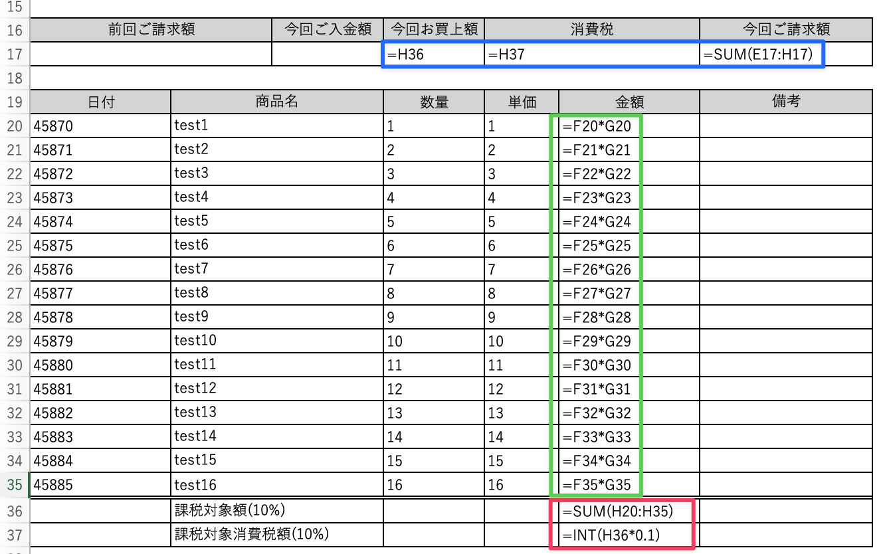
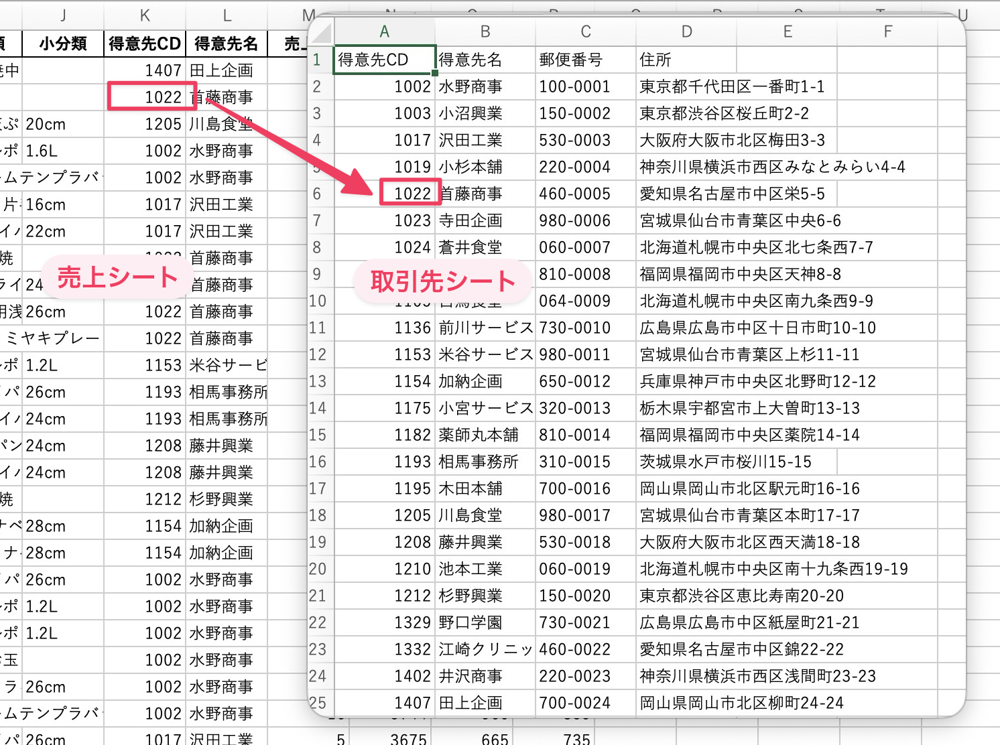
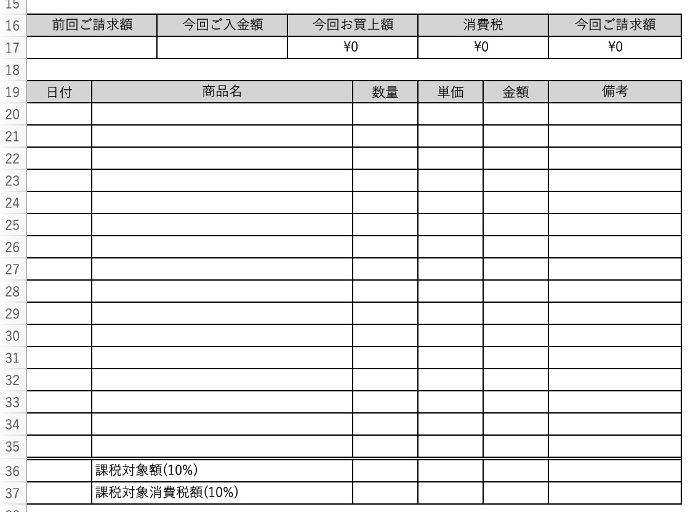
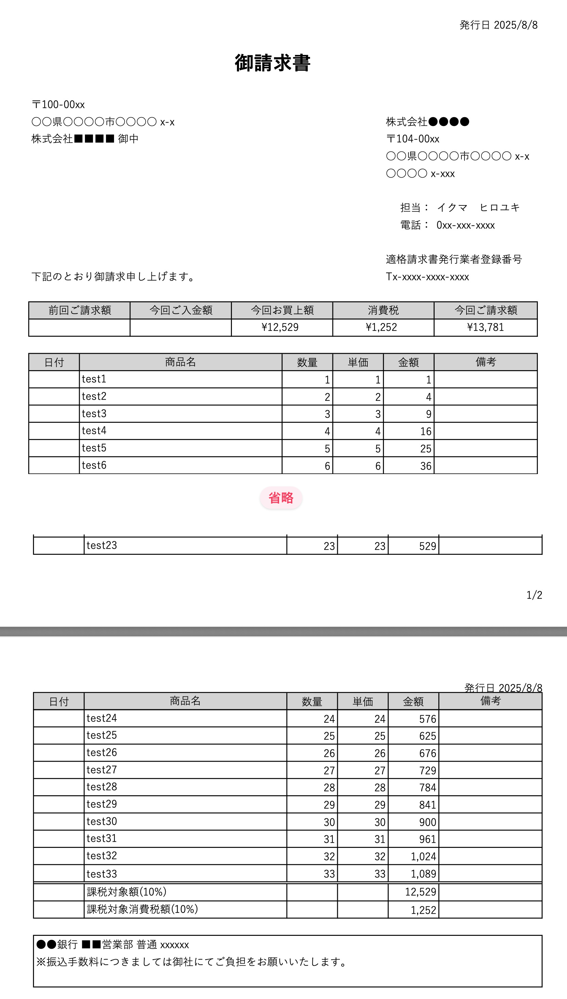
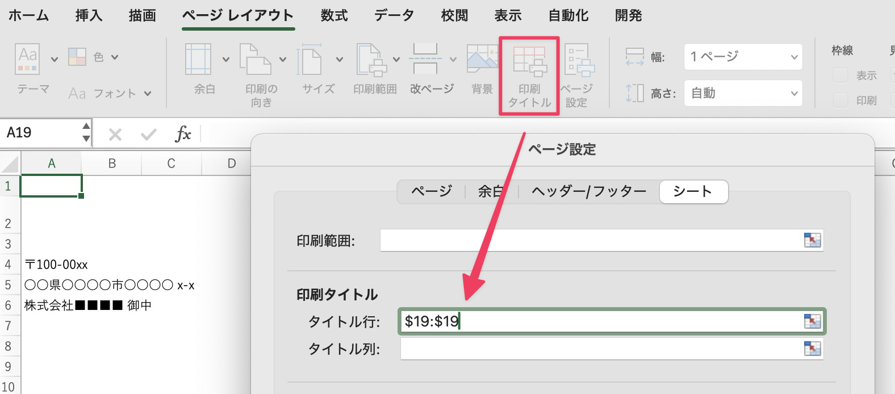
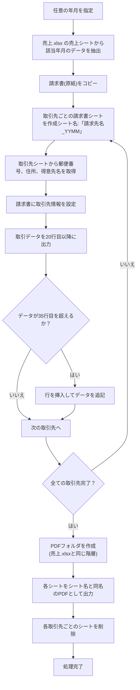

## 請求書.xlsx について

前回までで売上データ CSV ファイルを Excel に取り込むプログラムができました。次は売上データから請求書 (PDF) を作成するプログラムを作りましょう。これも Python で実装します。まずは請求書の完成見本から。

この請求書では下図のようにセルに数式・関数を仕込んで計算しています。

- 各行の売上金額は数式で計算 (緑枠)
- 課税対象額、課税対象消費税額は下部の関数で計算 (赤枠)
- お買上額、消費税額は赤枠を参照し請求額はこの 2 つの合計 (青枠)

この請求書を作るためにダウンロードしたフォルダの請求書.xlsx を使います。請求書.xlsx には「請求書 (サンプル)」「請求書 (原紙)」の 2 つのシートがあり、以下の手順で作成します。

1. 売上.xlsx の売上シートにある任意の月のデータを元に**取引先ごと**に請求書を作成します。
2. 請求書には取引先の「郵便番号」「住所」「会社名」を載せます。この情報は売上.xlsx の「取引先」シートにあり、売上シートの得意先 CD で照合します。取引先シートはいわゆるマスタテーブルです。

3. 各取引先ごとのデータを 請求書の 20 行目以降に追記していきます。

## 捕捉: タイトル行の設定について

初期状態では 35 行目まで書き込みできますが、取引件数がそれ以上の場合は必要な分だけ新しい行を追加します。行を挿入すると Excel の仕様で以下のような挙動になります。

- 行を挿入すると各行の金額を計算する数式は複製
- 課税対象額・消費税計算の参照範囲は拡張
- お買い上げ額、消費税額、参照セル再設定

行を挿入したら印刷範囲がずれて「それでうまく印刷できるの？」と思われるかもしれませんが、印刷時は以下のように 19 行目がヘッダー行になり次のページに続きが印刷されます。

ちょっと脱線しますがこれは「ページレイアウト」内の「タイトル行」の設定でこうなります。複数ページに跨がったときに設定した行が固定されて印刷される設定です。

4. PDF を発行したら各取引先ごとのシートは全て削除

という流れで処理します。

## 請求書発行の詳細な流れ

より詳細な流れは以下のようになります。

1. 任意の年月を指定
2. 売上.xlsx の「売上シート」から該当年月のデータを抽出
	1. 売上日は A 列
	2. 商品名は G 列
	3. 数量は M 列
	4. 単価は P 列
3. 請求書 (原紙) をコピーして取引先ごとの請求書シートを作成
4. 取引先ごとの請求書シート名の形式は「請求先名\_YYMM」とする
5. 請求書に記載する郵便番号、住所、得意先名は売上.xlsx の「取引先シート」にある以下のデータを利用
	1. A 列の得意先 CD と「売上シート」の K 列の取引先 CD で照合
	2. 郵便番号は C 列。請求書出力先は A4。
	3. 住所は D 列。請求書出力先は A5。
	4. 得意先名は B 列。請求書出力先は A6。
6. 取引データは 20 行目以降に出力する
	1. 日付は A 列
	2. 商品名は B 列
	3. 数量は F 列
	4. 単価は G 列
7. 原紙は 35 行目までしかないのでそれ以上のデータは行を挿入して追記
8. 全ての取引先についてシートを作成したらシート名と同名の PDF を出力する
9. PDF の出力先は売上.xlsx と同じ階層に PDF フォルダを作成して出力する
10. PDF 出力が終わったら各取引先ごとのシートは削除する

※ YYMM は年=YY (Year) で二桁表示、MM は月 (Month) の二桁表示を表します。

マーメイド図は以下のようになります。

次は仕様書作成と実装ですが、PDF を発行するような Excel 操作 は OS ごとに実装方法が異なるため別々に解説します。
