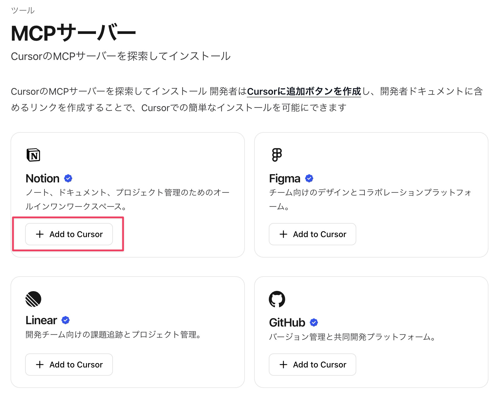
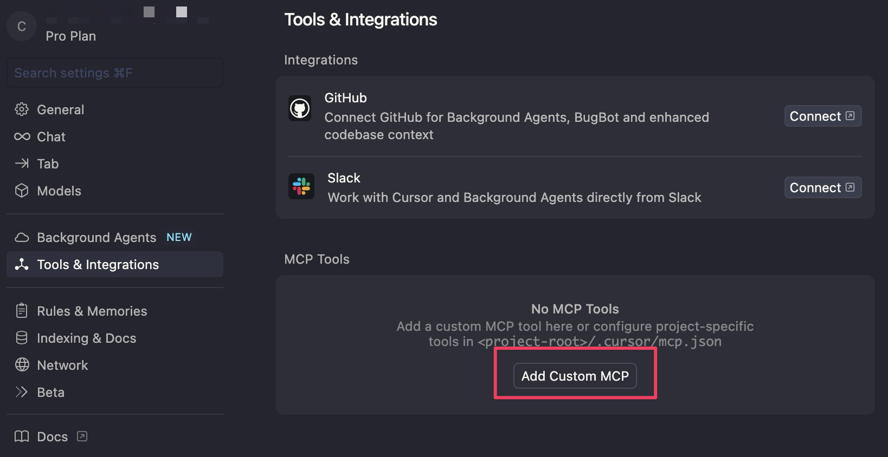

本書では Excel ファイルを対象にしたプログラムを実装しています。AI の実装するプログラムの精度を上げる場合はセル番地をプロンプトに含めるのが王道です。しかしそれだけではなく AI 自身に Excel ファイルを読み込ませて精度を上げる方法があります。

そのために MCP サーバーというツールを使います。

## MCP とは何か

そもそも MCP とは「AI と外部アプリが連携」するための規格です。「AI と外部アプリが連携」の例として今回のような Excel やデータベース、AI 同士の連携があります。

従来 AI が外部アプリと連携するため、すなわち外部アプリの情報をコンテキストとして取り込むためには個別の開発が必要でした。それでは使い勝手悪いよね、というわけで Anthropic 社が規格を提唱したわけです。OpenAI や Google も MCP のサポートを表明し業界のデファクトスタンダードになりつつあります。

MCP はよく USB-C に喩えられます。


https://x.com/norahsakal/status/1898183864570593663

要するに USB-C のようにケーブルを挿すだけの簡単操作で外部の情報を取り込める、というわけです。

## Node.js のインストール

MCP セットアップする前提として Node.js という JavaScript というプログラミング言語の実行環境をインストールする必要があります。以下の [公式サイト](https://nodejs.org/ja/download) からインストールする方法もあるのですが、簡単にバージョン管理できる「Volta (ボルタ)」というツールでインストールするのがオススメです。

### Volta のインストール

[Getting Started | Volta](https://docs.volta.sh/guide/getting-started)

#### Windows

Windows の場合はターミナルで以下のコマンのを実行してください。`winget` は Windows 版の Homebrew のようなもので、コマンドでアプリをインストールできるツールです。Windows11 であれば使えるはずです。

```
winget install Volta.Volta
```

もし `winget` が使えない場合は以下の URL から最新版をインストールしてください。(例: volta-2.0.2-windows-arm64.msi)

[Releases · volta-cli/volta](https://github.com/volta-cli/volta/releases)

#### Mac

Mac の場合はターミナルで以下のコマンドを実行してください。

```
curl https://get.volta.sh | bash
```

### Volta がインストールされたか確認

インストールできたか確認します。ターミナルを再起動して以下のコマンドでバージョンが表示されれば成功です。

```
volta --version
```

### Node.js インストールと確認

最新の LTS 版をインストールするコマンドです。

```
volta install node
```

インストールできたか確認します。バージョンが表示されれば成功です。

```
node --version
```

## Cursor 推奨の MCP サーバー

Cursor が推奨するする MCP サーバーであれば IDE にセットするのは簡単です。下記 URL を開き、Add to Cursor クリックすると IDE が開き簡単にインストールできます。インストールと削除の流れを身につけるため、どれか適当に選んでインストールしてみてください。

[Cursor – MCPサーバー](https://docs.cursor.com/ja/tools/mcp)



クリックすると次のようなダイアログが出るので「Cursor.app を開く」を押して先に進みます。


ツールによっては下の図のように警告が出ることがあります。日本語訳は以下のとおりです。

> MCP サーバーをインストールすると、あなたのユーザーと同じ権限でコマンドを実行します。サーバーのソースを完全に信頼し、その意味を理解している場合にのみ続行してください。


MCP サーバーの利用はセキュリティリスクをはらんでいます。上記画像は Cursor 公式ドキュメントで紹介されている「Playwright」という Web ブラウザを操作するものです。公式で紹介されているものなので安心でしょう。

## MCP サーバーを削除する


MCP サーバーを削除するには対象 MCP サーバーの鉛筆アイコンをクリックし下の図の枠囲み部分を削除します。


 これは JSON という形式で書かれた設定ファイルで、mcp.json に書き込まれます。削除したいサーバー名と、その中身である `{}` まで含めてください。

## Cursor に Excel MCP をセットする

本社で使いたい MCP サーバーは Cursor 公式サイトにはありませんので別の方法でインストールします。設定画面の Tools & Integrations > MCP Tools > Add Custom MCP から追加します。



以下の URL から Excel を操作する MCP サーバーをインストールします。

[https://github.com/negokaz/excel-mcp-server?tab=readme-ov-file](https://github.com/negokaz/excel-mcp-server?tab=readme-ov-file) を開き OS に応じた設定をコピーしてください。

Windows の場合は以下の部分です。

```json
"excel": {
	"command": "cmd",
	"args": ["/c", "npx", "--yes", "@negokaz/excel-mcp-server"],
	"env": {
		"EXCEL_MCP_PAGING_CELLS_LIMIT": "4000"
	}
}
```

macOS の場合は以下の部分です。

```json
"excel": {
	"command": "npx",
	"args": ["--yes", "@negokaz/excel-mcp-server"],
	"env": {
		"EXCEL_MCP_PAGING_CELLS_LIMIT": "4000"
	}
}
```

これを Cursor の設定に追加します。「Add Custom MCP」ボタンを押すと mcp.json というファイルが作られますので、そこにペーストします。


`"mcpServers": {}` の `{}` を改行してその中にペーストしてください。

```json
{
  "mcpServers": {}
}
```

コピーした文字列を貼り付けると下図のようにインデントが崩れることがあります。そんなときは「ドキュメントのフォーマット」を行ってください。


下図のように整形されて見やすくなります。


設定画面を見て excel という名前で MCP サーバーが読み込まれていれば成功です。


なお、すでに別の MCP サーバーの設定を記述している場合は

以下のようにしてください。MCP サーバーが複数になる場合、最後以外の `}` の後は `,` で区切って複数記述するのが JSON の書き方です。

```json
{
  "mcpServers": {
    "playwright-mcp": {
      "command": "npx",
      "args": [
        "-y",
        "@smithery/cli@latest",
        "run",
        "@microsoft/playwright-mcp",
        "--key",
        "0f63cae3-64b1-42cd-b861-860bbb003e4d"
      ]
    },
    "excel": {
      "command": "npx",
      "args": ["--yes", "@negokaz/excel-mcp-server"],
      "env": {
          "EXCEL_MCP_PAGING_CELLS_LIMIT": "4000"
      }
    }
  }
}
```

## Excel MCP サーバーのテスト

ツールをテストしてみましょう。新しいチャットを開いて以下のようなプロンプトを入力します。

```
excel mcpで請求書.xlsxのシートを調べて
```

すると、MCP サーバー、使用確認を求める「Run tool」ボタンが表示されるので、承認します。


ツールによって以下のように読み取ることができました。


今回のケースでは `excel mcp で` のように明示的にツールを指示するプロンプトを入力しましたが、明示しなくても AI がツールを使うか判断して確認を求めてくることもあります。今後のプログラム実装プロンプトではツール使用を明示しませんが必要なタイミングで呼び出されると思います。

## MCP サーバーの AppStore である Smithery について

前回までの Excel MCP サーバー設定は、必要な設定を自分で探して Cursor に自分で貼り付けて、というものでした。これをもっと楽に行うためのプラットフォームに Smithery というものがあります。

Smithery (スミゼリー) を使うと簡単に MCP サーバーをインストールできます。使用例として前回同様 Excel ツールをインストールしてみます。

Smithery 利用にはアカウント登録が必要です。無料です。[https://smithery.ai/](https://smithery.ai/) にアクセスして右上の Login ボタンからアカウント登録してください。執筆時点では Google か Github アカウントで登録できます。

### MCP サーバーのインストール

アカウントを登録したら [https://smithery.ai/](https://smithery.ai/) の検索窓に「Excel」と入力して Enter キーを押します。


いくつかヒットしますが、執筆時点で最も利用者が多い `@negokaz/excel-mcp-server` をインストールしてみます。

[Excel | Smithery](https://smithery.ai/server/@negokaz/excel-mcp-server)


これをクリックすると下図のような画面になります。右側の Connect にある Cursor をクリックしてください。


以下のような表示になるので下図枠囲みの Copy ボタンを押してください。下に表示されているコマンドがクリップボードにコピーされます。


ターミナルを開いてコマンドをペースト、実行してください。途中で以下の確認を求められます。Y (Yes) か n (no) を入力して先に進んでください。

>Would you like to help improve Smithery by sending anonymized usage data?
For information on Smithery's data policy, please visit: https://smithery.ai/docs/data-policy
>
>匿名化された利用データを送信することで、スミザリーの改善にご協力いただけませんか？スミザリーのデータポリシーについては、https://smithery.ai/docs/data-policy をご覧ください。


下図のように Successfully と表示されれば成功です。

```
✔ Successfully resolved @negokaz/excel-mcp-server
Installing remote server. Please ensure you trust the server author, especially when sharing sensitive data.
For information on Smithery's data policy, please visit: https://smithery.ai/docs/data-policy
@negokaz/excel-mcp-server successfully installed for cursor
```

Cursor の設定画面では下図のように `excel-mcp-surver` の設定が追加されます。


ただ、なにやら赤いアイコンが表示され、No tools or prompts と表示されています。これは、ツールをうまく読み込めていないというサインです。読み込めるタイミングもあるのですが、本書執筆時点ではこのツールは Smithery 経由だと動作が安定しません。

また、読み込めて緑アイコンになりツールを使ったとしても Excel をうまく読み込めないこともあります。ですから mcp.json から設定を削除しておきましょう。

New MCP Server クリックすると mcp.json が開くので、該当箇所削除してください。


今回紹介した Excel MCP Server というツールは、スミザリー経由ではうまく動作しませんでしたが、このツール固有の問題です。スミザリーには色々なものがありますので、今回紹介した方法で検索し、あなたのニーズに合ったものを必要に応じて追加してみてください。
