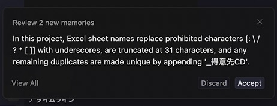
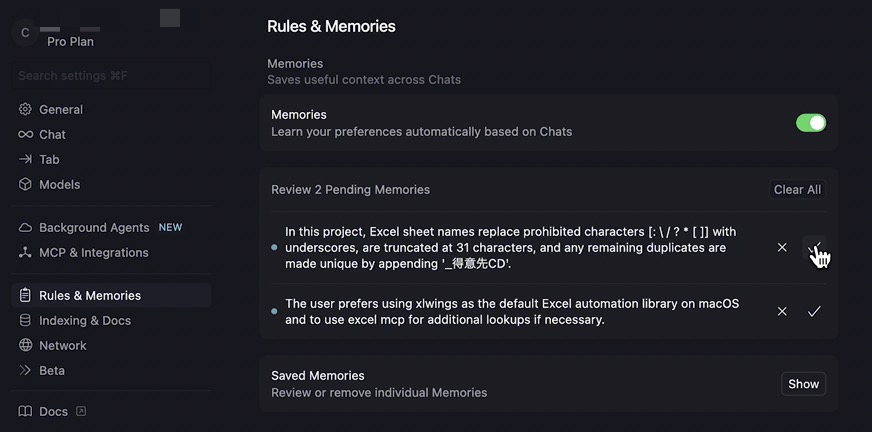

AI と壁打ちしていると下図のようなダイアログが画面左下に現れることがあります。これはメモリーズというもので、ユーザーの選択を AI に記憶させるかどうかというものです。

Accept(受け入れる)、Discard(破棄する) を選択します。一定時間が経つと消えてしまいますが、消えた場合は右上のアイコンから開く設定画面で確認できます。

Rules & Memories の Review(審査) から Accept, Discard を選択してください。このようなメモリが積み重なることで、精度がより高くなるはずです。

