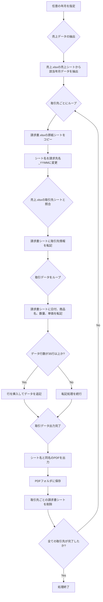

# Plan モードで請求書発行プログラムの仕様書作成

Plan モードで仕様書を作成しましょう。が、その前に 1 つだけ。実は今回のプログラムはなかなか期待した動きにならず少し苦労しました。

プロンプトを細かく調整したり、AI モデルを変えたり、実装されたプログラムを削除してイチから作り直させたり。最終的に上手くいったプロンプトを掲載していますが、あなたの環境で上手くいかない場合はこのような調整を行ってみてください。

では話を戻して、以下のようなプロンプトを新規チャットに入力します。

**excel mcp で 請求書.xlsx と売上.xlsx の構造 (シート名、使用中のセル、入力されている数式) を調べて。** であらかじめ AI にコンテキストとして理解させます。

また、**使用するライブラリ、技術スタックも記載すること**。という一文を加えてさらに詳細な仕様書を作成させます。

[bill\_todo\_prompt\_win](https://gist.github.com/ikuma-hiroyuki/685d49ce08f4ae2d2c269150dff327d2#file-bill_todo_prompt_win)

```
これから以下の仕様に基づく仕様書を作成したい。まずは excel mcpで 請求書.xlsxと売上.xlsxの構造(シート名、使用中のセル、入力されている数式)を調べて。

以下の処理を行うPythonプログラムを作成したい。OSはWindows。以下の内容で仕様書 bill_todo.md を作成して。使用するライブラリ、技術スタックも記載すること。

1. 任意の年月を指定
2. 売上.xlsx の「売上」シートから該当年月のデータを抽出
	1. 売上日は A 列
	2. 商品名は G 列
	3. 数量は M 列
	4. 単価は P 列
3. 請求書.xlsxの「請求書(原紙)」シート をコピーして取引先ごとの請求書シートを作成
4. 取引先ごとの請求書シート名の形式は「請求先名_YYMM」とする
5. 請求書に記載する郵便番号、住所、得意先名は売上.xlsx の「取引先」シートにある以下のデータを利用
	1. A 列の得意先 CD と「売上」シートの K 列の取引先 CD で照合
	2. 郵便番号は C 列。請求書出力先は A4。
	3. 住所は D 列。請求書出力先は A5。
	4. 得意先名は B 列。請求書出力先は A6。
6. 取引データは 20 行目以降に出力する
	1. 日付は A 列
	2. 商品名は B 列
	3. 数量は F 列
	4. 単価は G 列
7. 原紙は 35 行目までしかないのでそれ以上のデータは行を挿入して追記
8. 全ての取引先についてシートを作成したらシート名と同名の PDF を出力する
9. PDF の出力先は売上.xlsx と同じ階層に PDF フォルダを作成して出力する
10. PDF出力が終わったら各取引先ごとのシートは削除する
```



仕様書は以下のようになりました。

[bill\_todo\_mac.md](https://gist.github.com/ikuma-hiroyuki/0e75a6388fb722c3d5c9c24b683560a7#file-bill_todo_win-md)

この中に登場する Tkinter は GUI (Graphical User Interface) を作成するための Python 標準ライブラリです。`pip install` コマンドは必要ありません。AI とのチャットにおいて対象年月（YYMM または YYYY-MM 等）の指定方法について、どのような入力インターフェースにするか、という質問に対して GUI で指定したい。その際のライブラリは標準のものを使う。という回答で選定されたものです。

要するにターミナルで入力するのではなよく普段よく見るような視覚的なフォームで入力する、ということです。

```markdown
# 請求書自動生成プログラム仕様書 `bill_todo.md`

## Notes
- 対象 OS: Windows（Microsoft Excel がインストール済み）
- Python 3.11（推奨）  
- 仮想環境: `.venv`（既存ルールに従う）
- 使用ライブラリ・技術スタック  
  - pandas   … データ抽出・前処理  
  - openpyxl   … Excel 読み書き（テンプレート操作・行挿入）  
  - pywin32 (`win32com.client`)   … Excel COM 経由で PDF 出力  
  - tkinter   … 年・月選択 GUI（スピンボックス＋実行ボタン）  
  - logging（標準ライブラリ） … `warning.log` 出力  
  - pathlib / os   … パス操作・フォルダ作成  
- 入力ファイル  
  - `売上.xlsx`  
    - シート「売上」: 売上日 A列 / 商品名 G列 / 取引先CD K列 / 数量 M列 / 単価 P列  
    - シート「取引先」: 得意先CD A列 / 得意先名 B列 / 郵便番号 C列 / 住所 D列  
  - `請求書.xlsx`  
    - テンプレートシート名: 「請求書 (原紙)」  
- 出力  
  - `PDF/` フォルダ（`売上.xlsx` と同階層）に各請求先ごとの `請求先名_YYMM.pdf`  
  - プログラム配置ディレクトリに `warning.log`（一致しない取引先CD を警告として追記）
- GUI:  
  - 単一ウィンドウ  
    - 年: 2000–2100 の整数スピンボックス  
    - 月: 1–12 の整数スピンボックス  
    - 「実行」ボタン  
- 行挿入ルール: データ行は 20 行目開始、原紙は 35 行目まで。超過分は不足行数だけ挿入後に書き込み。  
- エラー処理: 取引先 CD が見つからない売上行はスキップし、`warning.log` に日時・対象年月・行番号・取引先CD を WARN レベルで追記。処理は継続。  

## Tasks
- [ ] 1.0 環境準備
  - [ ] 1.1 `.venv` 仮想環境を作成
  - [ ] 1.2 `.venv` をアクティベート
  - [ ] 1.3 `pip install pandas openpyxl pywin32`
  - [ ] 1.4 `pip freeze > requirements.txt` で依存関係を更新
- [ ] 2.0 スクリプト骨子作成
  - [ ] 2.1 `bill_generator.py` ファイルを新規作成
  - [ ] 2.2 必要ライブラリを import（pandas, openpyxl, win32com.client, tkinter, logging, pathlib, sys）
- [ ] 3.0 ロギング設定
  - [ ] 3.1 `logging.basicConfig` で `warning.log` を WARN レベルで設定
- [ ] 4.0 GUI 実装
  - [ ] 4.1 tkinter ウィンドウを生成
  - [ ] 4.2 年スピンボックスを配置（2000–2100）
  - [ ] 4.3 月スピンボックスを配置（1–12）
  - [ ] 4.4 「実行」ボタンにコールバック登録
  - [ ] 4.5 `mainloop()` で起動
- [ ] 5.0 ユーザー入力取得
  - [ ] 5.1 ボタン押下で年・月を整数取得
  - [ ] 5.2 `YYMM` と `YYYY-MM` 形式の文字列を生成
- [ ] 6.0 入力 Excel 読込
  - [ ] 6.1 `売上.xlsx` を openpyxl でロード
  - [ ] 6.2 `請求書.xlsx` を openpyxl でロード
- [ ] 7.0 売上データ抽出
  - [ ] 7.1 pandas で「売上」シートを DataFrame 化
  - [ ] 7.2 日付列を日付型へ変換
  - [ ] 7.3 対象年月でフィルタリング
- [ ] 8.0 取引先マスタ取得
  - [ ] 8.1 pandas で「取引先」シートを DataFrame 化
  - [ ] 8.2 得意先CD をキーに郵便番号・住所・得意先名を辞書化
- [ ] 9.0 データ検証
  - [ ] 9.1 売上行ごとに取引先CD 存在可否を確認
  - [ ] 9.2 存在しない場合は `logging.warning` で書き込み & 行を除外
- [ ] 10.0 請求先ごとのデータ分割
  - [ ] 10.1 フィルタ済み DataFrame を取引先CD でグループ化
- [ ] 11.0 PDF フォルダ準備
  - [ ] 11.1 `PDF/` フォルダの存在確認
  - [ ] 11.2 無ければ `mkdir` で作成
- [ ] 12.0 取引先ループ処理
  - [ ] 12.1 ループ開始（各得意先ごと）
  - [ ] 12.2 「請求書 (原紙)」シートをコピー
  - [ ] 12.3 請求書シート名を `請求先名_YYMM` に設定
  - [ ] 12.4 ヘッダセルに郵便番号（A4）を入力
  - [ ] 12.5 住所（A5）を入力
  - [ ] 12.6 得意先名（A6）を入力
  - [ ] 12.7 データ行数を算出
  - [ ] 12.8 不足行数があれば行を挿入（原紙 35 行突破分）
  - [ ] 12.9 20 行目以降に日付（A列）を書き込み
  - [ ] 12.10 商品名（B列）を書き込み
  - [ ] 12.11 数量（F列）を書き込み
  - [ ] 12.12 単価（G列）を書き込み
  - [ ] 12.13 Excel COM で該当シートを PDF として `PDF/請求先名_YYMM.pdf` 出力
  - [ ] 12.14 作成した請求書シートをワークブックから削除
- [ ] 13.0 後処理
  - [ ] 13.1 `売上.xlsx` を保存しないでクローズ
  - [ ] 13.2 `請求書.xlsx` を保存せずクローズ
  - [ ] 13.3 COM オブジェクトを `Quit()` して解放
- [ ] 14.0 テスト
  - [ ] 14.1 過去実績月でテスト実行
  - [ ] 14.2 `PDF/` に正しいファイルが作成されるか確認
  - [ ] 14.3 `warning.log` に未登録取引先CD が記録されるか確認
- [ ] 15.0 ドキュメント整備
  - [ ] 15.1 `README.md` に使用方法と前提条件を追記
  - [ ] 15.2 実行例スクリーンショットを添付（任意）
```

これを `bill_todo.md` として保存してください。

チャット履歴は以下のようになりました。

```markdown
# Python program for invoice generation

_Exported on 2025/8/15 at 9:01:31 JST from Cursor (1.4.5)_

**Cursor**

「売上」シートの K 列（取引先 CD）に一致する得意先 CD が「取引先」シートに存在しない場合、その売上行は  

1) 無視してスキップする  
2) エラーとして処理を停止する  
3) それ以外（例：警告ログを残して処理続行）  

のどれにするべきか、ご希望を教えてください。

---

**User**

警告ログを残して処理続行

---

**Cursor**

PDF を生成する方法について確認させてください。

Windows 環境では Excel の COM オブジェクト（`win32com.client`）を利用すると、ワークブック内の各シートをそのまま PDF 出力できます。  
お使いの PC に Microsoft Excel がインストールされており、COM を利用できる状態でしょうか？

---

**User**

yes

---

**Cursor**

対象年月（YYMM または YYYY-MM 等）の指定方法について、どのような入力インターフェースをご希望でしょうか。

1) コマンドライン引数（例: `python bill_generator.py 2025-07`）  
2) 実行時に対話的に入力を促す（標準入力）  
3) それ以外（環境変数や設定ファイルなど）

ご希望の方式をお知らせください。

---

**User**

GUIで

---

**Cursor**

GUI で年月を入力していただく具体的な画面仕様をお伺いします。  
次のいずれがご希望に近いでしょうか。

1) シンプルなウィンドウに「年」「月」をドロップダウン（またはスピンボックス）で選択し、「実行」ボタンを押すだけ  
2) カレンダーピッカー（日付選択カレンダー）から任意の日付を選び、プログラム側で年月だけを取得  
3) テキストボックスに `YYYY-MM` 形式を直接入力し、「実行」ボタンを押す  
4) それ以外（具体的にご希望をお書きください）

番号でご回答いただけますか？

---

**User**

1

---

**Cursor**

GUI を実装する際に使用する Python の GUI ライブラリについてご希望はありますか？  
（例：標準の tkinter、PySimpleGUI、PyQt など）  
ご指定がなければ、特別な追加インストールが不要な tkinter を前提に仕様を書こうと考えています。

---

**User**

tkinter

---

**Cursor**

取引先 CD が一致しない売上行をスキップした際に出力する「警告ログ」について、  

1) どのフォルダへ保存するか（例：スクリプトと同じフォルダ、PDF 用の `PDF` フォルダ内、任意のログ専用フォルダなど）  
2) ログファイルの形式（例：テキスト `.log`、CSV、Excel、JSON など）  
3) ファイル名の命名規則（例：`warning_YYYYMMDD_HHMMSS.log` など）

のご希望を教えてください。

---

**User**

1

---

**Cursor**

ログファイルの保存先は「スクリプトと同じフォルダ」で承知しました。  
次に、ログファイルの形式はどれがよろしいでしょうか。

1) シンプルなテキストファイル（`.log`）  
2) CSV  
3) Excel（`.xlsx`）  
4) JSON  
5) その他（ご指定ください）

番号でお答えください。

---

**User**

1

---

**Cursor**

ログファイル名の命名規則についてご希望をお聞かせください。  
例としては、

- `warning_YYYYMMDD_HHMMSS.log`（実行日時を含める）
- `warning_YYMM.log`（対象年月のみ）
- 固定名 `warning.log`（毎回上書き）

などが考えられます。  
ご希望のパターンを具体的にご指定いただけますか？

---

**User**

warning.log

---

**Cursor**

ご要望の詳細はすべて揃ったと考えています。  
仕様書 `bill_todo.md` を作成してよろしいでしょうか？

---

**User**

ok

```

## 実装の指示

仕様書に基づいて請求書発行プログラムを実装しましょう。新規チャットで以下のようにプロンプトを入力します。モデルは claude-4-sonent を使います。

```
@bill_todo.md にしたがって請求書発行Pythonプログラムを実装して
```

実装されたコードは以下 URL でご確認ください。

[invoice\_generators\_win.py](https://gist.github.com/ikuma-hiroyuki/c447a5379fd234c226fa603756c4d520/af09cab15e7f0934f631501591d24405f4e0d944)

プログラムを実行すると以下のようなダイアログが表示され、実行ボタンを押すと PDF 作成が始まります。


完了すると以下のようなダイアログが表示されます。


作成された PDF を確認します。4 点修正が必要です。


### ① 日付がバラバラ

明細行の日付の並び順がバラバラです。おそらく CSV ファイルを取り込んだ時の並び順そのままと思われます。日付順に並べ変えます。

### ② 挿入された行に罫線が引かれていない

新しく行を挿入した時に罫線を引く処理がうまくいっていません。

### ③ 課税対象額と課税対象消費税額の数式で参照先が元のまま

課税対象額は上の図で 131,240 と表示されている部分です。明細に対して少ないです。参照先が元のままなのでしょう。それに対して消費税が 399 ですから明らかにおかしいです。

### ④ 今回お買い上げ額と消費税額の参照先が元のまま

一番上の枠囲みの部分です。今回お買い上げ額は「8/17 Q フライパン 24cm 3990」が参照され、消費税はその下の行が参照されています。これも参照先が元のままになっています。

## コードの修正依頼

以下のように修正を指示します。ざっくりした修正では精度が落ちたり意図が伝わらなかったりするので、セル番地を含めて細かく指示します。

```markdown
以下の修正が必要。  
- 日付列の並び順を昇順に
- 挿入された行に35行目までと同じ罫線が適用されていない
- 行が挿入されても課税対象額セル(デフォルトはH36)の参照範囲が動的に拡張されていない(10行挿入したらSUM(H20:H35)をSUM(H20:H45)にする)
- 行が挿入されても消費税額セル(デフォルトはH37)の参照先を動的に変更されていない(10行挿入されたら=INT(H36*0.1)を=INT(H46*0.1)にする)
- 行が挿入されてもお買上額セル(E36)、消費税額セル(G37)の参照先が動的に変更されていない(10行挿入されたらお買上額を=H36からH46に、消費税をH37からH47に)
```

修正されたコードは以下でご確認ください。

[invoice\_generators\_win.py](https://gist.github.com/ikuma-hiroyuki/c447a5379fd234c226fa603756c4d520/2c57a6ed784cacde092332b7ec19b8fb5df313e4)

ほとんどよさそうですが挿入された行がおそらく結合されていないため余計な罫線が見えています。以下のように修正を指示します。

```
挿入された行のB~E列が結合されていない
```


以下のように修正されました。大丈夫そうです。

[invoice\_generators\_win.py](https://gist.github.com/ikuma-hiroyuki/c447a5379fd234c226fa603756c4d520/4678bef2e0ffeb5c0ad58b198c9f31a3e4c1ac09)


## 集計の確認

請求書に載っている金額、正しいか目視で確認します。


合計が合っているので大丈夫ですね。
