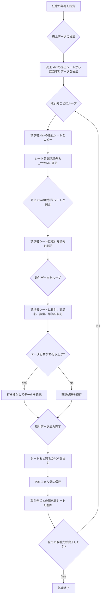
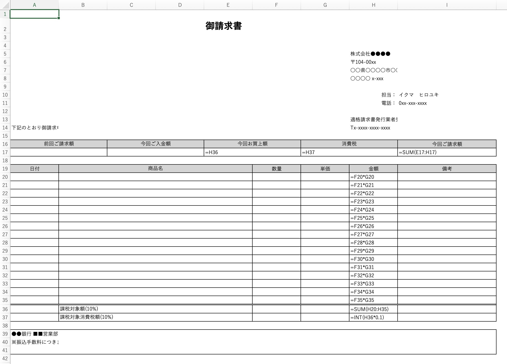
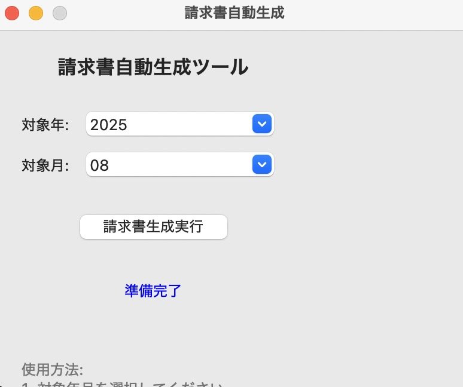
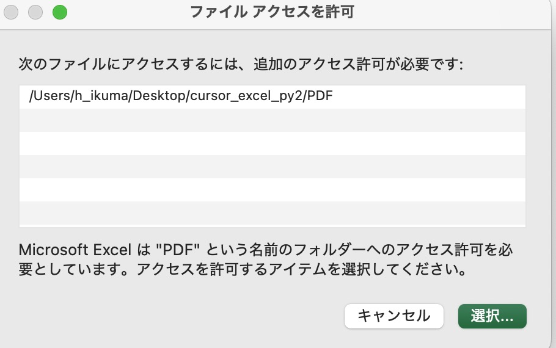
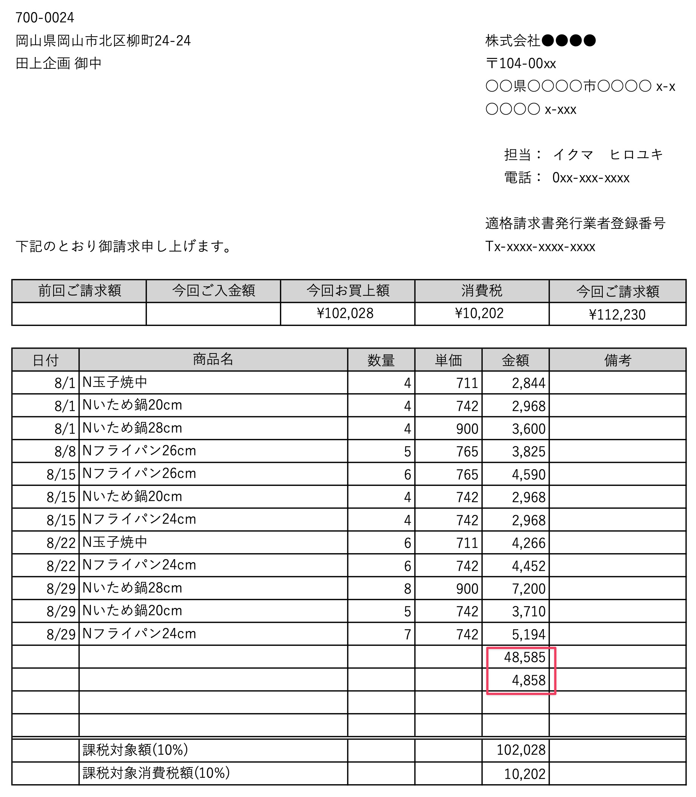
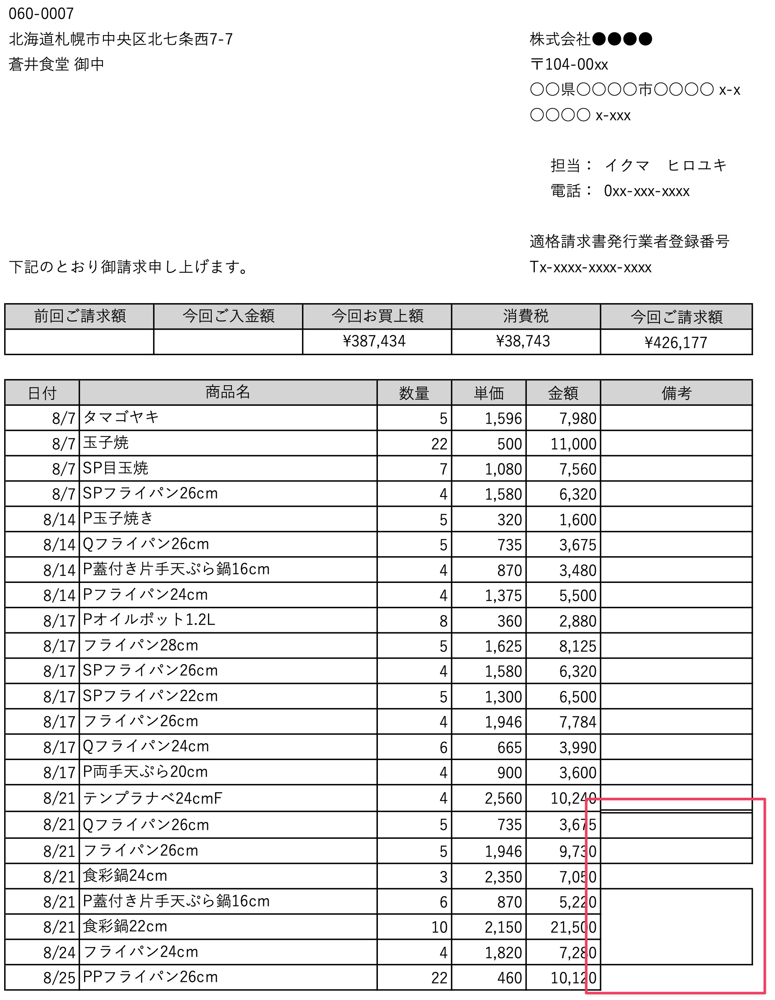
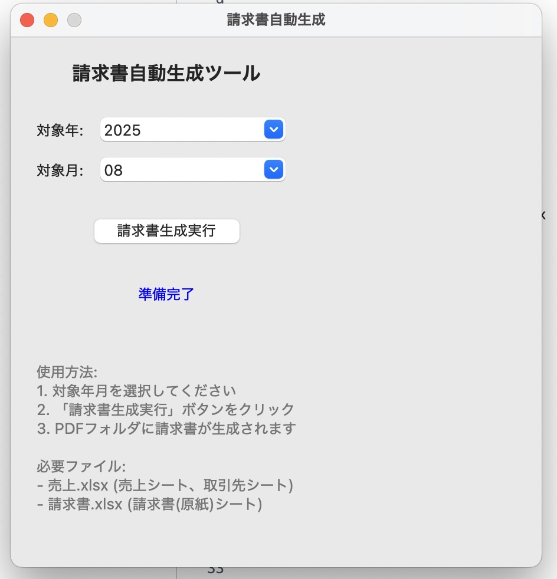
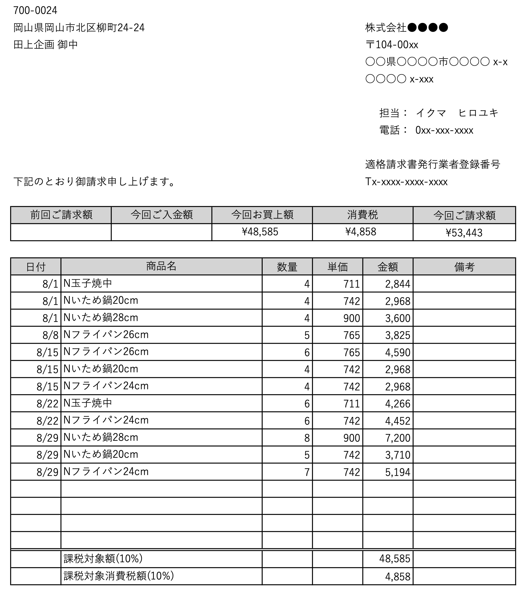
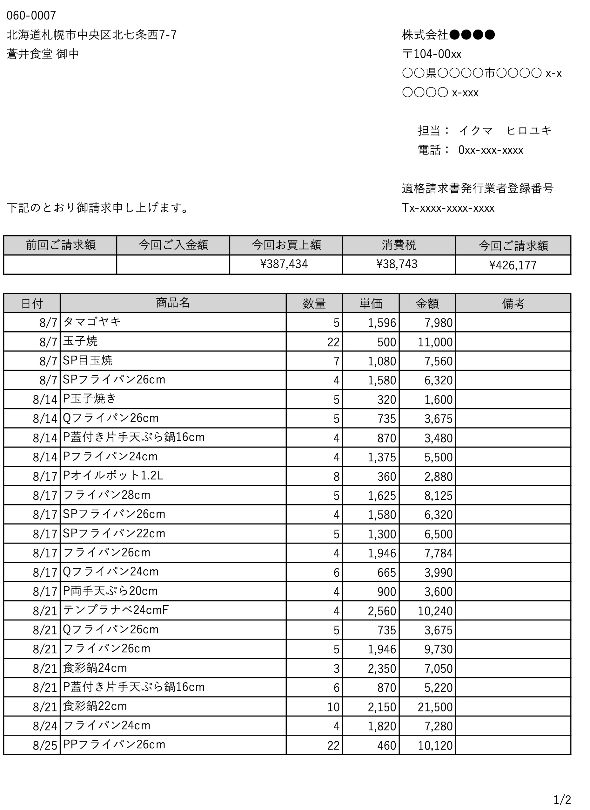
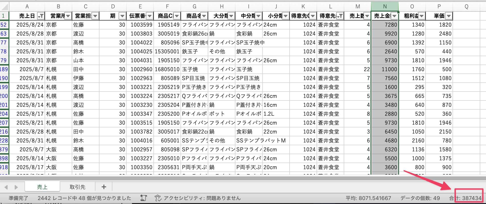

## Plan モードで請求書発行プログラムの仕様書作成

Plan モードで仕様書を作成しましょう。が、その前に 1 つだけ。実は今回のプログラムはなかなか期待した動きにならず少し苦労しました。

プロンプトを細かく調整したり、AI モデルを変えたり、実装されたプログラムを削除してイチから作り直させたり。最終的に上手くいったプロンプトを掲載していますが、あなたの環境で上手くいかない場合はこのような調整を行ってみてください。

では話を戻して、以下のようなプロンプトを新規チャットに入力します。

**excel mcp で 請求書.xlsx と売上.xlsx の構造 (シート名、使用中のセル、入力されている数式) を調べて。** であらかじめ AI にコンテキストとして理解させます。

また、**使用するライブラリ、技術スタックも記載すること**。という一文を加えてさらに詳細な仕様書を作成させます。

[bill\_todo\_prompt\_mac](https://gist.github.com/ikuma-hiroyuki/685d49ce08f4ae2d2c269150dff327d2#file-bill_todo_prompt_mac)

```
これから以下の仕様に基づく仕様書を作成したい。まずは excel mcpで 請求書.xlsxと売上.xlsxの構造(シート名、使用中のセル、入力されている数式)を調べて。

以下の処理を行うPythonプログラムを作成したい。OSはmacOS。以下の内容で仕様書 bill_todo.md を作成して。使用するライブラリ、技術スタックも記載すること。

1. 任意の年月を指定
2. 売上.xlsx の「売上」シートから該当年月のデータを抽出
	1. 売上日は A 列
	2. 商品名は G 列
	3. 数量は M 列
	4. 単価は P 列
3. 請求書.xlsxの「請求書(原紙)」シート をコピーして取引先ごとの請求書シートを作成
4. 取引先ごとの請求書シート名の形式は「請求先名_YYMM」とする
5. 請求書に記載する郵便番号、住所、得意先名は売上.xlsx の「取引先」シートにある以下のデータを利用
	1. A 列の得意先 CD と「売上」シートの K 列の取引先 CD で照合
	2. 郵便番号は C 列。請求書出力先は A4。
	3. 住所は D 列。請求書出力先は A5。
	4. 得意先名は B 列。請求書出力先は A6。
6. 取引データは 20 行目以降に出力する
	1. 日付は A 列
	2. 商品名は B 列
	3. 数量は F 列
	4. 単価は G 列
7. 原紙は 35 行目までしかないのでそれ以上のデータは行を挿入して追記
8. 全ての取引先についてシートを作成したらシート名と同名の PDF を出力する
9. PDF の出力先は売上.xlsx と同じ階層に PDF フォルダを作成して出力する
10. PDF出力が終わったら各取引先ごとのシートは削除する
```



仕様書は以下のようになりました。

[bill\_todo\_mac.md](https://gist.github.com/ikuma-hiroyuki/0e75a6388fb722c3d5c9c24b683560a7#file-bill_todo_mac-md)

この中に登場する Tkinter は GUI (Graphical User Interface) を作成するための Python 標準ライブラリです。`pip install` コマンドは必要ありません。※ macOS において Homebrew で Python をインストールした場合は別途インストールが必要です。

AI とのチャットにおいて年月をどのように指定するかという質問に対して GUI で指定したい。その際のライブラリは標準のものを使う。という回答で選定されたものです。要するにターミナルで入力するのではなく普段よく見るような視覚的なフォームで入力する、ということです。

```markdown
# 請求書自動生成ツール 仕様書（bill_todo.md）

## Notes
- 技術スタック  
  - Python 3.x（macOS 14 で動作確認）  
  - Tkinter（標準 GUI ライブラリ）  
  - pandas（データ抽出・集計）  
  - openpyxl（`売上.xlsx` からの読込）  
  - xlwings（Excel 操作・PDF 出力）  
- 前提  
  - macOS に Microsoft Excel がインストール済みで、PDF 出力が可能  
  - `売上.xlsx` にシート「売上」「取引先」が存在  
  - `請求書.xlsx` にシート「請求書 (原紙)」が存在し、20 〜 35 行目が明細行  
  - 明細行 20〜35 の金額列（H）には `=Fxx*Gxx` の形式で数式が入っている  
  - 合計行（H36）は `SUM(H20:H35)`、消費税行（H37）は `=INT(H36*0.1)`  
- 出力  
  - `売上.xlsx` と同じフォルダに `PDF` ディレクトリを作成し、  
    取引先ごとのシート名と同名の PDF（`請求先名_YYMM.pdf`）を保存  
  - 生成後、各取引先シートを削除しファイルを保存しないまま終了  
- GUI  
  - Tkinter で年月（YYYY-MM）を入力する 1 画面のみ  
  - 実行進捗はメッセージラベルで表示  
- 処理フロー概要  
  1. Tkinter で対象年月を取得  
  2. `売上.xlsx` → 「売上」シートを pandas で読込 & 年月で抽出  
  3. 抽出行を取引先 CD でグループ化  
  4. 取引先情報（郵便番号・住所・得意先名）を「取引先」シートから参照  
  5. xlwings で `請求書.xlsx` を開き、原紙シートを複写  
  6. 明細行数 >16 の場合は行挿入して数式・書式をコピー  
  7. 合計・消費税セルの数式範囲を動的に更新  
  8. ヘッダ情報・明細を転記  
  9. シートを PDF 出力  
 10. 取引先シート削除  
 11. 完了メッセージ表示

# Tasks
- [ ] 1.0 開発環境整備  
  - [ ] 1.1 Python 3.x がインストールされていることを確認  
  - [ ] 1.2 必要ライブラリをインストール（`pip install pandas openpyxl xlwings`）  
  - [ ] 1.3 macOS での xlwings アドイン不要設定を確認

- [ ] 2.0 GUI 実装  
  - [ ] 2.1 Tkinter ウィンドウを作成  
  - [ ] 2.2 年月入力フィールド（YYYY-MM）を配置  
  - [ ] 2.3 実行ボタンを配置し、クリック時にメイン処理を呼び出す  
  - [ ] 2.4 ステータス表示ラベルを実装

- [ ] 3.0 売上データ抽出  
  - [ ] 3.1 `売上.xlsx` を openpyxl で読み込み  
  - [ ] 3.2 「売上」シートを pandas DataFrame に変換  
  - [ ] 3.3 対象年月で `売上日` 列（A）をフィルタ  
  - [ ] 3.4 必要列（A, G, M, P, K）だけ抽出

- [ ] 4.0 取引先マスタ取得  
  - [ ] 4.1 「取引先」シートを pandas DataFrame に変換  
  - [ ] 4.2 取引先 CD（A列）・郵便番号（C列）・住所（D列）・得意先名（B列）を保持

- [ ] 5.0 データ集計  
  - [ ] 5.1 売上抽出結果を取引先 CD で groupby  
  - [ ] 5.2 グループごとに明細 DataFrame を生成

- [ ] 6.0 Excel テンプレート操作  
  - [ ] 6.1 xlwings で `請求書.xlsx` を開く  
  - [ ] 6.2 `PDF` フォルダの存在確認・作成  
  - [ ] 6.3 各取引先ループ処理を開始

- [ ] 7.0 取引先シート生成  
  - [ ] 7.1 「請求書 (原紙)」シートを複写しシート名を `請求先名_YYMM` に設定  
  - [ ] 7.2 ヘッダ A4〜A6 に郵便番号・住所・得意先名を転記  
  - [ ] 7.3 明細行が 16 行を超える場合、行を必要数挿入（34 行目を基点）  
  - [ ] 7.4 挿入した行の書式と数式（F*G→H, `=Fxx*Gxx`）をコピー

- [ ] 8.0 明細転記  
  - [ ] 8.1 A 列に日付を転記（YYYY/MM/DD）  
  - [ ] 8.2 B 列に商品名を転記  
  - [ ] 8.3 F 列に数量を転記  
  - [ ] 8.4 G 列に単価を転記  
  - [ ] 8.5 H 列は数式で金額計算されることを確認

- [ ] 9.0 合計・税計算セル調整  
  - [ ] 9.1 H36 の `SUM` 範囲を `H20:H(明細最終行)` に更新  
  - [ ] 9.2 H37 の消費税数式を維持（`=INT(H36*0.1)`）

- [ ] 10.0 PDF 出力  
  - [ ] 10.1 xlwings の `export_as_fixed_format` でシートを PDF 保存  
  - [ ] 10.2 ファイル名を `請求先名_YYMM.pdf` とし `PDF` フォルダへ配置  
  - [ ] 10.3 出力完了後シートを削除

- [ ] 11.0 終了処理  
  - [ ] 11.1 全取引先処理後、`請求書.xlsx` を保存せず閉じる  
  - [ ] 11.2 Tkinter で完了メッセージを表示

- [ ] 12.0 エラーハンドリング & ログ  
  - [ ] 12.1 ファイル存在チェック（`売上.xlsx`, `請求書.xlsx`）  
  - [ ] 12.2 年月入力形式チェック（`YYYY-MM` 正規表現）  
  - [ ] 12.3 例外発生時にポップアップでエラー内容を表示  
  - [ ] 12.4 ログファイル（`bill.log`）に処理結果を追記

- [ ] 13.0 動作確認  
  - [ ] 13.1 テスト用データで 16 行以内の請求書を生成  
  - [ ] 13.2 40 行超の請求書を生成し行挿入・数式更新を確認  
  - [ ] 13.3 PDF レイアウトと数値（合計・税）を検証
```

これを `bill_todo.md` として保存してください。

チャット履歴は以下のようになりました。

```markdown
# Python program for invoice generation
_Exported on 2025/8/14 at 5:51:27 JST from Cursor (1.4.5)_

**Cursor**

PDF 出力方法について確認させてください。一度に 1 つの質問のみで伺います。

macOS に Microsoft Excel がインストールされており、Python から Excel を自動操作して「PDF として保存」することが可能でしょうか？  
それとも、Excel を使わず Python ライブラリのみで PDF を生成する方法をご希望でしょうか？

---

**User**

可能

---

**Cursor**

対象とする「年月」は、プログラム実行時にどのように指定したいでしょうか？

1) 例：`python bill_generator.py 2025-07` のようにコマンドライン引数で渡す  
2) 実行後にプロンプトで入力する  
3) その他（GUI など）

ご希望の方法を教えてください。

---

**User**

GUIで

---

**Cursor**

GUI で年月を入力する際、利用したい Python の GUI フレームワークに希望はありますか？  
例：Tkinter（標準ライブラリ）、PySimpleGUI、PyQt など。

---

**User**

標準ライブラリ

---

**Cursor**

「請求書 (原紙)」シートには、明細行（20 行目以降）の下にあらかじめ合計・消費税・合計金額などを計算する行が存在していますか？  
存在する場合、行を挿入して明細が増えたときに、その合計用セルの数式範囲をプログラムで自動調整する必要がありますか？

---

**User**

添付画像のようになっている。

---

**Cursor**

ありがとうございます。  
画像を見る限り、合計行（H36）や消費税行（H37）の数式は固定セル範囲（例：`SUM(H20:H35)`）を参照しています。  
明細行が 35 行目より下に増えた場合、これらの数式範囲をプログラムで自動的に拡張・調整する必要がありますか？

---

**User**

拡張する必要があり、数式の参照も調整が必要

---

**Cursor**

Excel の操作や PDF への書き出しを自動化するために、openpyxl や xlwings などのサードパーティ Python ライブラリを使用してもよろしいでしょうか？  
（GUI は標準ライブラリ Tkinter を想定しています。）

---

**User**

よい

---

**Cursor**

PDF 出力後、取引先ごとのシートを削除したあとに  
「請求書.xlsx」を上書き保存せず元の状態（原紙シートのみ）に戻したまま終了しても問題ありませんか？

---

**User**

問題ない

---

**Cursor**

明細行を 35 行目より下に追加する際、  
「金額」列（画像では各行に `=F20*G20` などが設定）の数式を、新しく挿入した行にもコピーして設定する必要がありますか？

---

**User**

必要

---

**Cursor**

仕様書（bill_todo.md）を作成するための情報は揃ったと考えています。  
この内容で仕様書をまとめてもよろしいでしょうか？

---

**User**

ok

```

途中で以下のような AI の質問に対して画像を添付して回答しました。Excel の「数式タブ」の「数式で表示」ボタンを押すと表示される画面です。Excel に入力されている数式が表示されるので今回のようなケースで役に立ちます。

```
「請求書 (原紙)」シートには、明細行（20 行目以降）の下にあらかじめ合計・消費税・合計金額などを計算する行が存在していますか？  
存在する場合、行を挿入して明細が増えたときに、その合計用セルの数式範囲をプログラムで自動調整する必要がありますか？
```



## 実装の指示

仕様書に基づいて請求書発行プログラムを実装しましょう。新規チャットで以下のようにプロンプトを入力します。モデルは claude-4-sonnet を使います。

```
@bill_todo.md にしたがって請求書発行Pythonプログラムを実装して
```

実装されたコードは以下 URL でご確認ください。

[bill\_generators\_mac.py](https://gist.github.com/ikuma-hiroyuki/cd8c9e04a59cddd4de1d4a326fe1ff5e/c3d2009bdd6ab1d614104552a19936ddc73cfd67)

テストしてみます。**売上.xlsx は売上データを取り込んだ状態にしておいてください**。プログラムを実行すると以下のようなフォームが表示されますので、任意の年月を選んで実行ボタンを押します。



途中でファイルアクセスの許可が求められますが許可してください。



お使いの環境によっては、Excel を最小化していると処理が進まないかもしれません。ご注意ください。

完了時には以下のようなダイアログが表示されます。


作成された PDF を確認すると、3 箇所修正が必要です。

#### ① 年月設定フォームの使用方法が見切れてしまっている


#### ② 行追加不要な場合に余計な合計

新たに行を追加していない請求書の場合、下の図のように課税対象額と消費税出力欄を余計に出力しています。



#### ③ 行を追加した場合備考列を含まずに挿入している

行を追加した請求書の場合備考列を含まずに行を挿入しているようです。そのため罫線がずれてしまっています。



### コードの修正依頼

新しいチャットを開いて以下のように修正を依頼します。ざっくりとした修正では精度が落ちたり意図が伝わらなかったりするので、セル番地を含めて細かく指示するのが基本です。今回の場合は列番地を指示しています。

```
以下の修正が必要。
- GUIで使用方法より下が見切れてしまって途中までしか表示されていない
- 行を挿入しない請求書の場合金額合計とそれに対する消費税計算行が余計に追加されている。これは不要。
- 行を挿入する場合、AからH列までしか挿入されていない。I列まで含めて挿入する。
```

[bill\_generators\_mac.py](https://gist.github.com/ikuma-hiroyuki/cd8c9e04a59cddd4de1d4a326fe1ff5e/9e9c1be8bca83f96b3af16525a455e92cdca6e88)

確認したところ、うまくいきました。







### 集計の確認

請求書に載っている金額、正しいか目視で確認します。



合計が合っているので大丈夫ですね。
