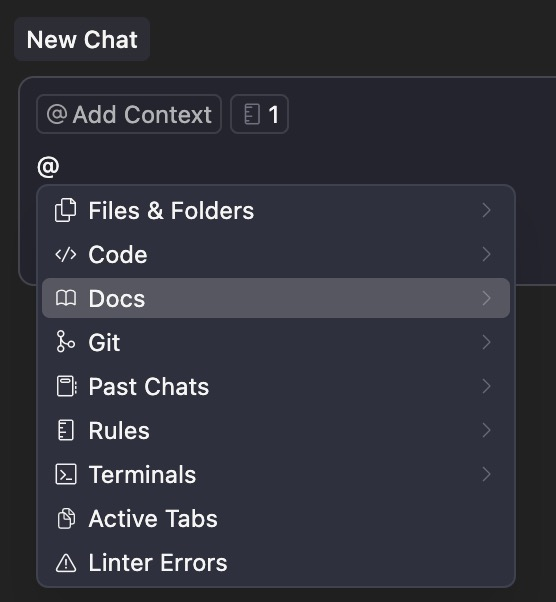
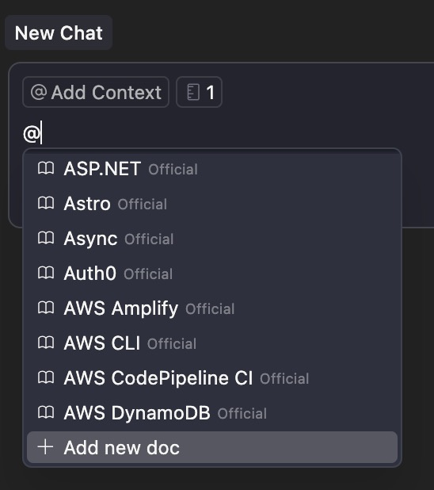
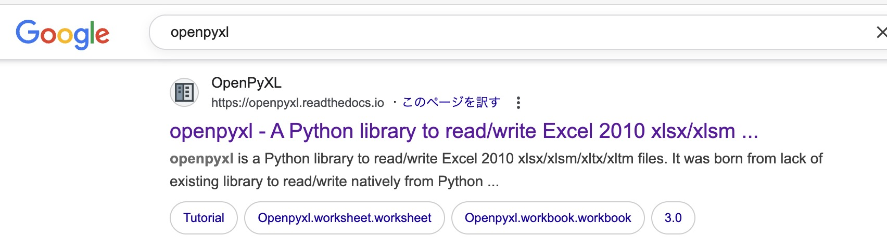
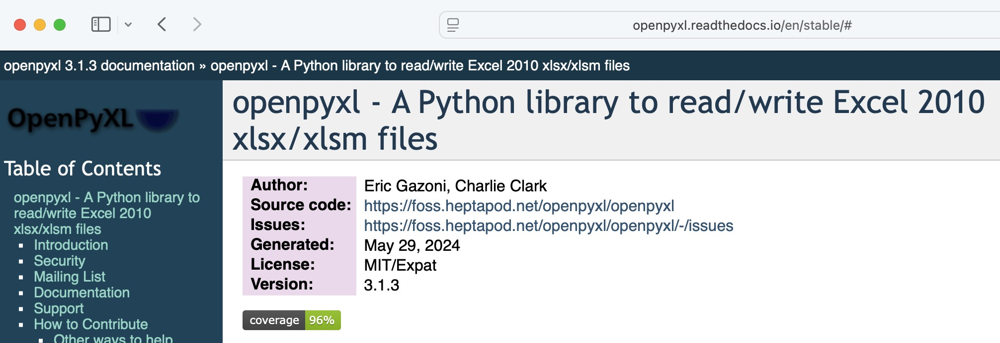
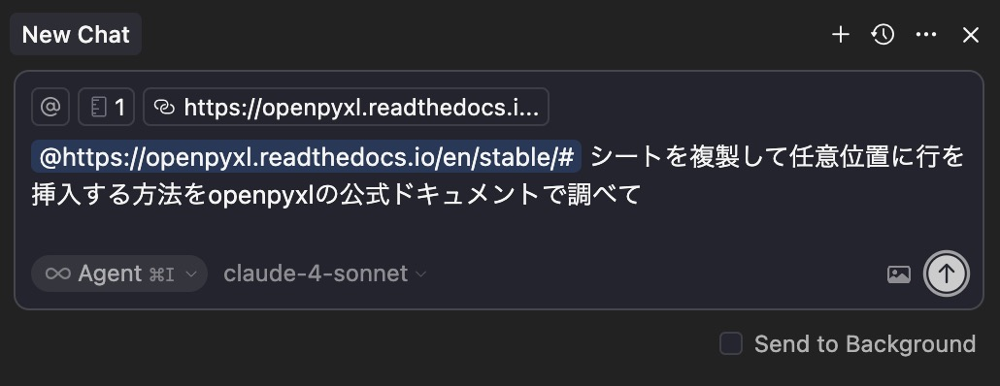
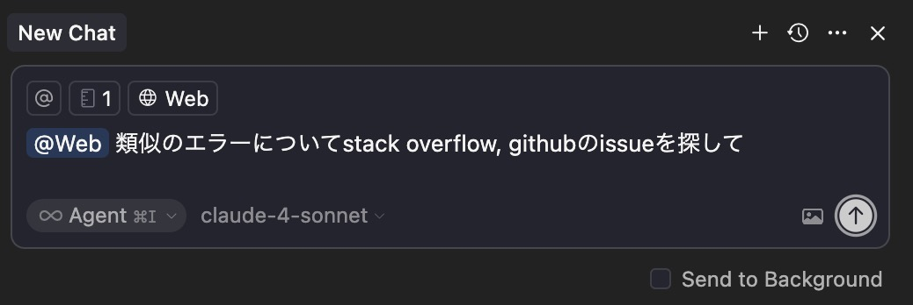

## 上手く行かない場合のステップ

バイブコーディングで何度トライしても上手くいかない場合は、まず **Python のバージョンを最新版ではなく少し前にしてください**。最新版はライブラリの開発が追いついていないことがあります。当初 `3.13.7` では上手く行きませんでしたが、`3.12.10` にしたところうまくいきました。

それでも上手くいかない場合は、以下のステップを試してください。

1. `@` シンボルでより有用なコンテキストを与える
2. より高度なモデルに変更
3. より詳細なプロンプトを入力
4. 最終手段として仕様書を削除しイチから作り直し
5. タスクを分割する

## 1. @シンボルでより有用なコンテキストを与える

これまでの `@` シンボルの使い方はファイル・フォルダを明示するものでしたが、`@` シンボルには他にもいろいろな使い道がありますが、ここでは 3 つに絞って解説します。上手くいかない時は、この 3 つを上から順番に試してみてください。

- Cursor に組み込まれた公式ドキュメントへの参照
- ユーザーが公式ドキュメントへのリンクを URL で与える
- AI に Web 検索させて最新の情報を見つけてコンテキストとして追加

なおこの方法はうまくいかない時だけではなく、仕様書を作る時、実装をさせる時にはじめからコンテキストとして与えることも有用です。

### Cursor に組み込まれた公式ドキュメントへの参照

プログラミングで調べ物をする時、初めに当たるべきは公式ドキュメントです。しかし、非エンジニアにとって公式ドキュメントは基本的に英語で書かれているうえ、技術文章なので読み解くのが難しいです。しかし AI には最高の教材になります。

公式ドキュメントをコンテキストとして与えるには `@` 入力した時に表示されるリストの中で、Docs を矢印で選択し、`Tab` キーを押すと、



下の図のように人気のある方式ドキュメントが大量に表示されます。この中にお目当てのドキュメントがあれば、コンテキストとして与えられます。



リストの末尾には「Add new doc」があり、リストにユーザーが指定する方式ドキュメントを追加することもできます。

[Cursor – @Docs](https://docs.cursor.com/ja/context/@-symbols/@-docs)

### ユーザーが公式ドキュメントへのリンクを URL で与える

Cursor 組込みの公式ドキュメントに目当てのものがない場合、ドキュメントへの URL をコンテキストとして与えられます。

例えば Excel 操作ライブラリである OpenPyXL を Google 検索するとトップに表示されます。これが公式ページですが、このリンクをチャット欄に貼ると AI のコンテキストになります。



[https://openpyxl.readthedocs.io/en/stable/#](https://openpyxl.readthedocs.io/en/stable/#)





[Cursor–@Docs](https://docs.cursor.com/ja/context/@-symbols/@-docs

### AI に Web 検索させて最新の情報を見つけてコンテキストとして追加

どれが公式サイトなのかわからない場合や、そこまで具体的でない要求、エラー解決を AI に Web 検索させてコンテキストにできます。

例えば下図のようにします。**ターミナルで表示されたエラーメッセージもコンテキストとして与えるのを忘れないでください。**



Stack Overflow は英語圏のエンジニア向けの Q&A サイト、Github の Issue はプロジェクトの課題管理ツールです。このような場所を検索すると解決策が見つかることがあります。

[Cursor – @Web](https://docs.cursor.com/ja/context/@-symbols/@-web)

## 2. より高度なモデルに変更

使用する AI のモデルによって料金が変わります。コスト圧縮のため、最高のモデルを使っていない場合、それを使うようにしてみてください。今まで解けなかった問題が一発で解けることもあります。

## 3. より詳細なプロンプトを入力

発生しているエラーの状況、例えばどういうタイミングでどういうエラーになるか、AI に詳しく説明したり、処理する順番を詳しく説明してみたりします。

喩えると、、、あるプロジェクトに、急に外部の協力者が入ってきた状況を想像してください。今起きている問題も、そのプロジェクトがどういうものなのかも、何も知らないその人に、イチからこと細かく説明するイメージです。

私の感覚では、もはや自然言語によるプログラミングを行っているのではないか、さえ思う時があります。つまり、「〇〇の場合はこうする、□□の場合はこうするそれ以外はこうする」などの判断や仕様説明を AI 自然に対して言語でしているわけですが、これはプログラミング言語を使ってコンピューターに具体的に指示するのとあまり変わらないなぁと思う時があります。

## 4. 最終手段として仕様書を削除しイチから作り直し

それでもうまくいかない場合は、一回すべてセットして、イチから作り直します。問題のある仕様書を元に問題のあるプログラムが出来上がった可能性もありますし、AI が仕様書に従いすぎて問題を解決できない場合も考えられます。

人間であれば、仕様書には●●と書いてあるけど、この問題を解くためには、■■の方がいいよね、と柔軟に考えられますが、詳細な仕様書ほど、AI は柔軟性を失います。そのため、発覚している問題を織り込んで、全部 1 から作り直しが時に有効です。本書の題材である「小規模」「使い捨て」のなせる荒技です。

## 5. タスクを分割する

本書では AI に仕様書を作らせてそれをもとに一気に実装させていますが、すべてを一気に実装させるのではなく、より小さな単位で実装させる有効な手段です。一気に実装させるとどの部分で失敗したのか分かりにくくなります。小さな単位で少しずつ確実に実装していき、足場を固めていきます。

「最終手段として仕様書を削除しイチから作り直しの後」でタスク分割するだけでなく最初からタスク分割して依頼するのもとても有効です。

AI が短時間で大量のコードを実装してくれるので、一気に実装させたくなってしまいますし、本書でもある意味一気に実装させているわけですが、従来のプログラミングでは小さなタスクを一つずつ確実に実装して積み上げていくのが常識でした。

例えば仕様書に以下のようなタスクがあった場合、まずはロギングの設定だけさせる。それがうまくいったら GUI を実装させる。それがうまくいったらユーザー入力取得だけ実装させる。という具合です。

```markdown
- [ ] 3.0 ロギング設定
  - [ ] 3.1 `logging.basicConfig` で `warning.log` を WARN レベルで設定
- [ ] 4.0 GUI 実装
  - [ ] 4.1 tkinter ウィンドウを生成
  - [ ] 4.2 年スピンボックスを配置（2000–2100）
  - [ ] 4.3 月スピンボックスを配置（1–12）
  - [ ] 4.4 「実行」ボタンにコールバック登録
  - [ ] 4.5 `mainloop()` で起動
- [ ] 5.0 ユーザー入力取得
  - [ ] 5.1 ボタン押下で年・月を整数取得
  - [ ] 5.2 `YYMM` と `YYYY-MM` 形式の文字列を生成
- [ ] 6.0 入力 Excel 読込
  - [ ] 6.1 `売上.xlsx` を openpyxl でロード
  - [ ] 6.2 `請求書.xlsx` を openpyxl でロード
- [ ] 7.0 売上データ抽出
  - [ ] 7.1 pandas で「売上」シートを DataFrame 化
  - [ ] 7.2 日付列を日付型へ変換
  - [ ] 7.3 対象年月でフィルタリング
```
