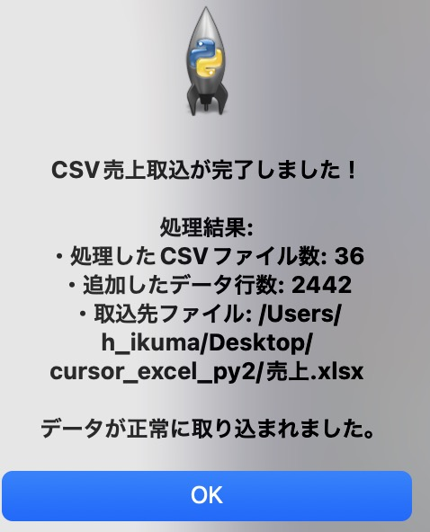
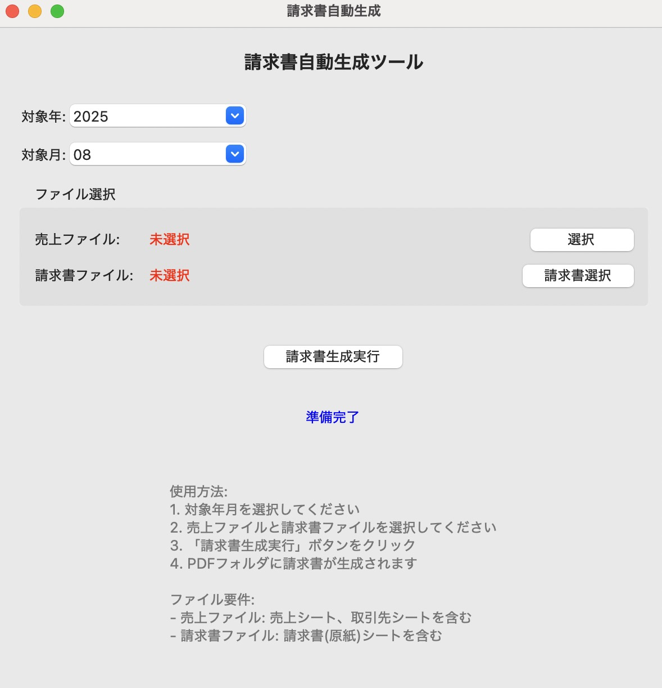
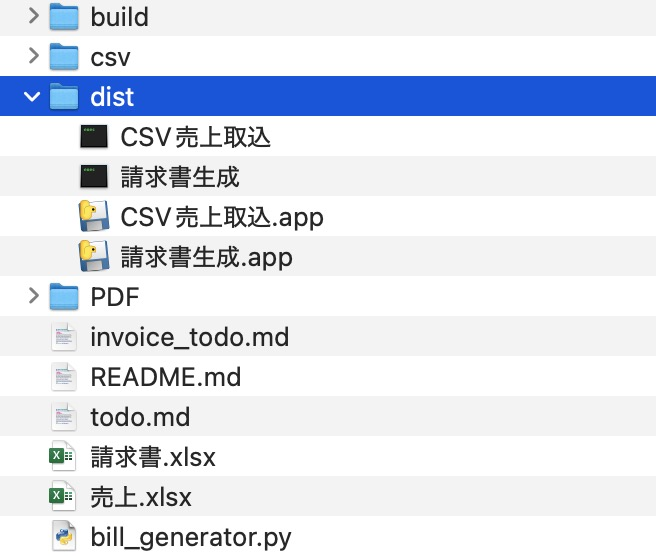
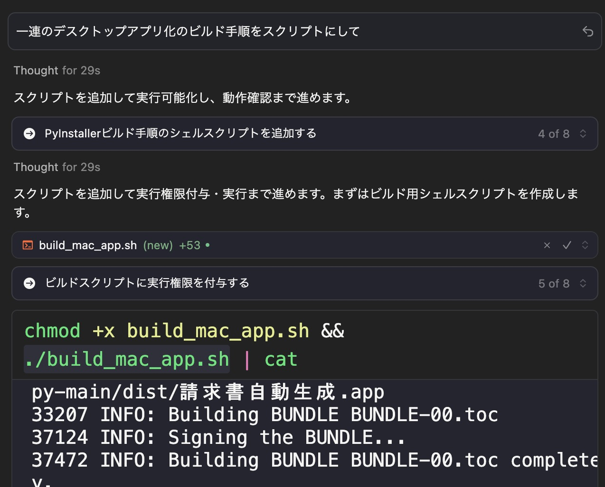
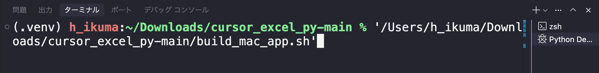

## 参照フォルダの修正

次はデスクトップアプリにします。ここまででプログラムはほぼ完成なのですが、デスクトップアプリ化するにあたり少しだけ調整が必要です。現在のプログラムでは、プログラムが配置されている場所と同じところに CSV フォルダと Excel ファイルがあるのが前提です。これを任意のフォルダ・ファイルを選択できるように変更します。詳細は割愛しますが、デスクトップアプリにするとこの前提を満たすのが難しくなるためです。

### csv_import.py の修正

デスクトップアプリにするため以下のように AI に指示を出します。まずは `csv_import.py` から。まとめてやると精度が落ちますので、なるべく細かく区切って指示を出すようにします。モデルは claude-4-sonnet です。

```
@csv_import.py 任意のフォルダと売上.xlsxを選択できるように修正。
```

```
@csv_import.py 売上.xlsxも選択できるように修正
```

```
完了時のダイアログも表示するように修正。
```

完成したコードは以下 URL からご確認ください。**Windows と macOS で共通です**。

[csv\_import.py](https://gist.github.com/ikuma-hiroyuki/4d83ede22f50c2c3deed8d21a23339a9/35c9a10384dbcab0c380543790927966e5e65063)

差分は以下 URL で確認できます。

[Revisions · csv\_import.py](https://gist.github.com/ikuma-hiroyuki/4d83ede22f50c2c3deed8d21a23339a9/revisions)

CSV ファイルを読み込むと、下図のように表示されるようになりました。(画像は macOS 版です)



### bill_generator.py の修正

次は新しいチャットで bill_generator.py を修正するために以下のように指示を出します。

```
@bill_generator.py 売上.xlsx と請求書.xlsx を任意の場所から選択できるように修正。
```

以下のようにファイルを選択できるようになりました。

完成したコードと差分は以下の URL からご確認ください。

#### Windows 版


[invoice\_generators\_win.py](https://gist.github.com/ikuma-hiroyuki/c447a5379fd234c226fa603756c4d520/f352cd7cb43ca12a58140b7a3303950581d2e6fa)

[差分](https://gist.github.com/ikuma-hiroyuki/c447a5379fd234c226fa603756c4d520/revisions)

#### macOS 版



[bill\_generators\_mac.py](https://gist.github.com/ikuma-hiroyuki/cd8c9e04a59cddd4de1d4a326fe1ff5e/4a8967e89d66f46c4a5f5dbf6c7a4a1cd52ee0ce)

[差分](https://gist.github.com/ikuma-hiroyuki/cd8c9e04a59cddd4de1d4a326fe1ff5e/revisions)

## デスクトップアプリ化の指示

デスクトップアプリ化するために以下のように指示を出します。

```
{OS名}環境で配布できるように @csv_import.py と @bill_generator.py をそれぞれデスクトップアプリ化して
```

`{OS名}` のところはお使いの OS を入力してください。

色々なコマンドが実行されて最終的に以下のように、dist フォルダに.exe/.app が作成されます。※ dist は distribution = 配布の略です

これを配布すれば他の方の Windows/macOS でも Python がインストールされていなくてもプログラムを実行できます。



お使いの環境によってはアプリビルド完了までけっこう待たされ、進捗してるの？と不安になるかもしれません。

そのような場合は下図の Click to focus をクリックしてください。途中経過をターミナルで確認できます。


また、完成したアプリはダブルクリックでは開かない場合があります (特に macOS)。そのような場合はもう一度ダブルクリックしてください。

ともあれ、ここまで自分で一行もコードを書くことなくアプリを作ることができました。お疲れ様でした！

## 一連のデスクトップ化作業をスクリプト化する

AI によってデスクトップアプリができたと思います。AI があなたの代わりに色々なコマンドを実行したり、ライブラリをインストールでデスクトップアプリ化されました。しかし、開発したプログラムに変更があった場合、再度 AI に依頼するのも時間とコストがもったいないですね。なので、AI による「一連の作業自体」をクリプト化してしまいましょう。

```
一連のデスクトップアプリ化のビルド手順をスクリプトにして
```



すると以下のような感じでライブラリインストールやコマンド実行をパッケージにしてクリプトにしてくれます。

Windows の場合は.bat もしくは.ps が、macOS の場合は以下のような末尾が.sh のファイルが作成されます。

```shell
#!/bin/zsh
set -euo pipefail

# ============================
# macOS 用デスクトップアプリ ビルドスクリプト
# - .venv を使用（なければ作成）
# - 依存関係と PyInstaller を .venv にインストール
# - PyInstaller で .app を出力
# - 仕上げに .app を ZIP 化（配布用）
# ============================

SCRIPT_DIR="$(cd "$(dirname "$0")" && pwd)"
cd "$SCRIPT_DIR"

APP_NAME="請求書自動生成"
ENTRYPOINT="bill_generator.py"
VENV_DIR=".venv"

echo "[1/5] 仮想環境の確認/作成: $VENV_DIR"
if [ ! -d "$VENV_DIR" ]; then
  python3 -m venv "$VENV_DIR"
fi

echo "[2/5] 仮想環境の有効化"
source "$VENV_DIR/bin/activate"

echo "[3/5] 依存関係のインストール/更新"
python -m pip install -U pip setuptools wheel
python -m pip install -r requirements.txt
python -m pip install pyinstaller

echo "[4/5] PyInstaller でビルド実行"
pyinstaller --noconfirm --clean --windowed --name "$APP_NAME" "$ENTRYPOINT"

DIST_DIR="dist"
APP_BUNDLE_PATH="$DIST_DIR/$APP_NAME.app"
ZIP_PATH="$DIST_DIR/$APP_NAME.zip"

if [ ! -d "$APP_BUNDLE_PATH" ]; then
  echo "エラー: $APP_BUNDLE_PATH が見つかりませんでした" >&2
  exit 1
fi

echo "[5/5] 配布用に ZIP 作成: $ZIP_PATH"
# ditto は macOS 標準で .app のリソースを保持したまま ZIP 化できる
rm -f "$ZIP_PATH" || true
ditto -c -k --sequesterRsrc --keepParent "$APP_BUNDLE_PATH" "$ZIP_PATH"

echo "--- 完了 ---"
echo "出力: $APP_BUNDLE_PATH"
echo "配布: $ZIP_PATH"
```

このクリプトファイルをマウスでターミナルにドラッグ&ドロップするとスクリプトのフルパスが表示されますので `Enter` キーで実行すれば一連のビルド作業が行われてデスクトップアプリができます。


