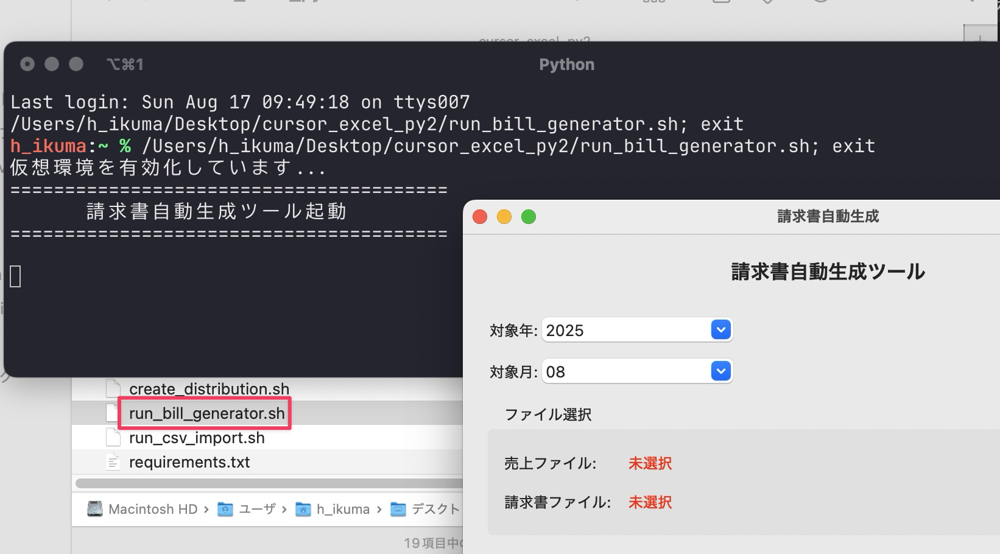
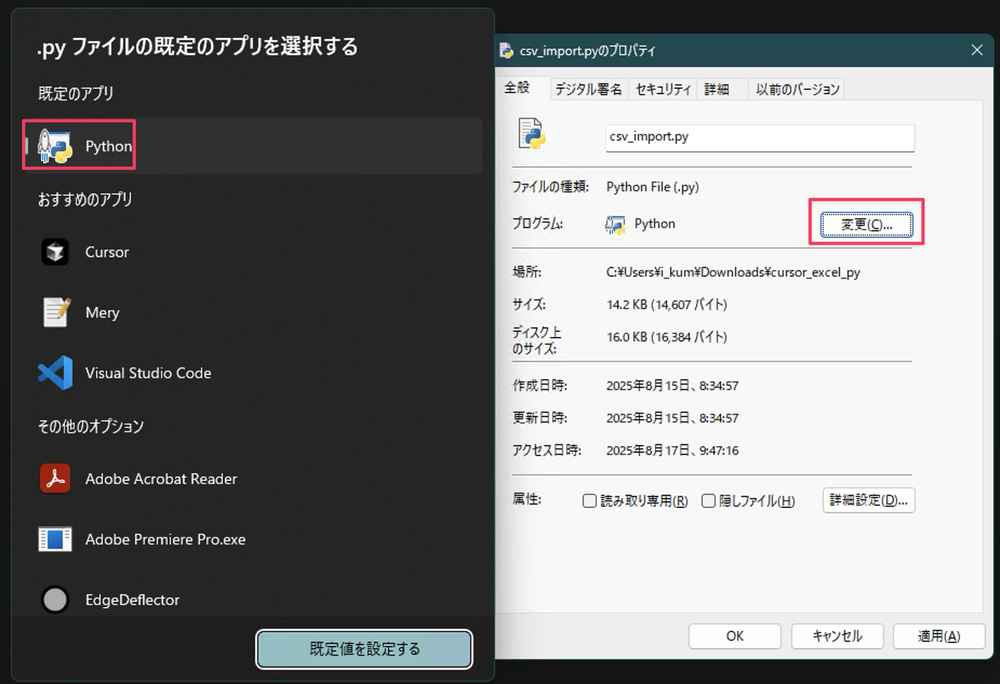
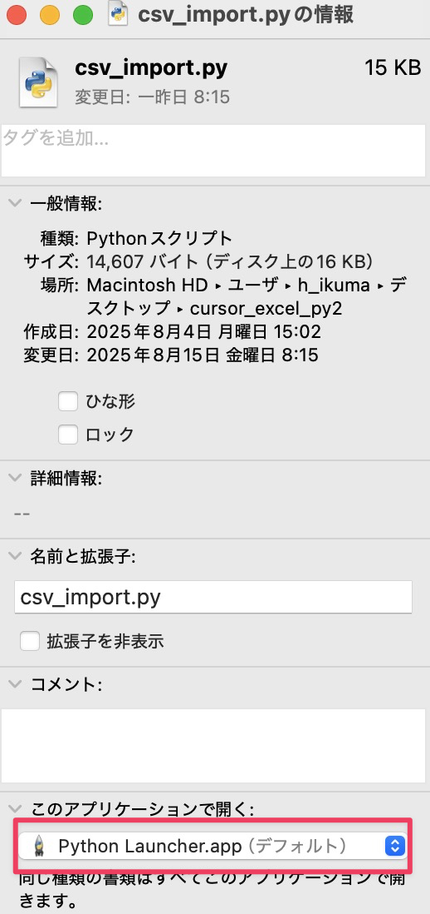

前項で Python がインストールされていない環境に配布して実行する方法を学びました。しかし他人に配布する必要がなく自分だけ使えればよい、ということもあるでしょう。このような時いちいち配布形式にして実行するのは面倒ですし AI の利用コストもかかります。

Cursor を開いて実行するのも１つの手段ですがプログラム実行のためだけに Cursor を開いて実行するのもやや大げさです。

そこでここではサクッとアプリを実行する方法を学びましょう。サクッと Python プログラムを実行するにはターミナルで実行します。通常は以下の手順で実行します。ぜんぜんサクッとじゃないじゃないか！という声も聞こえてきそうですがまずは基本を押さえて、その上でサクッと実行する方法を解説します。

1. ターミナルを開く
2. `CD` コマンドでプログラムが格納されているディレクトリ (フォルダ) に移動する
3. 仮想環境に入る
4. プログラムを実行する

2~4 のコマンドの具体例は以下のようになります (macOS 環境)。

```shell
cd /Users/h_ikuma/Desktop/cursor_excel_py
source .venv/bin/activate
python csv_import.py
```

`cd` コマンドとは、change directory の略で、ターミナルでどのディレクトリを開くかというコマンドです。ディレクトリはフォルダのことです。通常、ターミナルを開いた直後は、プログラムが格納されたフォルダが開かれていませんので、まずはプログラムが保存されているフォルダを開きます。

`cd` に続いて半角スペースを入力したらフォルダのパスを入力するのですが、ドラッグ＆ドロップしてもパス入力されます。

仮想環境を有効化する方法は先述しましたね。OS ごとのコマンドで有効化します。ただし、標準ライブラリだけで実装され、仮想環境がないプロジェクトの場合は、ここは飛ばします。

最後に Python コマンドと実行するファイルを指定してプログラムを実行します。

### ダブルクリックで実行できるようにする

さて、基本が分かったところでサクッと実行する方法を解説します。ダブルクリックで実行できるようにする方法です。以下のように AI にプロンプトを投げます。スクリプト作成は低負荷なので応答が早く低コストな `gemini-2.5-flash` でよいでしょう。

```
@bill_generator.py をダブルクリックで実行できるスクリプトを作成して
```

Windows の場合は末尾が `.bat`、macOS の場合は `.sh` のファイルが作成されると思います。これをダブルクリックすればサクッと実行できます。(Windows で作成されたファイルが `.bat` になっていない場合はプロンプトで `.bat` にするよう指示してください)



以下の一連の動作をまとめて実行するスクリプト (プログラム) です。

1. ターミナルを開く
2. `CD` コマンドでプログラムが格納されているディレクトリ (フォルダ) に移動する
3. 仮想環境に入る
4. プログラムを実行する

ここで作成されるスクリプトの中身は以下のようになっています。

**Windows**

```batch
@echo off
rem カレントディレクトリに移動
cd /d %~dp0

rem 仮想環境を有効化
call .venv\Scripts\activate.bat 

rem Python スクリプトを実行
python bill_generator.py 

rem 処理が完了するまでウィンドウを開いたままにする
pause
```

**macOS**

```bash
#!/bin/bash

# スクリプトがあるディレクトリに移動
SCRIPT_DIR="$(dirname "$0")"
cd "$SCRIPT_DIR"

# .venvをアクティブ化
if [ -d ".venv" ]; then
    source .venv/bin/activate
else
    echo ".venv が見つかりません。Python仮想環境が設定されていることを確認してください。"
    exit 1
fi

# Pythonスクリプトを実行
python import_csv_to_excel.py

# ターミナルが閉じないように一時停止
read -p "Press Enter to close..."
```

### ターミナルの挙動を微調整する

末尾の `pause` (Windows)、`read -p` (macOS) に注目です。これはターミナルを開いたままにするコマンドですが、GUI を使ったプログラムでは削除したほうが使い勝手がよいです。反対に `csv_import.py` のような GUI がないプログラムでは一瞬でターミナルが閉じて何が起きたのか分からないのであった方がよいです。

### 他のプログラムに応用する

上記スクリプトは `python bill_generator.py` のファイル名部分を書き換えることで他のプログラムにも応用できます。つまりこのスクリプトをコピーしてプログラム名を書き換えればもう AI に依頼する必要はありません。

## ダブルクリック用スクリプトを別の場所に移動させる

ここで作成されたスクリプトは、このままだと別の場所に移動してもプログラムを正常に実行できません。というのも、CD コマンドの移動先や仮想環境のある場所が、ダブルクリック用スクリプトがある場所を相対的な方法で示しているためです。AI に絶対パスで記述させる方法もありますが、Python プログラムを格納したディレクトリ自体を移動した場合、プログラムを実行できなくなります。

よって相対パスのまま移動できるようにします。ダブルクリック用スクリプトを右クリックし、Windows の場合はショートカットを作成、macOS の場合はエイリアスを作成して任意の場所にショートカット及びエイリアスを移動させます。

これで自分用のプログラムをサクッと実行できます。

## 仮想環境を使わないプログラムの場合

なお、この方法は仮想環境を使ったプログラムを実行する場合の方法です。標準ライブラリだけで実装されたプログラムの場合、ダブルクリック用のスクリプトを作る必要はありません。適切に設定されていれば Python ファイルをダブルクリックするだけでプログラムが実行されます。

適切な設定とは、Windows の場合 Python ファイルを選択して `Alt+Enter` キーでプロパティを開き既定のアプリを Python に設定します。



macOS の場合は Python ファイルを選択して `Cmd+I` キーで「情報」を表示させ「このアプリケーションで開く」を Python Launcher.app にします。


