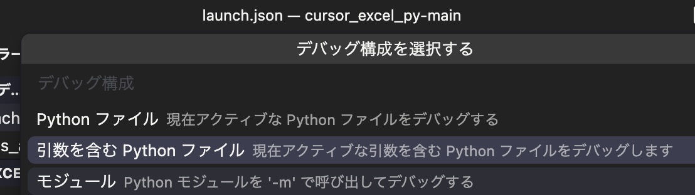
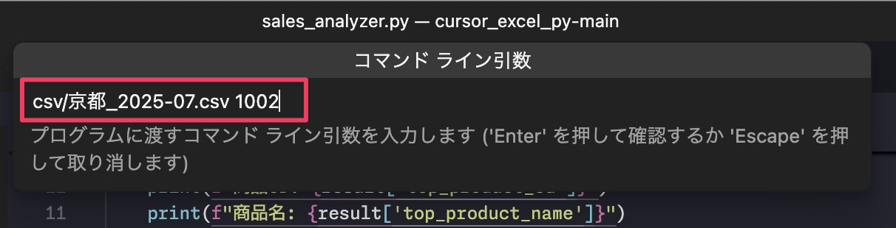

ここまで本書では「引数」が不要なプログラムを作ってきました。しかし今後あなたのバイブコーディングの中には引数が必要なプログラムが出てくるはずです。そのために引数の意味と実行方法を解説します。

プログラムにおける引数とは、実行したいプログラムに与えるデータのことです。このデータを元に計算させたり、条件を指定してプログラムを実行させることができます。

単純なものではプログラムに与えた引数 (数値) を 10 倍にして表示するとか、与えた引数 (名前) に「様」を付けて表示するとか、与えた引数 (数値) が 100 以上なら「100 以上です」と表示するとか、そういったことができます。

ここでは引数として「CSV ファイルのパス」、「得意先 CD」をもとに、その得意先名、売上金額合計、対象得意先で最も売上額が多い商品 CD と商品名を返すプログラムを作成します。返す値のことを戻り値や返値といいます。自動販売機にお金を入れて (引数)、商品を選ぶと (引数)、飲み物が返ってきますね (戻り値)。これと一緒です。

## CSV データ分析プログラムの実装

以下のようなプロンプトを入力します。モデルは `claude-4-sonnet` を使用しました。

```
売上データCSVファイル(Shift-JISおよびUTF-8)のパスと得意先CDを指定したら以下の結果を表示するプログラムを作って。
- 得意先名
- 売上金額合計
- 対象得意先で最も売上が多い商品CDと商品名、売上金額合計
```

すると、プロジェクト内の既存ファイル群を読み込んで方針を固め、すぐに以下のプログラムが実装されました。

`pandas` を使うプログラムです。仮想環境にインストールされていない場合は `pip install pandas` でインストールしてから実行してください。

この例では既存のファイル群があるので、それを読み込みましたが、プロジェクトで初めて実装するプログラムで、引数が必要な場合、Plan モードを使用たり、詳細なプロンプトを与えたりして調整してください。

[sales\_analyzer.py](https://gist.github.com/ikuma-hiroyuki/6ca25e73327d9cd0e710ceeae6a2cd45)

```python
#!/usr/bin/env python3
# -*- coding: utf-8 -*-
"""
売上データCSVファイル分析プログラム

CSVファイルパスと得意先CDを指定して以下の結果を表示する：
- 得意先名
- 売上金額合計
- 対象得意先で最も売上が多い商品CDと商品名、売上金額合計
"""

import pandas as pd
import sys
import os
from typing import Tuple, Optional


def detect_encoding(file_path: str) -> str:
    """
    CSVファイルのエンコーディングを検出する
    
    Args:
        file_path: CSVファイルのパス
        
    Returns:
        検出されたエンコーディング（'utf-8' または 'shift_jis'）
    """
    encodings = ['utf-8', 'shift_jis']
    
    for encoding in encodings:
        try:
            with open(file_path, 'r', encoding=encoding) as f:
                f.read(1024)  # 最初の1024文字を読み込んでテスト
            return encoding
        except UnicodeDecodeError:
            continue
    
    # どちらも失敗した場合はUTF-8をデフォルトとする
    return 'utf-8'


def load_csv_data(file_path: str) -> pd.DataFrame:
    """
    CSVファイルを読み込む
    
    Args:
        file_path: CSVファイルのパス
        
    Returns:
        読み込まれたDataFrame
        
    Raises:
        FileNotFoundError: ファイルが存在しない場合
        Exception: CSV読み込みに失敗した場合
    """
    if not os.path.exists(file_path):
        raise FileNotFoundError(f"指定されたファイルが見つかりません: {file_path}")
    
    # エンコーディングを自動検出
    encoding = detect_encoding(file_path)
    
    try:
        df = pd.read_csv(file_path, encoding=encoding)
        print(f"CSVファイルを読み込みました: {file_path} (エンコーディング: {encoding})")
        return df
    except Exception as e:
        raise Exception(f"CSVファイルの読み込みに失敗しました: {e}")


def analyze_customer_sales(df: pd.DataFrame, customer_cd: str) -> dict:
    """
    指定された得意先CDの売上データを分析する
    
    Args:
        df: 売上データのDataFrame
        customer_cd: 分析対象の得意先CD
        
    Returns:
        分析結果の辞書
    """
    # 得意先CDでフィルタリング
    customer_data = df[df['得意先CD'] == customer_cd]
    
    if customer_data.empty:
        return {
            'found': False,
            'customer_cd': customer_cd,
            'message': f'得意先CD "{customer_cd}" のデータが見つかりませんでした。'
        }
    
    # 得意先名を取得（最初のレコードから）
    customer_name = customer_data['得意先名'].iloc[0]
    
    # 売上金額合計を計算
    total_sales = customer_data['売上金額'].sum()
    
    # 商品別の売上金額を集計
    product_sales = customer_data.groupby(['商品CD', '商品名'])['売上金額'].sum().reset_index()
    
    # 最も売上が多い商品を取得
    top_product = product_sales.loc[product_sales['売上金額'].idxmax()]
    
    return {
        'found': True,
        'customer_cd': customer_cd,
        'customer_name': customer_name,
        'total_sales': total_sales,
        'top_product_cd': top_product['商品CD'],
        'top_product_name': top_product['商品名'],
        'top_product_sales': top_product['売上金額']
    }


def format_currency(amount: int) -> str:
    """
    金額を日本円形式でフォーマットする
    
    Args:
        amount: 金額
        
    Returns:
        フォーマットされた金額文字列
    """
    return f"¥{amount:,}"


def print_analysis_result(result: dict) -> None:
    """
    分析結果を表示する
    
    Args:
        result: analyze_customer_sales関数の戻り値
    """
    if not result['found']:
        print(f"\n{result['message']}")
        return
    
    print(f"\n=== 得意先分析結果 ===")
    print(f"得意先CD: {result['customer_cd']}")
    print(f"得意先名: {result['customer_name']}")
    print(f"売上金額合計: {format_currency(result['total_sales'])}")
    print(f"\n--- 最も売上が多い商品 ---")
    print(f"商品CD: {result['top_product_cd']}")
    print(f"商品名: {result['top_product_name']}")
    print(f"売上金額合計: {format_currency(result['top_product_sales'])}")


def main():
    """
    メイン関数
    """
    if len(sys.argv) != 3:
        print("使用方法: python sales_analyzer.py <CSVファイルパス> <得意先CD>")
        print("例: python sales_analyzer.py csv/京都_2025-07.csv 1002")
        sys.exit(1)
    
    csv_file_path = sys.argv[1]
    customer_cd = sys.argv[2]
    
    try:
        # CSVファイルを読み込み
        df = load_csv_data(csv_file_path)
        
        # 必要な列が存在するかチェック
        required_columns = ['得意先CD', '得意先名', '売上金額', '商品CD', '商品名']
        missing_columns = [col for col in required_columns if col not in df.columns]
        
        if missing_columns:
            print(f"CSVファイルに必要な列が不足しています: {missing_columns}")
            sys.exit(1)
        
        # 得意先CDの型を文字列に統一
        df['得意先CD'] = df['得意先CD'].astype(str)
        customer_cd = str(customer_cd)
        
        # 分析実行
        result = analyze_customer_sales(df, customer_cd)
        
        # 結果表示
        print_analysis_result(result)
        
    except Exception as e:
        print(f"エラーが発生しました: {e}")
        sys.exit(1)


if __name__ == "__main__":
    main()
```

## 引数を取るプログラムを実行する方法 

### ① ターミナルで実行

ただし、このプログラムは [AgentモードでCSVファイル取込の実装](011_AgentモードでCSVファイル取込の実装.md) で構成した実行構成では `F5` キーで実行するとエラーになります。**引数を取るためです**。

引数をとる場合、**ターミナルで**以下のような構文で実行する必要があります。コマンド名、プログラム名、引数名の間には半角スペースを入れます。

```shell
{コマンド名} {プログラム名} {引数1(CSVファイルのパス)} {引数2(得意先CD)}
```

具体的には仮想環境が有効な状態で、以下のコマンドを実行します。ターミナルの場合、パス入力時に Tab キーで入力補完できます。もしくは、ファイルをドラッグ＆ドロップしても OK です。

```shell
python sales_analyzer.py csv/京都_2025-07.csv 1002
```

以下のように表示されます。

```shell
(.venv) h_ikuma:~/Downloads/temp/cursor_excel_py-main % python sales_analyzer.py csv/京都_2025-07.csv 1002 
CSVファイルを読み込みました: csv/京都_2025-07.csv (エンコーディング: shift_jis)

=== 得意先分析結果 ===
得意先CD: 1002
得意先名: 水野商事
売上金額合計: ¥175,570

--- 最も売上が多い商品 ---
商品CD: 2305204
商品名: P蓋付き片手天ぷら鍋16cm
売上金額合計: ¥51,000
```

Excel の PivotTable で確認すると正しく計算できていることがわかります。


### ②実行構成に引数を取るプログラムを実行できる構成を追加

でも `F5` キーでサクッと実行したいときもありますよね。そんなときは実行構成に引数を取るプログラムを実行できる構成を追加する方法があります。

.vscode/launch.json を開き右下に現れる構成の追加をクリックします。


続いて「Python デバッガー」を選び、


次の画面で「引数を含む Python ファイル」を選択します。



すると、下図の枠囲み部分が追加されます。矢印を引いてあるところに注目してください。これが引数を受け取る設定です。


この構成を `F5` キーで実行するにはアクティビティバーの「実行とデバッグ」のシロップダウンリストから今追加した「Python デバッガー：引数を含む現在のファイル」を選択して `F5` キーを押します。


Cursor の画面上部に引数を入力するダイアログが表示されます。下図のようにターミナルと同じく半角スペース区切りで引数を入力します。実行すると期待した動作になります。



それから一点注意点です。Cursor のダイアログで引数を入力するときに `Esc` などでダイアログを閉じてしまうとしばらく `F5` キーでの実行を受け付けなくなります。どうやら裏で入力待ちしているようでタイムアウトするまで `F5` キーで実行できなくなります。時間がたつとエラーメッセージが表示され、再度 `F5` キーで実行できるようになります。


### ③ 実行構成に引数を設定して実行する方法

ただ、上記 2 つのやり方でプログラムの挙動確認のためデバッグ実行する場合、毎回引数を入力するのが面倒です。実行構成に引数をあらかじめ設定しておき、`F5` キー1 回で実行できるようにすると便利です。難しいタスクではないので、`gemini-2.5-flash` で十分でしょう。

```
@launch.json に@sales_analyzer.py の引数を csv/京都_2025-07.csv 1002 で実行する構成を追加して。
```

以下のような構成が追加されました。


対象の実行構成を変更すれば、`F5` キー1 回で実行できるようになります。


