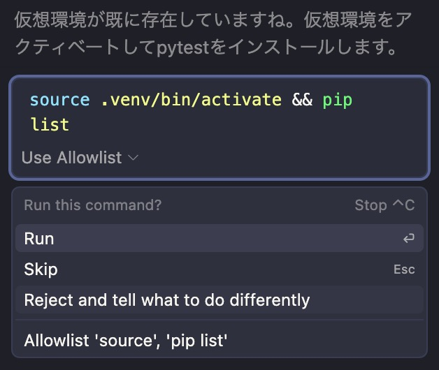
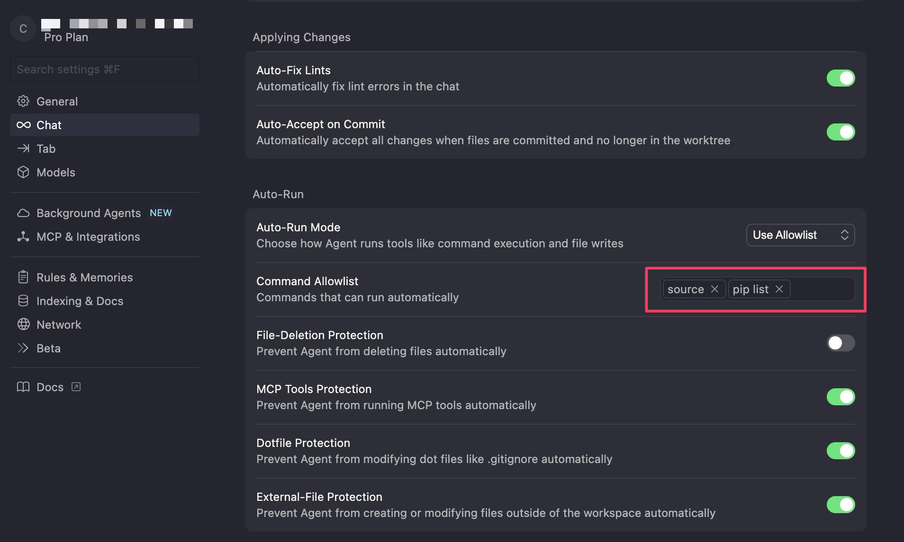

ここまでの実装では下の図のように AI によるコマンド実行の許可を求められる場面が何度か登場したと思います。毎回確認して許可を与えると全自動運転できなくて時間がもったいないと感じる方も少なくないでしょう。

AI に確認せずに実行権限を与える機能があります。上の図の例では、`Allowlist 'source', 'pip list'` クリックすることで、`source` と `pip list` コマンドに実行権限を与えられます。(`source` はファイルに書かれたコマンドを現在のターミナルで実行する、`pip list` は環境にインストールされているライブラリを列挙するコマンドです)

許可を与えたコマンドは設定画面の Command Allowlist で確認できます。ここにコマンドを入力することで任意のコマンドも追加できます。

先述したように、コマンドを使えばコンピューターの全データを削除するような極めて強力かつ危険な事ができます。AI がこのような危険なコマンドを提案する可能性は高くないと思いますが、プロジェクト内の必要なファイルを勝手に削除するくらいの暴走はあり得ます。権限付与はコマンドをよく調べたうえで慎重に行ってください。
