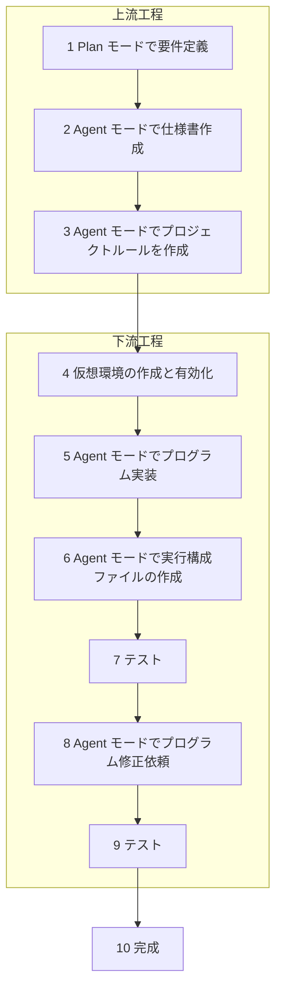

ここまでで Cursor を使ったバイブコーディングアプリ開発は終了です。お疲れ様でした。バイブコーディングによって一行もコードを書くことなくアプリを開発できたのではないでしょうか？同じ手法で簡易な Web アプリを作成したりデータ分析ツールや AI を利用したアプリも開発できます。

ぜひ日々の生活に取り入れてください。例えば私は最近だと以下のようなプログラムをバイブコーディングで作りました。

- 長時間の mp3 音声ファイルをエラーにならないサイズにチャンク化して文字起こしし、適切な単位で読みやすく改行し、見出しを付与してマークダウンファイルを作成する
  https://github.com/ikuma-hiroyuki/japanese-mp3-to-text-transcriber
- スキャンした PDF ファイルを OCR にかけて文字を抽出し、テキストファイルとして書き出す
  https://github.com/ikuma-hiroyuki/japanese-ocr-tool
- gmail から特定の送信元のメールを抽出してマークダウンファイルとして保存

バイブコーディングはあなたの日常を変える力を持っています。本書で学んだことを活用して日々を快適にしていきましょう！

## 開発の流れのおさらい

開発の流れをおさらいします。

1. Plan モードを作成し、Plan モードで仕様書を作成
2. Agent モードでプロジェクトルールを作成
3. 仮想環境の有効化
4. Agent モードで仕様書をもとに実装
5. プログラムをテスト
6. 完成

という流れです。この流れは今回のような Python と Excel を使うアプリ以外でもほぼ同じです。何度もこの流れを繰り返すうちに自然と身に付くと思いますのでぜひあなたのプロジェクトにも取り入れてみてください。

## 使用した Cursor の機能や技術のおさらい

本書では以下の Cursor の機能や技術を扱いました。どんなものだったか思い出しながら身につけ、今後のプロジェクトに活かしてください。

| Cursor の機能               | 説明                                    |
| ------------------------ | ------------------------------------- |
| Ctrl+k/Cmd+k             | エディタやターミナルでその場でプロンプトを入力               |
| Agent モード                | AI による複数ファイル・フォルダを操作するモード             |
| Ask モード                  | 質問を入力するモード                            |
| カスタムエージェントの作成            | ニーズに応じたカスタムエージェントを作成 (Plan モードを作成した)  |
| Cursor Tab               | エディタでユーザーの行動を予測して AI が提案              |
| MCP サーバー設定               | MCP サーバーを使用して外部アプリをコンテキストに取り込む        |
| タイムライン                   | ファイル変更履歴の確認・元に戻す操作                    |
| @シンボル                    | `@` でファイル、フォルダ、ドキュメント、Web 検索を AI に指示する |
| Auto Run                 | エージェントが確認を求めずにコマンドを自動実行するモード          |
| Use Allowlist            | 許可されたコマンドのみ自動実行するモード                  |
| Cursor Command Allowlist | エージェントに自動実行を許可するコマンドリスト               |
| プロジェクトルール                | AI に守らせるルールを設定                        |
| ドキュメントのフォーマット            | コードを見やすくする                            |

以下の技術を使用しました。

| 技術              | 説明                                                          |
| --------------- | ----------------------------------------------------------- |
| ターミナル           | コマンドを実行してコンピュータを操作するためのツール                                  |
| winget          | Windows のターミナルでアプリをインストールするツール                              |
| brew            | macOS のターミナルでアプリをインストールするツール                                |
| Python          | プログラミング言語                                                   |
| 仮想環境            | コンピュータ内の他の環境に影響を与えずプログラム開発する                                |
| Node.js         | JavaScript 実行環境                                             |
| Volta           | Node.js のバージョン管理ツール                                         |
| 文字コード           | テキストファイルは UTF-8 や Shift-JIS なとで作成されており、適切な文字コードで開かないと文字化けする |
| マークダウン記法        | 文章を簡単に装飾できる記法                                               |
| マーメイド図          | 視覚化するための記法                                                  |
| デスクトップアプリ作成     | Python がインストールされていない環境でも利用できるようにする                          |
| GUI ライブラリでアプリ作成 | 開発者以外でも利用できるようにする                                           |
| ダブルクリックで実行      | ダブルクリックで実行できるようにスクリプト化                                      |
| CSV             | データをカンマで区切ったファイル形式                                          |
| JSON            | データ構造を柔軟に表現するためのファイル形式                                      |
